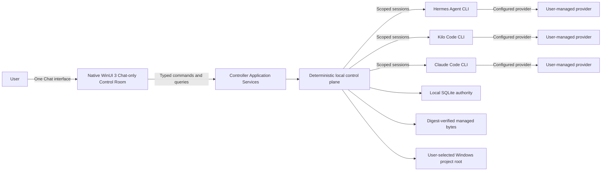
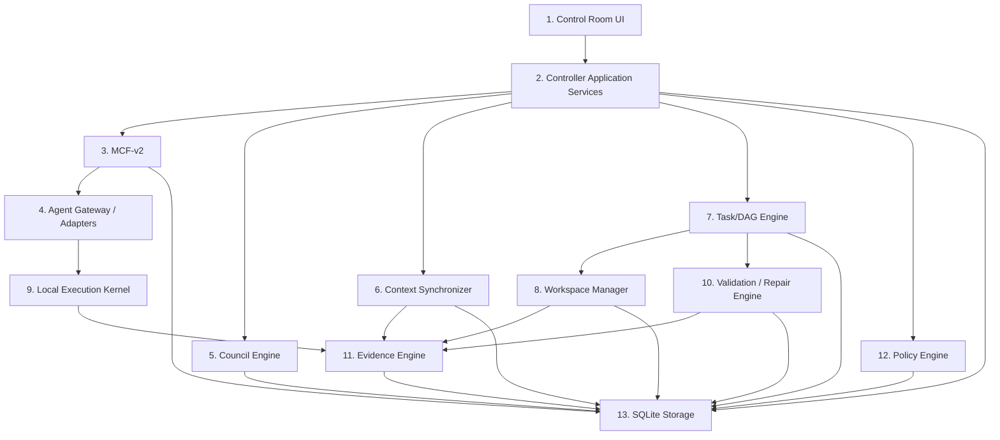
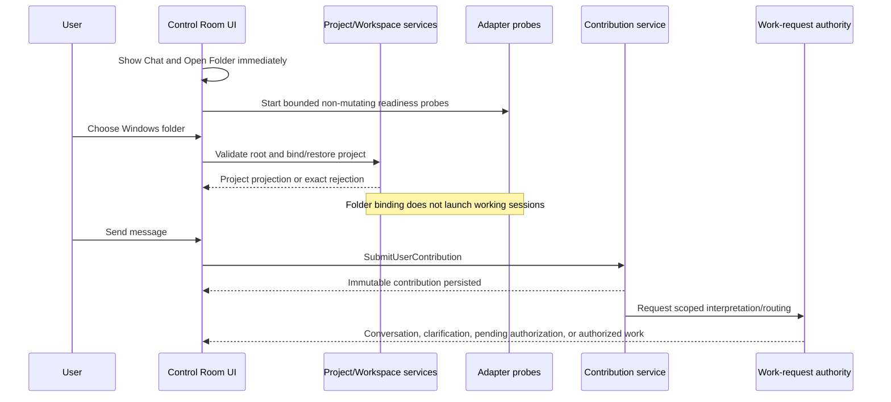
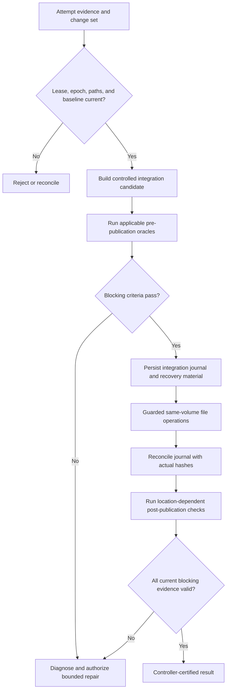

# Mayasaba Architecture

## Document status

This document is an implementation-facing architectural reference derived from [Mayasaba — Complete System Description (for AI agents).md](./Mayasaba%20%E2%80%94%20Complete%20System%20Description%20%28for%20AI%20agents%29.md). The complete system description remains authoritative. If the two conflict, follow the complete system description and correct this document through an explicit architectural change.

The architecture combines fixed decisions, candidate implementation details that must be pinned before build, and enforcement claims that require local Windows proof. A candidate or `PROOF REQUIRED` item is not a validated capability.

## 1. Architectural intent

Mayasaba is a local, deterministic Windows control plane for three independent coding agents. It converts a user's Chat contribution into authorized, scoped, evidence-backed work and publishes accepted results into the same Windows folder the user opened.

The system deliberately separates:

- what the user authorized;
- what the controller decided and scheduled;
- what an agent proposed or reported;
- what the local machine actually did; and
- what current evidence proves.

Agents provide reasoning and implementation proposals. They do not own project truth, permissions, state transitions, or completion.

The same control plane may execute software engineering, document, research, data, and refactoring work. Lifecycle stages and validation oracles are task-applicable: non-software work is not forced through meaningless build or runtime gates.

### System context



The provider connections belong to the external CLIs. Mayasaba does not choose models, manage provider credentials, or run its own inference service.

## 2. Architectural invariants

The following are system invariants rather than implementation preferences:

1. **Windows only and fully native.** C++20 implements the controller and UI code; WinUI 3, XAML, and C++/WinRT implement the Control Room.
2. **One project reality.** The controller owns one durable, source-linked view of project identity, intent, requirements, decisions, tasks, evidence, and state.
3. **Three isolated agents.** Hermes, Kilo Code, and Claude Code retain distinct sessions, configurations, providers, tools, and reasoning.
4. **Exactly thirteen functional layers.** New implementation components must fit a declared layer without creating another authority plane.
5. **Exactly twelve authoritative state machines.** Other workflows are projections over them.
6. **One owner per durable record.** Coordination never implies co-ownership.
7. **Typed boundaries.** UI commands/queries, domain commands, MCF-v2 events, storage operations, and adapter protocols are distinct.
8. **SQLite is the only authoritative state store.** Managed artifact bytes outside SQLite are accepted only through database-linked identity, provenance, and digest verification.
9. **The selected folder is the canonical project root.** Agent workspaces are isolated views derived from that root; accepted results return to it through controlled publication.
10. **Authority and factual evidence are independent.** Neither can substitute for the other.
11. **Unknown fails closed.** Unobserved, stale, or inconclusive state cannot satisfy a positive gate.
12. **Completion is controller-certified.** Agent statements, ACKs, exit code zero, compilation, and process launch are not completion.
13. **Chat is the only persistent user-facing route.** Council, requirements, decisions, tasks, files/evidence, validation/repair, delivery and diagnostics are background projections surfaced only as contextual timeline cards, expanded inline details or temporary dismissible sheets over Chat.

## 3. Functional layers

Dependencies flow through declared interfaces. Lower layers do not depend on higher layers, and CLI-native protocols never escape their adapter.

| # | Layer | Responsibility | Must not do |
| --- | --- | --- | --- |
| 1 | Control Room UI | Render one persistent Chat timeline, contextual projection cards and temporary details sheets; collect folder, attachment, control and decision input through Chat | Add standalone project pages/navigation, write SQL, launch processes, talk directly to agents, schedule work, or certify results |
| 2 | Controller Application Services | Own domain commands and records; coordinate phases, barriers, and gates | Let the Orchestrator overwrite another service's state |
| 3 | MCF-v2 Communication Fabric | Route, persist, acknowledge, retry, deduplicate, dead-letter, and replay typed traffic | Treat delivery as authorization or task success |
| 4 | Agent Gateway / Adapters | Discover, probe, launch, stream, interrupt, and translate one CLI each | Leak native wire formats or alter model/provider settings |
| 5 | Council Engine | Run FULL deliberation, critique assignment, rounds, and synthesis checks | Persist binding decisions or use majority voting |
| 6 | Context Synchronizer | Build immutable context snapshots, manifests, versions, digests, and stale detection | Invent inspection coverage or authority |
| 7 | Task/DAG Engine | Own tasks, dependencies, attempts, leases, fencing, scheduling, and recovery | Treat a lease as an operating-system sandbox |
| 8 | Workspace Manager | Enforce project boundaries; create isolated views; stage, reconcile, and publish changes | Let agents concurrently write the selected root |
| 9 | Local Execution Kernel | Launch and observe controller-issued processes and commands | Claim hidden CLI-internal actions were mediated without proof |
| 10 | Validation / Repair Engine | Evaluate criteria, run oracles, diagnose failures, and bound repairs | Accept self-certification or rewrite source for environment failures |
| 11 | Evidence Engine | Preserve observations, artifacts, hashes, citations, and provenance | Convert narrative, paths, or repeated claims into proof |
| 12 | Policy Engine | Authorize material actions and record denials | Infer authority from an agent, ACK, or factual observation |
| 13 | SQLite Storage | Serialize SQL, migrations, transactions, integrity, and backup | Originate domain authority or imply filesystem publication succeeded |

### Layer dependency shape



The diagram shows logical use, not permission for arbitrary cross-layer calls. Concrete interfaces must preserve ownership and dependency direction.

## 4. Canonical record ownership

Layer 2 contains several application services, but they do not co-own records.

| Record or controlled effect | Canonical owner |
| --- | --- |
| Project identity, folder binding, `ProjectIntent`, project epoch | Project service |
| Requirements, amendments, requirement approvals | Requirement service |
| `UserContribution`, message/question/attachment links | Message/Contribution service |
| `WorkRequest`, routing, authorization, pending change proposal, `ResearchAssignment` authorization | Work-request authority service |
| Binding decision, lock, disposition, supersession | Decision service |
| Phase scheduling, barriers, cross-service coordination, decision triggers | Orchestrator |
| Council points, positions, critiques, rounds, syntheses | Council Engine |
| Envelopes, inbox/outbox, ACK, retry, replay | MCF-v2 Fabric |
| CLI session identity, adapter health, translated traffic | Agent Gateway |
| Snapshot, context version, digest | Context Synchronizer |
| Task graph, attempt, lease, fencing version | Task/DAG Engine |
| Workspace view, staging, integration, publication journal | Workspace Manager |
| Controller-issued process launch and observed result | Local Execution Kernel |
| Validation result, failure diagnostic, repair disposition | Validation/Repair Engine |
| Evidence, artifact/source hash, citation provenance | Evidence Engine |
| Material-action authorization and denial | Policy Engine |
| SQL connection, migration, serialization, persisted bytes | SQLite Storage |

SQLite persists an owner's transaction; it does not become the semantic owner. The Orchestrator coordinates owner commands; it does not write another owner's record. The Council Engine deliberates; only the Decision service can persist a binding decision after all gates pass.

## 5. Authoritative state model

Mayasaba uses twelve independent state machines:

1. project lifecycle;
2. agent session;
3. message delivery;
4. context;
5. task;
6. lease;
7. council round;
8. synchronization barrier;
9. handoff;
10. execution;
11. validation; and
12. repair.

Each transition has a registered command and event. Compare-and-swap or equivalent transactional guards protect transitions. The Orchestrator reads these machines and derives overall project state; it does not flatten them into one mutable status field.

Adapter readiness values (`CHECKING`, `READY`, `MISSING`, `UNSUPPORTED`, and `PROBE_FAILED`) are projections. Request routing, repository exploration, research assignments, and decision-validity assessments are workflows or projections. None is a new authoritative state machine.

### Project lifecycle

The canonical software lifecycle is:

```text
PROJECT_CREATED -> DISCOVERY -> INDEPENDENT_ANALYSIS -> PROPOSALS
-> CROSS_CRITIQUE -> REBUTTAL_AND_REVISION -> DISAGREEMENT_RESOLUTION
-> USER_INTERVIEW -> PRODUCT_AND_UX_DESIGN -> TECH_STACK_DEBATE
-> ARCHITECTURE_REVIEW -> ARCHITECTURE_LOCKED -> TASK_PLANNING
-> IMPLEMENTATION -> INTEGRATION -> BUILD -> TEST -> E2E
-> CROSS_AGENT_REVIEW -> REPAIR (when required) -> FINAL_VALIDATION
-> PACKAGE -> COMPLETE
```

`PAUSED`, `STOPPED`, `BLOCKED`, and `RECOVERING` are orthogonal operational conditions, not lifecycle phases. User interruption has highest operational priority. Project service alone commits an authorized epoch change; the Orchestrator invalidates affected work and schedules the return to the appropriate phase.

## 6. Application command boundary

The WinUI layer calls typed C++ commands and queries on application services and receives immutable projections. It never uses MCF-v2 as a UI transport.

Important command flows include:

- open or switch the authorized project folder;
- submit a `UserContribution`;
- attach or remove a pending file;
- answer a linked question or decision request;
- request pause, stop, retry, reassignment, or reopening;
- query Chat, project, council, task, artifact, evidence, validation, and readiness projections for rendering inside Chat cards or temporary detail sheets.

The UI owns unsent drafts, pending attachment selections, card expansion, temporary-sheet state, focus/scroll restoration, and presentation state only. Domain owners validate and persist all authoritative effects.

### Chat-only projection model

Chat is the application's sole persistent route. Layer 1 does not expose Council, Requirements, Decisions, Tasks, Files, Validation, Delivery, Settings or Agents as standalone pages, tabs or navigation destinations. Their domain records remain fully authoritative in their owning services but are hidden from ordinary presentation until relevant.

Application services derive compact, immutable `ChatCardProjection`-style results for meaningful state changes: a decision requiring input, a task milestone or blocker, an exploration report, changed files, a validation result, a repair/recovery event, a deliverable, or a CLI problem. The exact contract name may differ, but it must remain a projection rather than a new authoritative owner or state machine.

Each card has a stable source record, concise summary, truthful status and allowed actions. **Show details** either expands the card in the timeline or opens a temporary modal/sheet over Chat for dense trees, matrices, logs, per-file coverage or diagnostics. The sheet is not another route; dismissal restores the same timeline scroll position and keyboard/accessibility focus. A user may also request the same information conversationally, such as "show current tasks," producing a current source-linked card without changing authority.

Routine controller traffic stays hidden. Cards are emitted for user-relevant changes rather than every event, preventing background mechanics from flooding the conversation. This presentation filtering never deletes, merges or weakens the underlying durable records and cannot fabricate completion.

## 7. Startup, folder binding, and Chat flow



Opening a folder never scans files, initializes Git, launches model-backed sessions, or approves work. Every enabled Send after folder binding uses the same command and creates one immutable contribution. If dependent agents are unavailable, the contribution remains persisted while the affected operation truthfully waits or blocks.

### Semantic interpretation

When deterministic parsing and explicit controls are insufficient, one available authorized CLI may propose a bounded, read-only `InterpretationCandidate`. The candidate contains source-text spans, operation proposals, constraints, referenced records, affected scope, missing details, and suggested acceptance criteria.

The candidate is advisory. Work-request authority verifies it against the exact contribution, approved records, policy, and allowed vocabulary. Unsupported assumptions stay assumptions. Multi-intent turns are split into source-linked operations. Negation and sequencing such as "analyze first; implement only after approval" must be preserved.

## 8. MCF-v2 communication fabric

MCF-v2 carries agent/controller traffic and bus-routed cross-service asynchronous events. It does not replace synchronous typed domain calls or the UI command/query boundary.

Every envelope includes protocol/schema version, message/event identity, project/session identity, sender/recipients, channel/type/phase, correlation, sequence, epoch, priority, timestamp, acknowledgement/response/blocking flags, payload, security data, and an operation ID for material actions.

Priority order is:

1. emergency control;
2. synchronization;
3. task control;
4. failure recovery;
5. council;
6. progress and heartbeat; and
7. bulk.

Delivery is at least once. Safety therefore depends on transactional inbox/outbox persistence, schema validation, explicit ordering-gap detection, bounded queues, deduplication, and project-plus-operation idempotency. ACK means only that a message was received and persisted. Replay creates a new message and requires fresh authority for material effects.

Per-project event chains use SHA-256 over contract-defined canonical bytes to detect corruption, deletion, or reordering. The chain is not a keyed signature and cannot prevent a deliberate full recomputation.

## 9. Agent Gateway and adapter model

Each CLI has one dedicated adapter. The adapter owns executable discovery, bounded behavioral probes, process/session lifecycle, native transport decoding, normalized MCF-v2 events, interruption, and diagnostics.

| CLI | Baseline transport | Required isolation behavior |
| --- | --- | --- |
| Hermes Agent CLI | Streamed native JSON over standard I/O | Suppress outside-workspace rule/memory/skill injection; forbid approval bypass, upgrades, outbound messaging, credential export, and service control |
| Kilo Code CLI | Native JSON events; local ACP only when verified | Absolute working directory; private controller-owned session; default-deny permissions; no cloud/public sessions, plugin/import surfaces, or codebase indexing |
| Claude Code CLI | Headless print mode (`-p`); native JSON events | Establish the installed CLI's supported JSON mode through a bounded behavioral probe; reject `--dangerously-skip-permissions`, background listeners, plugin installation and credential export. Never rewrite or treat raw Claude settings or an interactive `/permissions` display as authorization proof; prove task permissions and containment through a controlled-session behavioral/fault check tied to the launched process. |

Compatibility is behavioral. Adapters do not request or compare release numbers. A path or executable name alone cannot prove support.

The user owns each CLI's model, provider, authentication, credentials, updates, and native research backend. Adapter launch arguments, environment, and project configuration must not select or rewrite them. Required runtime configuration access outside the project root is a separate, least-privilege allowance and must never become task-visible source access.

## 10. Council architecture

FULL is the only deliberation mode. All three agents participate in every registered decision point.

### Decision-point lifecycle

A decision point is a durable scoped question with a trigger, affected records, required outcome, acceptance checks, project epoch, and context digest. Valid creation triggers are:

1. a registered lifecycle decision gate;
2. a material execution or validation event exposing a new choice;
3. an explicitly authorized reopening request; or
4. a material scope-change proposal originating from a persisted Chat contribution.

Raw messages and agent suggestions cannot open or close decision points directly. Stable trigger keys deduplicate equivalent events within an epoch.

### FULL round

1. Confirm all three adapters and freeze one synchronized context.
2. Select the chair deterministically by fixed round-robin.
3. Collect three independent proposals before disclosure.
4. Freeze the proposal set and assign six directed peer critiques.
5. Collect rebuttals and immutable revisions.
6. Grade evidence, preserve conflicts, and review any chair synthesis with a non-chair agent plus controller coverage checks.
7. Seal the round using one allowed outcome or an internal `CONTINUE` reason.

Externally reported outcomes are `converged`, `synthesized`, `cap reached`, `escalated`, or `sealed with an open question`. `CONTINUE` is internal. A first stable round cannot prove convergence by itself; absent an accepted synthesis, a second comparable FULL round is required. The default five-round budget covers the entire decision point and does not reset after user input or context changes.

User choice/trade-off and missing factual information use distinct typed answer contracts. Silence and timeout pause; they never authorize.

## 11. Context and repository exploration

Context Synchronizer creates versioned, immutable, digest-linked snapshots. Repository relationships and indexes are advisory and carry source file IDs, hashes, extraction method, epoch, and uncertainty.

Whole-repository exploration is a separately authorized all-three read-only workflow:

1. validate the canonical root and explicit exclusions;
2. create a bounded `RepositoryManifest` with identity, type, size, digest, and access outcome;
3. expose frozen or change-detecting source references;
4. send identical independent assignments to all three CLIs;
5. collect attributed, source-linked findings;
6. independently validate citations, ranges, hashes, and coverage;
7. open a FULL council only if a real registered decision trigger emerges; and
8. produce a controller-owned report with honest gaps.

Coverage states are `INVENTORIED`, `CONTENT_INSPECTED`, `ANALYZED`, `EXCLUDED`, `UNREADABLE`, `UNSUPPORTED`, `TOO_LARGE`, and `STALE`. A filename listing is not content inspection. Agent assertion is not analysis evidence. Full coverage may be claimed only when every readable in-scope file has matching current inspection evidence and all gaps are reported.

Normal tasks use incremental invalidation and the smallest sufficient context. Changed hashes invalidate affected files, demonstrable reverse dependencies, and acceptance checks. Incomplete dependency knowledge requires conservative wider retrieval or explicit `PARTIAL`/`STALE` status.

## 12. Tasks, attempts, leases, and scheduling

A task is the stable unit of acceptance. An attempt is one execution of that task. A lease assigns an attempt, and its active version is the only fencing token for lease-derived material effects.

Every actionable `TaskContract` includes:

- task, project, work-request, contribution, epoch, and snapshot identity;
- linked requirement and decision records;
- objective and expected artifacts;
- dependencies and assigned CLI;
- allowed read paths, allowed write paths, and forbidden paths;
- approved commands/tools and resource budgets;
- expected change types; and
- criterion IDs, oracle types, and blocking designations.

The scheduler respects dependencies and compares read/write sets. Overlapping, unknown, generated, aliased, or reparse-mediated writes are serialized or blocked until safe. Disjoint tasks may run concurrently in separate writable views. Discovered changes outside the contract are rejected rather than retroactively approved.

Each attempt produces an immutable evidence bundle containing lease/session identity, baseline and result hashes, observed changes, process/tool outcomes, diagnostics, proposed criterion evidence, and omissions.

## 13. Execution and containment

The Local Execution Kernel uses controlled Win32 process creation, restricted inheritance, redirected streams, and controller-owned Job Objects. Controlled processes are created suspended, assigned to their job, and then resumed. Cancellation records request, deadline, escalation, and observed process-tree termination separately.

Job Objects do not restrict filesystem or network access. For each CLI and execution profile, Mayasaba must either:

- mediate a material side effect before it occurs; or
- independently prove an effective Windows isolation and revocation profile across the real process/service tree.

The containment prototype must exercise forbidden writes, unapproved outside-root reads, reparse escapes, parent instruction injection, unmanaged tools, shared service attachment, lease revocation, and unapproved network/service effects. Required narrow runtime authentication/configuration reads must continue to work without becoming task-visible.

If neither mediation nor confinement is proven, the operation is `UNSUPPORTED` or `BLOCKED`. Prompt instructions, worktrees, permission maps, event logs, and post-hoc hashes do not retroactively authorize an uncontrolled action.

## 14. Workspaces, integration, and publication

The user's selected folder remains the canonical root and final destination. Read-only work uses an enforced snapshot/view. Implementation uses a task-scoped Git worktree for eligible repositories or a controller-owned staged copy for other projects.

### Publication flow



Windows does not make a multi-file publication atomic. The journal records before/after identities and digests, authorization, recovery material, expected outputs, and the per-file plan. Immediately revalidate user-owned files before each guarded mutation. After failure or restart, compare the journal with actual hashes; never blindly roll back over newer user edits.

SQLite transaction success and filesystem publication success are separate facts.

## 15. Persistence architecture

SQLite is embedded in Mayasaba-owned local application storage. The storage layer owns connections, prepared statements, migrations, transaction boundaries, backups, and integrity checks. Writes are serialized through one owner-mediated path.

Durable domain changes commit with their events and outbound records. Event history is append-only. Startup recovery reconciles persisted intent with observed process, artifact, and filesystem outcomes; uncertain effects remain `UNKNOWN` until checked.

WAL is a candidate for eligible local filesystems, not a universal assumption. Before release, prove actual journal mode, `synchronous` behavior, busy handling, checkpoint policy, bounded readers, clean shutdown, crash recovery, backup/restore, migration, and integrity checks. Use SQLite's online backup API or an equivalent consistent snapshot rather than copying a live database file alone.

Managed attachment and evidence bytes live outside SQLite only for size and access-management reasons. SQLite remains authoritative for identity and provenance. Every use rechecks existence, hash, permissions, and project association.

## 16. Evidence, validation, and repair

Every task and deliverable has an `AcceptanceEvidenceMatrix`. Each criterion identifies the requirement, observable expectation, oracle class, environment, blocking status, expected artifact/hash scope, check procedure, result, evidence, freshness, and disposition.

Valid criterion outcomes are:

- `PASS`: the correct current observation was established and preserved;
- `FAIL`: a valid oracle observed the expectation was not met;
- `INCONCLUSIVE`: evidence or oracle adequacy was insufficient;
- `BLOCKED`: the check could not run safely or with required authority/dependencies; and
- `NOT_APPLICABLE`: verified task-specific justification shows the criterion does not apply.

Completion is a matrix gate. All blocking criteria must be `PASS` or validly `NOT_APPLICABLE`.

An `OracleAdequacyReview` must establish that an oracle measures the named requirement. A compile check cannot prove runtime behavior; process launch cannot prove functional correctness; an agent-authored passing test cannot prove its own relevance. Use positive, negative, boundary, regression, and controlled fault-injection cases when safe and applicable.

Failure diagnosis precedes repair. Diagnostic classes distinguish code/test defects, integration conflict, stale context, toolchain/dependency failure, CLI/provider failure, policy/scope denial, external environment failure, and unknown causes. A repair attempt carries a falsifiable hypothesis, narrow scope, expected discriminating check, and regression plan. Repeated identical failure without objective improvement stops that strategy.

## 17. Research architecture

User-authorized research uses all three CLIs independently. Each uses its own configured native search and fetch/extract tools. Mayasaba does not add a search provider or arbitrary HTTP fallback.

Adapters probe the actual assignment-scoped tool behavior. Authorized profiles permit only native read-only search and page fetch/extraction plus the necessary scoped local reads. They do not permit shell HTTP, servers, uploads, forms, posting, account changes, external messaging, credential export, or plugin installation.

Findings distinguish search snippets from fetched pages and include query, URL, observed date, native result identity, excerpt/range, limitations, and digest where available. Evidence validation deduplicates repeated sources and preserves contradictory results. Missing tools or agents produce partial or blocked coverage, never fabricated three-agent completion.

## 18. Technology baseline

| Area | Baseline | Status |
| --- | --- | --- |
| Language | C++20 | Fixed |
| UI | WinUI 3, XAML, C++/WinRT | Fixed |
| Platform APIs | Win32 and Windows Runtime | Fixed |
| Resource ownership | RAII, standard ownership, Microsoft WIL | Fixed approach |
| Core build/test | CMake, CTest, GoogleTest/GoogleMock candidate | Pin before build |
| UI build | MSBuild, Windows SDK, Windows App SDK | Fixed; pin toolchain |
| JSON | `nlohmann/json` candidate | Pin and validate |
| JSON Schema | `pboettch/json-schema-validator` draft-07 candidate | Pin and prove dialect coverage |
| Hashing | Windows CNG SHA-256 | Fixed primitive; canonical byte profile must be tested |
| Persistence | Embedded SQLite C API, single writer | Fixed; durability policy requires proof |
| Process control | `CreateProcessW`, redirected streams, Job Objects, overlapped I/O/IOCP where supported | Fixed primitives; per-CLI behavior requires proof |
| Workspace isolation | Git worktrees or controlled staging | Fixed model; confinement requires proof |
| Packaging | WiX-authored MSI | Fixed |
| Runtime layout | Unpackaged, self-contained Windows App SDK payload candidate | Packaging prototype required |
| UI verification | Windows UI Automation | Pin and prove discriminatory tests |

Third-party revisions, source hashes, licenses, schema dialect, and an offline-restorable dependency manifest must be fixed before implementation relies on them. Listing a candidate does not authorize a download or installation.

## 19. Suggested codebase boundaries

The source specification fixes responsibilities but not final folder names. A practical initial layout may be:

```text
/
  app/                 # WinUI entry point, XAML, view models, UI composition
  core/
    application/       # Layer 2 services and typed command/query contracts
    protocol/          # MCF-v2 envelopes, registries, codecs
    council/           # FULL council domain logic
    context/           # snapshots, manifests, invalidation
    tasks/             # DAG, attempts, leases, scheduling
    workspace/         # roots, views, integration, publication journal
    execution/         # Win32 process supervision
    validation/        # acceptance matrices, diagnostics, repair
    evidence/          # provenance and artifact evidence
    policy/            # authorization and denials
    storage/           # SQLite implementation and migrations
  adapters/
    hermes/
    kilo/
    claude/
  contracts/           # versioned schemas, registries, canonical test vectors
  tests/
    unit/
    integration/
    contract/
    fault/
    ui/
  installer/           # WiX MSI sources and packaging verification
  docs/
```

Treat this as a boundary proposal, not permission to create placeholder directories or bypass a better solution structure. Whatever physical layout is selected must make forbidden dependencies testable.

## 20. Architectural proof gates

Before production implementation relies on the design, local Windows evidence is required for:

1. responsive WinUI rendering during sustained CLI/event streaming;
2. controlled launch, redirected I/O, cancellation, crash cleanup, and process-tree ownership; and
3. enforceable project/workspace access, parent-rule isolation, and stale-write rejection for every admitted CLI profile.

Additional release gates cover:

- contract/schema drift and hostile parser inputs;
- bounded queue backpressure and SQLite inbox/outbox atomicity;
- council replay, participation, six critiques, and convergence guards;
- canonical serialization vectors;
- SQLite journal, backup, restore, migration, and crash recovery;
- publication interruption and concurrent user edits;
- oracle discrimination and repair stopping rules;
- UI accessibility and responsiveness;
- MSI install, launch, repair, upgrade, uninstall, signing, and supported Windows/architecture matrix.

## 21. Architectural governance

Classify every material architecture change as `additive`, `refinement`, `replacement`, or `deprecation`. Record:

- previous behavior;
- new behavior;
- reason and supporting evidence;
- compatibility impact;
- migration path;
- affected records, contracts, and tests; and
- whether a locked decision must be reopened.

Historical requirements, decisions, dissent, and evidence remain append-only. A successor links to its predecessor. A conflict between sources is recorded and traced rather than silently edited away.

The architecture is successful only when authority, observed execution, and current evidence remain distinguishable from input through final certification.
