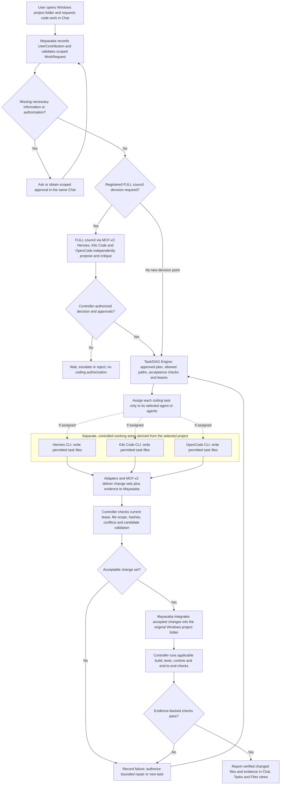

# Mayasaba — Complete End-to-End Description

Mayasaba is a fully native, Windows-only desktop control plane built in C++20, with a WinUI 3 interface and a deterministic local core. A user points it at a folder on their own PC and states a request. Three coding agents deliberate and carry the work out in isolated workspaces, and Mayasaba declares the result done only after it has verified the work itself, with evidence. The agents supply the intelligence; Mayasaba supplies state, authority, safety and proof.

## Contents

1. [What Mayasaba is](#1-what-mayasaba-is)
2. [Project lifecycle](#2-project-lifecycle)
3. [Frontend and UI/UX](#3-frontend-and-uiux)
4. [Architecture and authoritative state](#4-architecture-and-authoritative-state)
5. [Council deliberation and user decisions](#5-council-deliberation-and-user-decisions)
6. [MCF-v2 communication fabric](#6-mcf-v2-communication-fabric)
7. [Agent integration and controls](#7-agent-integration-and-controls)
8. [Technology stack](#8-technology-stack)
9. [Contracts, verification and governance](#9-contracts-verification-and-governance)
10. [Technical references](#10-technical-references)

## 1. What Mayasaba is

Mayasaba is a native C++20 application and the deterministic control plane between a user and three coding agents. After the three-CLI readiness gate, the user opens an existing Windows directory using **Open Folder** at the bottom-left of the Chat navigation rail. That directory becomes the authorized project root. The user then describes the task through the single Chat composer. The agents reason and write inside separately authorized task workspaces; Mayasaba coordinates, verifies and integrates accepted changes into the selected project folder.

**The three agents.** Hermes Agent CLI, Kilo Code CLI and OpenCode CLI, and no others. Mayasaba does not replace them or add a model of its own. **The user configures the model, model-provider account and authentication separately inside each CLI; Mayasaba always uses that CLI's existing selection and never chooses, changes or overrides a model or provider.** Each CLI retains its own native model configuration, tools, login, session and reasoning. Mayasaba counts independent agreement by **lineage**, not by agent count, because two of the three share a codebase — Kilo Code is a fork of OpenCode — so those two corroborate each other as **one**, never two.

**Supported work.** Software engineering from requirements to a packaged application, and other local-file work: documents, research reports, data cleanup and refactors. A research task may read public web pages, read-only, and saves the report and its citations locally. A user may also request whole-repository exploration in Chat: Mayasaba inventories the authorized folder, sends controlled independent read-only analyses to all three CLIs, and verifies source-linked findings before producing a coverage-qualified report.

**Hard boundaries**

- Windows only. All controlled execution happens on the user's own PC: no cloud machine, hosted workspace or remote executor, and no account or login.
- The folder the user picks, plus task-specific allowed paths, is the filesystem boundary. A typed path is only a candidate until Mayasaba confirms it exists, is local and is allowed. It never scans the whole PC.
- No outside side effects: it does not send messages, publish, submit forms, buy things, change accounts or control unrelated applications.
- It installs from an MSI package and keeps all of its state in a local SQLite database.

**What it refuses to be.** Not a fifth AI model, a cloud IDE, a chat wrapper, an agent marketplace, or a system where an agent has the final word. An agent saying "done" never completes a task.

**Core principle: one project reality, three separate agent sessions.** Mayasaba holds the facts: requirements, decisions, task ownership, context versions, workspace scope, evidence and validation state. The agents never share a hidden brain, and nothing an agent claims becomes true until Mayasaba confirms it.

## 2. Project lifecycle

A software project passes through these stages. Other local-file tasks run only the stages that apply to their acceptance criteria, so a report never needs a build step. A document, research or data task is validated by the checks its own acceptance criteria require — structure, source and citation validity, record counts, invariants or integrity — never by a software gate that does not apply to it.

1. **Open a folder and keep chatting.** After the three-CLI startup check, **Open Folder** at the bottom-left of Chat binds an authorized local Windows directory to a persistent project identity or restores its registered project. Every Send uses the same `SubmitUserContribution` command and persists an immutable `UserContribution`—whether the user asks a question, explores existing code, describes an idea, requests new work, changes requirements, attaches files or answers Mayasaba. The Project/Requirement services maintain a rolling, source-linked, versioned internal `ProjectIntent` projection of authorized current scope, without a one-time goal-completion checkpoint or separate project document. The owning services route each contribution to its specific allowed workflow. Explicit read-only exploration may start before any build goal has been established; material implementation requests and changes follow their own requirement, FULL-council, policy and approval checks. When a specific operation lacks necessary detail, Mayasaba asks about that operation in the same Chat rather than freezing all conversation. The project may grow, change direction and be re-planned repeatedly. All agents use authorized isolated working areas; Mayasaba validates and integrates accepted changes into the selected root. Chat never widens filesystem authority.
2. **Discovery.** For an authorized engineering request needing investigation, the Project/Orchestrator services issue a scoped, idempotent `WorkRequestAuthorized` event and enter or revisit `DISCOVERY` as appropriate. The controller establishes objective workspace facts, requirements, source context and toolchain constraints for this request. Exploration and ordinary conversation can proceed through their own authorized paths without forcing the whole project into a new software-build lifecycle. Further discovery and planning can recur when user requirements change; no complete project description is required up front.
3. **Independent analysis and proposals.** All three agents receive the same snapshot of the project and analyze it independently, without seeing the others, then each submits a proposal. All three must participate in council deliberation; an absent or unavailable agent pauses or blocks the council rather than reducing its membership. This avoids anchoring on whoever speaks first.
4. **Cross-critique, rebuttal and revision.** Mayasaba assigns each agent which proposals to review. Reviewers critique with evidence, authors answer and revise.
5. **Disagreement resolution and user interview.** Material disagreements stay visible. They are settled by evidence, by revision, or by the user. Agents' questions are collected, merged and checked against the workspace first; the user is asked only what is still unresolved, in one batch.
6. **Design and architecture.** Product and UX design, a technology-choice debate and an architecture review end in a **locked architecture**: recorded decisions with rationale, evidence and alternatives.
7. **Task planning.** The work becomes a graph of tasks. Each task has an objective, allowed paths, dependencies, required outputs, acceptance criteria and a validation method.
8. **Implementation.** Agents work on leased tasks, each in an isolated workspace.
9. **Integration, build, test and end-to-end checks.** Mayasaba merges accepted work in a workspace it controls, then builds, tests and exercises the running application. Agents also review each other's work. These are separate results, not one: building successfully, launching a process successfully and behaving correctly at runtime are three different things, and only the last of them is runtime correctness. A process starting up proves nothing about whether the application works.
10. **Repair.** Failures are diagnosed and turned into bounded repair tasks, followed by targeted and regression tests.
11. **Final validation, packaging and certification.** The project is complete only when Mayasaba certifies it from evidence.

### Coding and file changes — from Chat request to the opened Windows folder

The following flow shows how **Mayasaba turns agent output into verified project files**. The three agents take part in every registered FULL-council decision; implementation tasks are assigned individually to whichever agent or agents hold valid task leases. An agent's text reply is not a file change or proof of completion.

**Folder boundary.** The destination is the **same Windows folder opened in Mayasaba**, never a CLI-selected alternative. Agents work against task-scoped worktrees or staged copies, not concurrently against the user's original writable root. The Workspace Manager and Execution Kernel enforce file access; the controller alone accepts and publishes changes to that root.

**Response versus implementation.** Agent proposals and chat answers travel through adapters and MCF-v2; actual coding requires an authorized task, a current lease and observed file changes. Mayasaba examines each submitted change set, rejects conflicts or unpermitted/stale writes, and integrates only accepted work. Build, test and runtime outcomes remain separate evidence records. Failed checks produce controlled repair/re-planning; neither an agent saying "done" nor a process exiting successfully certifies completion. The user sees the resulting changes and their validation in the **same Chat and project views**, not separate CLI terminal windows.
### Continuous Chat and per-request authorization

**There is no single global project goal-completion checkpoint.** The user may keep describing, exploring, refining, correcting or changing the project through one Chat for its entire life. Folder selection establishes the workspace and project identity; it does not start a special intake conversation. The same composer and `SubmitUserContribution` contract apply from the first message onward. Neither a message count, an agent's confidence nor a one-off user summary unlocks all future work.

**Every Send is recorded; individual operations are separately assessed.** The contribution service persists a `UserContribution` with project/root identity, attachments, message and question links. The interpreting component can propose typed routing labels `CONVERSATION`, `READ_ONLY_EXPLORATION`, `WORK_REQUEST`, `CHANGE_PROPOSAL`, `QUESTION_RESPONSE` and `CONTROL_ACTION`. These are advisory classifications of one message, not UI modes, authoritative approvals or additional state machines. The responsible controller service verifies what the user actually requested; one message may contain several independently tracked work items.

**Operation-specific controls:**

1. **Conversation:** questions, brainstorming and clarifications receive normal Chat responses without being converted into tasks, locked requirements or project-wide decisions.
2. **Read-only exploration:** a clear instruction to inspect the selected project can use the existing independent three-CLI repository-exploration workflow after current root, scope, privacy and enforced read-only checks. No separate first-project goal or redundant whole-project confirmation is demanded.
3. **Engineering and deliverable work:** a concrete user request becomes a source-linked `WorkRequest` with operation, authorized affected scope, known inputs, expected result/acceptance checks as applicable, current project context and the relevant user authority. The owner checks only the facts necessary for this operation, asking a targeted clarification for missing or conflicting details. `WorkRequestAuthorized` is an idempotent controller event bound to this request and current authority, not a permanent project unlock. Design and architecture decisions still pass through the mandatory FULL three-agent council; execution needs valid leases and policy/evidence gates.
4. **Ongoing changes:** an instruction to add a feature, correct a bug, remove a component or change direction is recorded even during implementation, validation or delivery. If it materially conflicts with current approved scope, the owning service opens a pending change proposal, uses the existing FULL-council decision trigger and required user approval, then commits updated requirements and a successor `ProjectIntent` version. The controller advances the epoch only for an approved material change, invalidates/reconciles affected work and resynchronizes the three agents. Unrelated authorized work and Chat need not stop.
5. **Responses and controls:** question answers, decisions and pause/stop/retry instructions use Chat or inline controls with explicit links to the owning question/operation. Approval is required only at the relevant authorization gate and must name its effect; silence, an unrelated "yes", an agent suggestion or routine Chat never authorizes a protected change.

**Continuous durable truth.** `ProjectIntent` is an internal rolling projection of currently confirmed user direction, scope, requirements and decisions, each linked to the actual immutable contributions and approvals that established them. It may have no committed build goal while the user explores files; it never freezes future conversation. New authorized scope creates a new version without editing past decisions or pretending every message was an approved requirement. The transcript and agent interpretation remain advisory; application services own authoritative requirements, tasks, decisions and evidence.

**Routing is deterministic and recoverable.** Each typed actionable request is uniquely identified by project, source contribution, operation and affected scope, and its controller-derived status is `RECORDED`, `NEEDS_CLARIFICATION`, `PENDING_AUTHORIZATION`, `AUTHORIZED`, `REJECTED` or `COMPLETED`. These are request projections, not another authoritative lifecycle state machine. Commands and events are schema-checked, persisted and deduplicated; retries cannot repeat side effects, and changed project context invalidates stale authorization. A blocked request does not prevent normal Chat or unrelated authorized work. The existing twelve state machines continue to govern project, council, execution and recovery.

### Repository exploration and verification — read-only three-agent workflow

**Natural Chat trigger.** When the user asks Mayasaba to "read all files and folders", "explore this project" or "analyze the whole repository", it records an ordinary `UserContribution`. The owning service validates a separately scoped read-only request against the already authorized folder, privacy restrictions and effective read-only agent permissions; Mayasaba can start inventory and all-three independent inspection even if the user has never described a build goal. Unsafe or unclear portions receive targeted clarification or explicit exclusions; existing approved requirements and locks remain unchanged. Output is an evidence-linked coverage-accounted report, not a new Chat mode or automatic architecture decision.

**End-to-end controller procedure:**

1. **Set the permitted boundary.** The Workspace Manager and Policy Engine authorize the selected canonical root and identify explicit permitted and excluded paths. Enumeration handles Windows junctions, symlinks, reparse points, inaccessible directories, cycles, hidden files, Git administrative data, generated/vendor trees and archives under declared rules and budgets. A request to read *everything* never permits a scan outside that root or a bypass of credential/secret protections. Every exclusion is recorded with a reason.
2. **Create a trustworthy inventory.** Mayasaba enumerates the permitted tree through controlled read-only operations and persists a versioned `RepositoryManifest` keyed by project/root, scan ID, context/epoch and snapshot digest. Each entry records its normalized relative path, kind (file/directory/link), size, digest when safely readable, and any access/exclusion error. Listing a filename is `INVENTORIED`, not proof its content was read. Traversal and hashing are bounded and cancellation-aware; file mutation or identity change between scan and inspection marks evidence `STALE` pending revalidation.
3. **Prepare synchronized source access.** The Context Synchronizer builds a consistent frozen or change-detecting baseline from the manifest and exposes versioned, bounded file/chunk references with content hashes and byte/line ranges where applicable. Content sent to a model is filtered for secrets and unauthorized data; repository text and instructions embedded in files are treated as untrusted source material, not controller commands. Large, binary, archive or unsupported content is inspected only by safe applicable readers; it is never silently assumed to fit into an agent context window.
4. **Dispatch to all three CLIs independently.** The Orchestrator delivers three separate, read-only `ExplorationAssignment` messages over MCF-v2 to **Hermes Agent CLI**, **Kilo Code CLI** and **OpenCode CLI**. They get the same question, authorized manifest, snapshot version and evidence-access policy; each returns its own initial analysis before seeing the other agents' findings. Controller-enforced read-only execution allows only permitted source reading/searching: it forbids edits/deletions, installations, executing repository scripts/builds, uncontrolled network/service commands and access outside the selected scope. If read-only enforcement cannot be proved for an agent, block its assignment rather than rely on prompt instructions.
5. **Collect attributed findings.** Each agent returns source-linked `ExplorationFinding` records covering relevant project layout, entry points, modules, dependencies, data paths, tests, build structure, risks, missing information and file-level observations. Every claim links to manifest entries and source/chunk evidence, or is explicitly an inference or unknown. The controller records actual per-entry coverage as `INVENTORIED`, `CONTENT_INSPECTED`, `ANALYZED`, `EXCLUDED`, `UNREADABLE`, `UNSUPPORTED`, `TOO_LARGE` or `STALE`; the latter statuses have concrete reasons. `CONTENT_INSPECTED` requires observed read evidence; `ANALYZED` additionally requires traceable source-based analysis, never just an agent declaration.
6. **Independently validate.** The Evidence and Validation services compare all three reports against the controller manifest, recheck source references and current hashes, validate claimed line/range locations and run only explicitly authorized read-only/static checks when useful. Findings become `VERIFIED` only with controller-observed facts; otherwise mark them `CITED`, `INFERRED` or `UNVERIFIED` with the reason. Agreement is not verification, and Kilo Code plus OpenCode remain one lineage for independence counting. Conflicting factual claims are resolved by re-inspection where possible and unresolved differences are preserved. On changed files, re-snapshot and boundedly retry or report the stale scope.
7. **Apply existing council decision rules only when needed.** Exploring or comparing read-only reports does not itself create a council decision point. If the exploration exposes a real architecture choice, requirement conflict or other registered decision trigger, the Orchestrator opens/links a decision point and runs the existing **FULL** three-agent council. The exploration phase itself still requires independent participation from all three CLIs; an offline or failing agent yields waiting/blocked with recoverable partial evidence, **never a claimed completed three-agent inspection from two agents**.
8. **Report honestly in the same Chat.** Mayasaba presents one controller-owned `ExplorationReport`: repository tree and architectural explanation, each agent's attributed findings, verified facts, disagreements, confidence limitations, excluded paths and recommended next checks. It displays separately the count of inventoried in-scope files, files with actual content inspection evidence, deeply analyzed files, unreadable/excluded/oversized/unsupported files and files invalidated by changes. Counts are computed from distinct manifest IDs and validated evidence, not agent totals. Claim **full content coverage** only if every readable in-scope file has matching inspection evidence, the inventory is current, and no unreported gap exists; otherwise label the result `PARTIAL` or `BLOCKED` and specify the exact gaps. Full content coverage is not a guarantee of perfect understanding. The exploration never changes project files; exporting a report to disk requires separately authorized output.

**Typed ownership and recovery.** `RepositoryManifest`, `ExplorationAssignment`, `ExplorationFinding`, `FileCoverage` and `ExplorationReport` have versioned machine-readable contracts and immutable provenance links to the originating contribution, project, agent sessions, context, entry digests and evidence. The existing Workspace Manager, Orchestrator, Context Synchronizer, MCF-v2 and Evidence/Validation services own their respective records and transitions; exploration is a coordinated workflow, **not a thirteenth authoritative state machine**. Idempotent assignments, bounded retries, interruption and restart recovery preserve partial results without ever fabricating completion.
The canonical phase sequence beneath these stages — the software-engineering lifecycle — is:

~~~text
PROJECT_CREATED → DISCOVERY → INDEPENDENT_ANALYSIS → PROPOSALS
→ CROSS_CRITIQUE → REBUTTAL_AND_REVISION → DISAGREEMENT_RESOLUTION
→ USER_INTERVIEW → PRODUCT_AND_UX_DESIGN → TECH_STACK_DEBATE
→ ARCHITECTURE_REVIEW → ARCHITECTURE_LOCKED → TASK_PLANNING
→ IMPLEMENTATION → INTEGRATION → BUILD → TEST → E2E
→ CROSS_AGENT_REVIEW → REPAIR (when needed) → FINAL_VALIDATION → PACKAGE → COMPLETE
~~~

`REPAIR` is entered only when required. `COMPLETE` is controller-owned and evidence-backed. Global conditions include `PAUSED`, `STOPPED`, `BLOCKED` and `RECOVERING`; these are orthogonal conditions on the lifecycle, not phases. User interruption has the highest operational priority. **A mid-project requirement proposed in chat enters the pending-change and FULL-council flow; it does not immediately alter the approved plan.** On an authorized material change to a requirement, a locked decision, the architecture or a contract, the project returns to the applicable earlier planning/design phase, advances its epoch and **invalidates the affected plans**: work still queued under the old plan is recomputed rather than allowed to execute as though nothing changed. The Control Room shows every message, conclusion, action, artifact and piece of evidence, never an agent's private chain of thought.

## 3. Frontend and UI/UX

The frontend is the native WinUI 3 Control Room. A **blocking three-CLI readiness check precedes the Chat UI on every app launch**. After all three pass, **one persistent chat interface and composer are the sole entry point for user project intent, conversations, clarifications, requests, answers and file attachments through delivery.** The Chat navigation rail has **Open Folder** at its bottom-left for project selection; the single composer is reserved for project intent and ongoing messages, without a separate intake form or editor. Council, requirements, tasks, decisions and evidence remain inspectable through structured views in the same Control Room, with controller-authorized controls for specific actions. Users do not manipulate database files, protocol messages or internal work directories to manage a project. Background processing remains accountable: every project-affecting action, conclusion, artifact and validation result is available through an appropriate view.

### Startup prerequisite gate — before Chat

**MSI installation and first launch.** Mayasaba's MSI installs the native application and its own runtime assets. The three external CLIs remain user-installed tools: Mayasaba does not silently download, install, update or authenticate them. After MSI installation, launching Mayasaba opens a native **Checking agents** screen, not the Chat UI. This same mandatory gate runs on every subsequent launch before creating or reopening a project.

~~~text
MSI installs Mayasaba successfully
             |
             v
       Launch Mayasaba
             |
             v
  Check Hermes / Kilo / OpenCode
             |
             v
    All three CLIs READY?
        /          \
       NO          YES
       |            |
       v            v
   Agent Setup   Open Chat UI
   Chat blocked  Create / reopen project
       |
  Install/fix, locate CLI
       |
    Recheck all three --> check again
~~~

**Fail-closed navigation.** Missing or incompatible CLIs do not cause the MSI installation to fail or force Mayasaba to exit. Instead the app stays on **Agent Setup**, a prerequisite-recovery screen with no project-intent composer; the user cannot bypass it to Chat, launch a council round or start task execution. The application never operates a reduced two-agent council.

**Adapter-controlled preflight.** Each of Hermes Agent CLI, Kilo Code CLI and OpenCode CLI has a separately verified row. Its adapter resolves an explicitly configured executable or a command in the user's effective environment, validates the candidate path, checks the version and performs bounded, safe version/health/capability probes through the Local Execution Kernel. A matching filename or a command on PATH alone does not establish readiness. The checks must honor the existing process-supervision and adapter-specific safety requirements; they cannot scan the user's entire PC, run arbitrary installation scripts or take custody of provider credentials. An agent may be installed yet still show as unsupported or probe-failed. Provider login and per-session permissions remain separate requirements for actual agent execution.

**What the user sees.** The blocking Agent Setup screen lists exactly three required CLIs: **Hermes Agent CLI**, **Kilo Code CLI** and **OpenCode CLI**. Every row shows a **pre-project adapter-readiness status** of `CHECKING`, `READY`, `MISSING`, `UNSUPPORTED` or `PROBE_FAILED`, derived from the adapter's latest probe result rather than from an Agent Session state. It also shows the detected version/path when known and a clear reason or safe installation/configuration guidance. Controls include **Recheck**, **Locate executable** (validated explicit file selection) and **Exit**. Recheck repeats the verification for all three. If external installation changes PATH, Mayasaba refreshes the environment safely where possible or explains that restarting the app is required. Never invent download links, assume success or install agents silently.

**Opening Chat, relaunch and recovery.** Only when all three distinct adapters have current verified `READY` results does the controller produce `ALL_AGENTS_READY` and open the existing single Chat UI. A new user sees a welcome composer and **Open Folder** at the bottom-left of the side rail; a returning user can reopen the previous project from the same folder control. This startup gate does not waive later authentication, capability, context or authorization checks. If a required agent is removed or stops meeting requirements during a project, the Orchestrator blocks agent-dependent work, pauses the FULL council when needed, preserves state/drafts and displays readiness recovery. Work continues only after all three are reverified and normal recovery gates pass.

### What the user sees

**Before a folder is opened.** After all three CLIs pass startup checks, Chat shows the welcome view and the bottom-left **Open Folder** control. A draft can be typed, but Send stays disabled until an authorized root is bound. An unregistered folder creates the persistent project shell; an existing registered folder restores its conversation, intent state and work. **Every message from the first onward follows the same Chat Send and `UserContribution` path.** The user may explore, ask questions or describe and refine work over many messages; Mayasaba clarifies only what the specific requested operation needs. Opening a folder alone never launches a working agent session or starts project analysis. Authorized engineering requests can enter or revisit Discovery; read-only exploration follows its own bounded workflow. There is no separate initial-project submission screen, special button or different message format.

**Inside a project.** A persistent header identifies the project, authorized workspace, lifecycle phase and operational condition. It shows agent readiness and whether work is running, waiting for the user, blocked, paused, stopped or recovering. Phase and condition are separate fields. The agent details view distinguishes **installed/ready** from **session running** for Hermes, Kilo Code and OpenCode; the app does not open their terminal windows, but exposes linked responses, assignments, progress, errors and evidence. Pause and stop remain reachable while background work is active.

A side rail provides project navigation with a **persistent Open Folder / current-project control anchored at its bottom-left, below the navigation entries**. Before selection it shows Open Folder; afterward it shows the folder name and an inspectable canonical path, with Open Folder or Switch Folder available. Selecting another root changes the active project through the Project service; it does not rebind existing tasks, merge projects, lose previous state or bypass controlled pause/recovery requirements. The central pane shows Chat or another project section, and an optional details pane shows the selected message, task, decision, file or evidence. Narrow windows may collapse secondary panes without hiding this folder entry.

| Surface | What the user sees and can do |
| --- | --- |
| Chat | Use one composer and **Send** for every message after opening a folder: ideas, details, questions, attachments, corrections and answers. See linked current intent, agent responses and controller outcomes in the conversation. |
| Project folder (bottom-left sidebar) | **Open Folder** invokes the native Windows directory picker, opens a new or registered project mapped to its canonical path, shows the active project root and supports controlled project switching. This is not **Attach files**. |
| Council | Inspect each decision point's triggering gate/event and status; its ordered FULL rounds, three agent proposals, six directed critiques, chair, rebuttals, revisions, evidence grades, carried-forward positions, conflicts, next-round reasons and user escalations. Concise rationales are visible; private chain of thought is excluded. |
| Requirements | Inspect the current confirmed `ProjectIntent` projection, structured requirements, approval status and links to decisions, tasks and checks. All clarifications and change requests originate in Chat. |
| Architecture and decisions | Inspect recorded choices, alternatives, lock status and affected requirements; submit an explicit reopening request through the declared command flow. |
| Tasks | Inspect dependencies, ownership, attempts, current progress, blockers and required acceptance checks. Retry or reassignment is available only through controller-authorized actions. |
| Files and evidence | Inspect authorized project artifacts, submitted attachments, supported previews, source/provenance records, content hashes and links to producing tasks or commands. Internal storage is not presented as a second editable source of truth. |
| Validation and repair | Inspect build, test, runtime, review and packaging results separately; see failures, supporting evidence, repair attempts and the remaining gates. |
| Delivery | Inspect the requested local deliverables, their locations, certification evidence and any unmet acceptance criteria. Completion is shown only when the controller has certified it. |
| Settings and agent readiness | On startup, Agent Setup lists all three required CLIs, verified status and remediation controls. After readiness passes, inspect Mayasaba-owned project settings, detected CLI versions, capabilities and health. Each CLI retains the model and provider the user configured in that CLI; Mayasaba has no model/provider selector, switcher or override control and never displays or stores provider credentials. |

These sections are views over the existing authoritative services and records. They do not introduce separate project, task or decision owners.

### Where the user actually types

The Control Room has **one Chat interface and one consistent composer** after the three-CLI readiness gate. The bottom-left **Open Folder** control chooses the Windows project root. **Every sent user message uses the same `SubmitUserContribution` command and immutable `UserContribution` contract**, including the earliest messages; the Chat never switches to a different input mode.

| Chat/project state | User interaction | Controller-owned result |
| --- | --- | --- |
| **No folder selected** | Draft a message and use **Open Folder**. | Send waits for an authorized folder binding. |
| **Conversation in an opened project** | Ask questions, brainstorm, attach context or continue describing features. | Every Send persists `UserContribution`; a conversational reply does not automatically commit requirements. |
| **Read-only exploration requested** | Ask Mayasaba to examine the selected folder. | The verified read-only scope can launch three-agent exploration without an initial goal milestone. |
| **Engineering work requested** | Request a feature, fix, app or deliverable. | The service validates a scoped `WorkRequest`, asks only necessary clarification and routes approved work through the appropriate planning/council/lease gates. |
| **Existing project reopened** | Open its folder and continue. | Restore persisted Chat, requirements, decisions and task progress. |
| **Material change proposed** | Change functionality or direction at any point in Chat. | FULL council and relevant user authorization precede changes to authoritative scope, epoch and plans. |
| **Question/approval pending** | Reply in Chat or use linked inline controls. | Only the response tied to the exact pending operation can authorize its proposed effect. |

**One input pipeline, continually evolving project.** Every Send persists a source-linked `UserContribution` with user, project, message, attachments, current context and pending-question reference where applicable. Its suggested role is advisory; the owner checks the specific requested action and independently records its result. `ProjectIntent` is an internal, rolling, versioned projection of authorized scope and user decisions, not an upfront goal, user-authored brief or prerequisite to answering a question or exploring a repository. It can remain unset while work is exploratory and changes over the lifetime of the project.

**Opening a folder and chatting are different actions, not different message types.** Folder selection creates or restores an authorized project identity, but never treats local files as instructions, launches agents, initializes Git or rewrites data. Chat messages never grant filesystem permissions or bypass council, requirement, evidence and approval rules. The UI displays the owning service's real outcome, never a classifier's guess.
**Ownership remains distinct even though the input experience is unified:**

| Concern | Owner |
| --- | --- |
| **All user text entry, pending file selections and unsent draft** | The single Chat UI/composer (temporary presentation state only) |
| **Authorized root selection and workspace access checks** | Workspace Manager and Policy Engine |
| **Folder-to-project binding and project identity** | Project service; persisted before initial project intent |
| **Rolling confirmed project direction** | Project and Requirement services maintain source-linked authorized `ProjectIntent` and requirement versions as user requests evolve, without a first-goal condition |
| **All user contributions and their interpretation** | Message/contribution service and each action's owning authority service handle the first and every later `UserContribution` identically |
| **Structured requirements derived from confirmed intent** | Requirement service |
| **Analysis context snapshot** | Context service |
| **Deliberation over the frozen context** | Council service |

The composer does not directly write requirements, decisions, `ProjectIntent` versions or epochs. Every user message is advisory until an owning service authorizes its specific effect. Simple questions get ordinary responses; an explicit read-only request follows the bounded three-CLI exploration workflow; engineering work uses a source-linked `WorkRequestAuthorized` event for only that operation. Material changes to approved scope require the existing mandatory FULL council and user-approval gates, then re-plan and synchronize affected work. No globally confirmed goal or initial approval is required before ordinary conversation, read-only exploration or receiving clarifications.

**Folder and Chat submission states remain separate.** Folder selection shows opening, opened and rejected outcomes and stores the project identity. Every Chat Send uses the same **draft**, **sending**, **persisted** and **rejected** states; the resulting interpretation displays commentary, clarification needed, pending approval, approved or rejected. There is no special first-message completion state. Reopening a project restores prior conversation and confirmed intent. Send is unavailable until an authorized folder is opened.

### Chat interface and file attachments

The Control Room provides a native, chat-centered user experience. The central conversation pane presents user contributions, agent-attributed responses, controller outcomes and links to tasks, decisions, artifacts and evidence. Project navigation stays in a side rail, while an optional details pane shows the selected item's context. The active project, workspace, lifecycle phase and pause/stop controls remain visible. Council deliberation and other project sections are accessible from this interface without creating separate sources of project truth.

**Composer experience.** The single Chat composer provides multiline text, **Attach files**, drag-and-drop and one **Send** action for every conversational turn. **Open Folder** lives separately at the bottom-left of the navigation rail. Draft typing is allowed before folder selection but Send is disabled until a root is authorized. The first and later messages use identical persistence and routing, and ordinary conversation, council questions and approval responses use the same composer with configurable keyboard behavior.

**Attachment experience**

- Users select one or more local files with the native Windows file picker or drop files onto the composer. Selecting files does not submit the draft.
- Each selected file appears as a removable attachment chip or card with its name, detected type, size and preparation status. Supported images have thumbnails; supported text and document formats have read-only previews. Files without a supported preview retain a metadata card and an explicit preview-unavailable label.
- Attachment preparation, ready, rejected and submitted states are visually distinct. Size, count, type and parsing limits are declared; a rejected file shows an actionable error beside that file. The draft and valid selections remain available after a failed submission.
- Submitted attachments appear with their originating `UserContribution` in Chat and in the project's artifacts view, with supported previews, provenance and context-inclusion status.
- Long conversations are virtualized. Streaming updates preserve the user's reading position, and new activity can be reached through an explicit jump-to-latest action. Text, code blocks and structured controller results are rendered with native controls. Empty, loading, disconnected and error states explain the available next action.

**Attachment ownership and context.** The UI owns pending attachment selections only. Application services validate selected files, register them through the Workspace Manager and record artifact provenance through the Evidence Engine, with SQLite storing the authoritative metadata and associations. Accepted attachments receive stable identifiers, content hashes, detected types, sizes and source records, and are stored as durable managed copies in an authorized project attachment location. Later changes to the original file do not silently change a submitted attachment.

A selected file outside the project folder requires explicit authorization for that file and its managed copy; selecting it does not authorize its parent directory or a scan of surrounding files. Attachment processing does not execute the file or follow embedded instructions as authority. Any subprocess used for extraction passes through the execution kernel and its policy gates.

An attachment is supporting material, not an approved requirement, decision or verified factual claim. Authorized content is included through the Context Synchronizer's versioned snapshots with attachment references and provenance. Adding an attachment to ongoing chat records it with a `UserContribution`; only the authoritative services decide whether project truth changes and whether the project epoch must advance. The interface shows preparation, persistence, context inclusion and agent synchronization separately, so a file displayed in chat is never automatically reported as read or applied by every agent. Agent context delivery follows the existing provider policy and workspace authorization.

**Desktop acceptance.** Local UI tests cover one Chat Send flow from first to latest message, bottom-left Open Folder and project switching, initial read-only exploration with no prior build goal, normal questions, multi-turn evolving requirements, work-specific clarification, pending approval, scope revisions, draft retention, attachments, keyboard accessibility and streaming. Controller tests verify all requests retain source references, scoped authorization, deduplication and appropriate FULL-council/lease/evidence checks; stale requests never override approved decisions.

### Chat and interaction behavior

Chat is the **primary and continuous project-input surface after the startup gate passes through delivery**. Agent Setup does not accept project intent. Each submitted message shows author, timestamp, persistence/interpretation outcome and links to source `UserContribution`, derived `ProjectIntent` state, decisions or other authoritative records. User messages, agent responses and controller results are visually distinguishable. Streaming text is provisional until its recorded outcome exists; an agent's completion claim is never shown as controller-certified success.

The composer provides multiline input, file attachment selection, draft attachment removal and a visible submit action. Attachments show preparation, rejection, persistence and context-inclusion status. Supported previews are read-only; an unsupported preview has a clear fallback card. Selecting an attachment does not send the draft.

A pending interview presents one batch of unresolved questions with the context needed to answer. A material disagreement shows the competing positions and affected requirements, with any recommendation labelled advisory. No response or timeout is shown as approval.

**Repository exploration display.** When a user asks to explore all files, Chat shows the requested root, scan/manifest status, three named agent assignments, source verification, and an exploration report with separate inventory, read, analyzed, excluded and stale counts. The Files/evidence view provides per-file coverage and citation drill-down; the main conversation is not flooded with raw listings. Missing agents, unreadable files and incomplete analysis remain visibly partial or blocked, never presented as full verification. No separate Explore composer is introduced.

The interface preserves the user's reading position during streaming, provides a jump-to-latest action, and keeps drafts after rejected submissions. Loading, empty, unavailable and error states identify what happened and which action is available. An acknowledgement, completed command and validated result are displayed as different outcomes.

### What happens in the background

Routine implementation mechanics are not displayed as raw text in the main conversation. Their relevant status, effect and evidence are surfaced through the project views and an inspectable event timeline.

| Background responsibility | Work performed by the controller | User-facing result |
| --- | --- | --- |
| Orchestrator | Derive overall project state, schedule work, coordinate barriers and enforce phase gates. | Current phase and condition, next permitted work and the reason progress is waiting or blocked. |
| Project and requirement services | **Open Folder** binds project identity; **Every Send** persists `UserContribution`. Services classify and validate specific questions, read-only investigations, engineering requests, material changes, linked answers and controls; maintain evolving versioned `ProjectIntent`/requirements; issue idempotent `WorkRequestAuthorized` events for eligible work, and require FULL council and user approval for relevant scope changes. | One uninterrupted Chat timeline with per-request status, clarification, proposals, authorized work, updated decisions and verified outcomes. |
| Context Synchronizer | Assemble immutable snapshots, including repository-manifest digests and bounded, authorized file-content references for three-agent exploration; track versions and reject stale context. | Verified snapshot inclusion and synchronization status, with warnings when changed files invalidate exploration. |
| Council Engine | Assign reviewers, track positions, apply round budgets and enforce decision gates. | Council progress, critiques, unresolved disagreements and questions needing a user answer. |
| Task/DAG Engine | Evaluate dependencies, grant leases and track attempts and recovery. | Ready, active, waiting and blocked task states with ownership and causes. |
| Agent adapters and MCF-v2 | Probe all three CLI installations at startup; on an authorized agent-using request, launch/resume scoped, headless subprocess sessions through the Execution Kernel and manage their redirected streams, typed MCF-v2 routing, acknowledgments and stop/recovery. Folder selection alone never launches active agent sessions. | Agent Setup when prerequisites fail; otherwise separate ready/running states, attributed responses, assignment/synchronization status, delivery outcomes and relevant errors. |
| Workspace Manager, Policy Engine and Execution Kernel | Validate the selected root, create policy-bounded, read-only repository manifests and source-access views, enforce agent task scopes, supervise processes and integrate only authorized validated changes when implementation is requested. | Authorized folder, inventory/coverage/exclusions, denied accesses, agent activity and any separately approved file changes. |
| Validation/Repair and Evidence Engines | Verify repository inventory, coverage, file hashes, source citations and read-only exploration claims, as well as applicable build/test, diagnostic and repair evidence. | Separate inventory/read/analysis evidence, validation results, unknowns, repairs and certification gates. |
| SQLite Storage | Persist transactional state, events and inbox/outbox records; support recovery. | Durable project views after restart and visible recovery or integrity failures. |

The UI requests commands and queries through typed application interfaces. Application services produce authoritative projections and events; the UI renders those results. UI code does not write SQL, spawn processes, schedule agents or decide that a task succeeded.

### Internal files and information boundaries

The normal project experience shows the user's authorized source files, submitted attachments, generated artifacts, relevant command output and evidence. Background storage also includes the SQLite database and its supporting files, persisted event/inbox/outbox records, controller-managed snapshots, adapter buffers, temporary files and isolated worktree bookkeeping. Users are not expected to edit these internal records to control the project. Where an internal failure affects the project, its error and effect must be visible.

Diagnostic detail may expose relevant technical records in a read-only inspection view, subject to workspace authorization and redaction. Ordinary chat is not flooded with raw protocol envelopes, queue operations, handle identifiers or database internals. Credentials, tokens and other secrets never enter ordinary messages, logs or evidence views. Agents' private chain of thought is never exposed. Evidence and record inspection do not grant broader filesystem access.

### Feedback, accessibility and acceptance

The interface displays progress from observed controller records. It does not invent completion percentages, token totals, capabilities or successful cancellation. When an outcome is unknown, it says so and shows the recovery state. After restart, it renders persisted state while reconciliation is pending rather than pretending that interrupted work completed.

All main flows support keyboard use, visible focus, screen-reader labels, high contrast, DPI scaling and reduced motion. Large conversation, task and evidence lists remain responsive during sustained event streaming. Success and failure are communicated with text as well as visual styling.

Local desktop acceptance covers bottom-left **Open Folder**, continuous uniform `UserContribution` messages, no up-front goal checkpoint, scoped read-only exploration as the first actionable request, per-work authorization, clarifications that do not block unrelated activity, approved feature changes during execution, source-linked rolling `ProjectIntent`, idempotent requests and invalidated stale leases. The three-CLI startup gate, file attachments, council interviews, pause/stop, accessibility, recovery and evidence-backed certification remain covered.

## 4. Architecture and authoritative state

### Layer ownership

The WinUI 3 UI talks to C++ application services through a typed command/query boundary. The services drive thirteen layers, and each layer has exactly one owner.

| # | Layer | What it owns |
| --- | --- | --- |
| 1 | Control Room UI | Shows state and collects user decisions. It calls only declared commands and queries; it never touches the database, a process or an agent. |
| 2 | Orchestrator | Phase transitions, scheduling, barriers and gates. It derives the project's overall state from independent state machines. |
| 3 | MCF-v2 Communication Fabric | The message bus: routing, acknowledgement, retry, de-duplication, dead letters and replay. |
| 4 | Agent Gateway / Adapters | One adapter per CLI: detection, probing, launch, streaming, interruption and translation of native output. |
| 5 | Council Engine | Structured deliberation among the agents. |
| 6 | Context Synchronizer | Immutable context snapshots, versions and digests, and stale-context rejection. |
| 7 | Task/DAG Engine | The task graph, leases, attempts, scheduling and recovery of work. |
| 8 | Workspace Manager | Folder boundaries, isolated worktrees, checkpoints and integration. |
| 9 | Local Execution Kernel | The only place a command or process is ever started. |
| 10 | Validation / Repair Engine | Build, test and end-to-end checks, diagnosis and bounded repair. |
| 11 | Evidence Engine | Artifacts, hashes, command records and the proof behind every claim. |
| 12 | Policy Engine | Authorization of every material action. |
| 13 | SQLite Storage | The only component that writes SQL. |

### Dependency and interface boundaries

**Ownership rules.** Every layer has one canonical owner and no second copy of its truth. Lower layers never depend on higher ones. The protocol layer depends on no agent or domain implementation. Storage depends on no higher-level layer. The agent layer never lets one adapter depend on another. The orchestrator is the only cross-subsystem orchestration owner. Layers publish typed events across the bus boundary; they do not create ad-hoc callbacks. The typed native application boundary is a command/query interface, **not** a domain layer. UI dispatch and view-model notifications carry projections only and do not create a second orchestration channel. Anything that looks like a "mission", "worker" or "supervisor" is only a view assembled from these records, never a competing source of truth.

### Authoritative state machines

**State is never one giant status field.** Twelve independent state machines are each authoritative for one concern:

1. Project lifecycle
2. Agent session
3. Message delivery
4. Context
5. Task
6. Lease
7. Council round
8. Synchronization barrier
9. Handoff
10. Execution
11. Validation
12. Repair

Each has an ordered main path and explicitly declared side branches, and every transition has a defined event and a registered command. The orchestrator reads them and derives the project's overall state.

**Startup readiness is not a thirteenth state machine.** The five Agent Setup labels (`CHECKING`, `READY`, `MISSING`, `UNSUPPORTED`, `PROBE_FAILED`) are a read-only pre-project projection of the three Agent Gateway/Adapter probe results, exposed through the typed application query boundary. The Orchestrator alone derives the `ALL_AGENTS_READY` Chat gate from three current verified `READY` results. **Agent session (machine #2)** owns the lifecycle of actual agent sessions only after they are created; later adapter failures are reported to that machine and the Orchestrator's existing block/recovery flow, not modeled as session-state transitions before any session exists.

Three cross-cutting rules govern the state machines: a **cross-machine rule** for how machines interact, a **fail-closed rule** so that unverifiable state cannot satisfy a positive gate, and a **recovery rule**. The whole system separates what Mayasaba intends to happen, what an agent reports and what is physically observed on the machine. Where the physical outcome cannot yet be established, execution and attempt state may be recorded as **unknown** — which is neither a soft failure nor a success: it does not silently consume a retry, and nothing stable and resource-available is allowed to sit running forever unobserved.

### Tasks, attempts and lease fencing

**Work is identified separately from its execution.** A task is the stable unit of acceptance and keeps its identity across retries; each retry or reassignment is a separate **attempt** under it. A task is assigned through a **lease**, and the active lease version is the single fencing token for material actions derived from that lease — there is no second fencing authority. Every material side effect must confirm that the acting attempt still holds the current lease version, and a stale one is rejected *before* any side effect occurs. This is what prevents a superseded agent from writing into work that has already moved on. This guarantee requires an enforceable write boundary: a lease record alone cannot stop a CLI with direct filesystem access. Mediated writes and any admitted operating-system restriction must be tested for revocation and out-of-scope denial; work is blocked when the required enforcement cannot be established.

### Truth precedence and traceability

**What wins when sources disagree**, strongest first:

1. Requirements the user has approved
2. Locked decisions
3. Versioned architecture and contracts
4. Verified facts about the workspace
5. Objective evidence: build, test and end-to-end results, citations and integrity checks
6. Mayasaba's persisted orchestration state
7. Agent proposals and reports

Conflicts between these are recorded explicitly and traced, never resolved silently. In repository exploration, directory enumeration, actual file-content inspection, agent explanation and controller verification are separate evidence states; no agent consensus proves content was read or makes an unsupported claim verified. Every material requirement is traceable from the user's intent through requirement, decision, architecture, task and attempt, to the evidence, validation and certification that support it; a requirement with no task, work with no owning task, or a certification claim with no evidence is detectable as an orphan.

### Configuration

**Mayasaba-owned configuration is layered, and the nearest layer wins:** project configuration over user configuration over application defaults. This precedence applies only to Mayasaba's own settings (authorized folder, task policies, process supervision, UI and controller contracts); **it does not apply to, shadow or override the user-managed model/provider choice in Hermes, Kilo Code or OpenCode**. Each CLI's own supported configuration resolution remains authoritative for its model, provider, authentication and credentials. Controller configuration is versioned and schema-validated, and secrets are referenced rather than copied into ordinary state, messages or logs.

## 5. Council deliberation and user decisions

The council lets the three agents deliberate as a virtual council **without becoming one shared mind**. **FULL is the only council deliberation mode:** Hermes Agent CLI, Kilo Code CLI and OpenCode CLI all participate in every council decision point. The controller never selects a smaller council or bypasses deliberation based on task size, risk or user preference. A controller-side council service owns the process. Agents contribute through ordinary messages on a dedicated council channel, and they never touch the council's records directly. Individual implementation tasks may still be leased to an agent; a task assignment is not a council deliberation mode.

### How a deliberation runs

Every council decision point follows the FULL deliberation workflow: independent analysis and proposals from all three agents, controller-assigned cross-critique, rebuttal, revision, disagreement resolution, a targeted user interview when needed, convergence on product and task scope, debate on solutions, tools and architecture, review of acceptance criteria and the validation plan, and finally a controller-owned decision and lock when justified. **Initial analysis happens before any agent sees another's proposal**, to reduce anchoring. Every required contribution is associated with the same current context snapshot and checked before the council can authorize a decision.

### Decision points, triggers and round identity

**A decision point is a durable question, not a lifecycle phase or a round.** The Orchestrator requests a decision point through a typed, idempotent command; the Council Engine owns the resulting record and its rounds. The request must carry the project, triggering phase/gate or event, narrowly scoped question, affected requirement/decision/task IDs, required outcome and acceptance checks, project epoch and context snapshot digest. A stable trigger key prevents duplicate opening or parallel conflicting points for the same question and epoch. The controller may have multiple separately scoped decision points in a phase; entering a phase does not create arbitrary open-ended debates.

**Creation triggers are controlled and enumerable:**

1. **A registered lifecycle decision gate** needs a recorded choice before progress, including product/UX design, technology and architecture deliberation, architecture review/lock, or a material task-plan choice. Discovery and requirement approval remain owned by their existing services; an ordinary chat contribution or routine progress event is not automatically a council decision. Only a validated controller-owned trigger starts council deliberation.
2. **A material execution or validation event** exposes a new choice not covered by an approved requirement, locked decision or valid plan: a disputed implementation design, unresolvable technical trade-off, or failed validation requiring a different approach. The Orchestrator checks whether an existing decision point covers it before requesting a new one. Mere retries, routine task leases and repeat notifications do not create decision points.
3. **An explicit, authorized user reopening request** identifies an existing decision/lock and its affected scope. The owning service validates impact and advances the project epoch if material; the Orchestrator opens a successor decision point linked to the superseded decision. An agent may submit a reasoned request to deliberate, but cannot open, close, reopen or authorize a decision point itself.
4. **A material requirement or scope-change proposal originating in chat** is registered by the owning Project/Requirement service after interpreting a persisted advisory `UserContribution`, regardless of how early or late in the conversation it appears. For example, during implementation the user says, "Also add inventory management and monthly reports." The service distinguishes genuinely new scope from clarification, commentary, duplicates and already approved intent, recording a source-linked pending proposal. The Orchestrator deduplicates and opens/links a FULL-council decision point for impact analysis; this does not instantly approve requirements, revise locks or create tasks. After council review and any necessary user approval, owning services may persist an updated `ProjectIntent`/requirement version, advance the epoch, invalidate affected plans, regenerate context and authorize revised planning. The originating user message remains a traceable contribution, never direct authority.

**All four triggers are controller-owned.** A raw chat submission, agent statement or attachment never calls the Council Engine directly. Each owning service emits a validated, durable trigger event; the Orchestrator de-duplicates it against active points using source record, affected scope and current epoch. In particular, a new chat proposal and an execution-side observation of the same issue must link to one decision point rather than two conflicting debates.

**One decision point can own multiple sequential rounds.** The decision-point identity, original trigger, affected scope, linked decisions and complete history persist across rounds. Every round has its own monotonically increasing number, active project epoch/context digest, assigned chair and roles, frozen proposal set, critique assignments and immutable position revisions. The Council Engine records each round's end reason and the link to its predecessor. The current surviving positions, evidence grades and unresolved conflicts carry forward as references into the next round; past positions are never overwritten. Within an unchanged context, each agent explicitly **reaffirms or revises** its surviving position in the next round. After a material epoch/context change, previous positions remain history only: all three agents must independently produce fresh proposals against the new synchronized snapshot before any new critique or approval.

### Exact FULL round procedure

1. **Open and synchronize.** The Orchestrator checks the decision gate and the Council Engine confirms all three required agent adapters are ready. The Context Synchronizer freezes one snapshot/digest for the round; the synchronization barrier confirms that Hermes, Kilo Code and OpenCode received that version. If any agent is absent, stale or lacks a required capability, no reduced council starts.
2. **Assign roles and chair.** The controller chooses the temporary synthesis chair by round-robin in the fixed order Hermes → Kilo Code → OpenCode, offset by the decision point's monotonic creation ordinal and advanced by each new round number. The recorded ordinal and round number make the choice reproducible across restarts; agents cannot volunteer, veto or override it. Proposer, skeptic and verifier duties also rotate, with the skeptic assigned to a different lineage from the leading position when feasible. All three still propose and critique regardless of their rotating duty or chair title.
3. **Collect proposals independently.** On the first round of a context baseline, all three receive the same decision-point question and independently submit their initial proposals before any other's proposal is disclosed. On a following round with the same baseline, each submits an explicit reaffirmation or revision after inspecting the prior sealed round. The Council Engine validates the three contributions against the active snapshot and stores them as immutable positions. A missing response pauses or blocks the round; silence is never an abstention or agreement.
4. **Freeze and assign cross-critiques.** After three valid contributions, the controller freezes that proposal set and creates **six directed critique assignments**: each agent critiques each of the other two agents' proposals, never its own. Assignment and completion use the same records; there is no separate implicit reviewer picker. All six critiques must target the frozen position IDs, identify claims and evidence, and be completed or explicitly marked non-participating. Different-lineage scrutiny is therefore present, while Kilo Code and OpenCode still count as a single lineage for corroboration.
5. **Rebut and revise.** The controller delivers critiques to the targeted authors, records each author's rebuttal and optional superseding revision, and retains all predecessor links. It evaluates the version, evidence and acceptance impact of revisions. A missing required contribution pauses/blocks instead of being inferred.
6. **Review disagreements and synthesize.** The controller grades evidence and computes surviving material conflicts. The chair may submit a synthesis citing all surviving positions; a non-chair agent must review it, and the controller performs an independent coverage check. A synthesis is a candidate only, never an authorization. Missing required reviews, an unsupported load-bearing claim or a blocking conflict prevents a positive result.
7. **Seal and decide whether to continue.** The controller applies the explicit round/decision termination rules below in one recorded transition. A nonterminal round seals as an internal `CONTINUE` checkpoint and causes the next numbered FULL round to open automatically if the budget and current authority permit. Otherwise the round records one of the five externally reported outcomes. The Council Engine derives whether the decision point is resolved, blocked or awaiting the user; only an eligible, evidence-supported resolution can feed the owning decision/lock service. No chair, voting majority or agent completion claim closes the point.

### What an agent can say

**Message vocabulary.** Council messages express ideas, proposals, questions, critiques, counterarguments, rebuttals, revisions, stances (agree, disagree, block, accept, reject, abstain), decision and lock candidates, and synthesis.

Each contribution becomes an **immutable position** with its author, the message it came from, its type, a concise rationale (never private chain of thought), the positions it responds to, and a list of claims. Every claim carries evidence references, and a claim with none must be labelled an assumption. A revision points to the position it supersedes.

- Ideas and proposals open positions. A critique must cite targets that the controller assigned.
- Agree, disagree, block, accept, reject and abstain are reasoned stances, not decisions.
- A question is only a candidate; it never prompts the user by itself.
- **An agent's decision or lock is only a candidate.** Only the controller, acting for the user, persists an authoritative decision or a hard lock.
- A synthesis may be submitted only by one participating agent acting as the round's temporary chair. It must cite every position it merges, it is a proposed merge rather than a decision, and it does not by itself settle a disagreement; a merge that consists only of the chair's own position is not a synthesis. A non-chair agent reviews every synthesis, and a coverage check confirms it cites every surviving position, so the chair can never certify its own summary. The chair holds no vote, tie-break or override.
- A transport acknowledgement is never agreement.
- Before critique, positions are frozen and every proposal is assigned at least one reviewer; self-review does not count.

### Rounds and how they end

A round moves through open, collecting responses, critique, rebuttal, revision, disagreement review, closing and sealed, with a waiting-for-user state and explicit timeout and non-participation handling. **Silence is never agreement.**

**The five externally reported round outcomes are:** **converged** (two consecutive complete FULL rounds on the same context produced no new or changed surviving position), **synthesized** (the reviewed, fully covered synthesis resolves every load-bearing material conflict with sufficient evidence), **cap reached** (the five-round default per decision point, or another configured budget, is exhausted), **escalated** (the user must resolve a material question or authorized trade-off), or **sealed with an open question** (the point is awaiting a user answer). A nonterminal round instead seals with the internal transition reason `CONTINUE`; it is not a sixth reported outcome and authorizes no decision. Converged or synthesized can resolve the decision point only after its other authorization and verification gates pass; cap reached blocks it; escalated or sealed with an open question suspends it awaiting user input. A user answer may resume that same decision point in a new numbered round under its remaining budget, so escalation is not inaccurately treated as final completion. The controller records `CONTINUE` and opens the next sequential FULL round only when valid contributions are complete, the surviving position set changed or a material conflict still needs another council pass, and a round remains in budget. A round does not repeat merely because the controller prefers more conversation.

A positive **converged** or **synthesized** outcome requires completed independent participation and all six directed critiques from the three agents on the current context, required synthesis review if one exists, sufficient evidence and no unresolved blocking assumption. A changed surviving position after revisions normally produces `CONTINUE` if budget remains; an unchanged position set with unresolved material conflict is **not** convergence to an approvable decision and must be escalated or blocked. No vote tally, chair preference or transport acknowledgement is a decision. Cap reached, escalation and open questions do not authorize a decision; reaching the cap is not itself evidence of disagreement.

**Disagreement routing is rule-based.** The controller first compares the disputed claims with approved requirements, locked decisions, valid contracts and verified facts using the truth-precedence rules. If an authorized local check or cited evidence resolves the factual question, it records the evidence-backed resolution and gives all three agents the result. If a recorded revision removes the conflict without contradicting higher authority, it marks the disagreement revised away. If the remaining question is an authorized user preference, requirement interpretation or trade-off the evidence cannot settle, it produces an escalation packet; a question requiring information rather than a choice remains open and blocks the decision until answered. A conflict with workspace policy, unsupported authority, insufficient proof or another non-overridable gate blocks the decision/lock regardless of user or agent preference. Every route includes the conflicting position IDs, governing facts, classification, recorded reason and next permitted action; no branch is picked ad hoc or by majority vote.

**Escalation is explicit.** When a point escalates, the user receives a structured packet: competing positions with their strongest arguments, a conflict matrix naming the actual requirement IDs in dispute and each side's stance, and an advisory recommendation. This matrix exposes the structure of conflict, not a vote tally. The recommendation is never persisted as a decision, and the packet's timeout behaviour is fixed to pause, so silence, timeout or a missing answer cannot become assent.

Material disagreement is first-class state, preserved across round checkpoints. Evidence resolution, accepted revision, user escalation and blocking are distinct controller-computed routes. A new round never clears a conflict merely because its original author changed roles, became chair or fell silent.

### Keeping decisions high quality

The controller computes all of this from facts. Agents cannot set any of it, and none of it changes the message set or the round's states.

- **Deliberation happens around an explicit decision point.** Council work is not open-ended discussion: every decision point is recorded with its identity, current context version, three required agent participants, linked positions, evidence and resulting decision disposition. FULL is an invariant of the council, not a variable chosen per decision point.

- **Only the FULL council is permitted.** Hermes Agent CLI, Kilo Code CLI and OpenCode CLI must each contribute an independent proposal before cross-critique. The controller assigns critique targets, collects rebuttals and revisions, checks evidence and lineage, then records a justified outcome or pauses/escalates. No model, user command, configuration setting or risk calculation can downgrade participation, skip the council or select another deliberation mode. Decision risk, blast radius, validation failures and disputes can strengthen evidence checks and trigger user escalation, but they cannot change council membership. If a required agent or its capabilities are unavailable, the decision remains blocked or the round pauses until recovery; it cannot be approved by a reduced council.

- **Decision disposition is explicit and separate from deliberation.** Every decision point has a disposition of `HARD_LOCK`, `SOFT_DECISION`, `ASSUMPTION` or `OPEN`. These values describe whether the outcome is binding or unresolved; they never select how many agents deliberate. An assumption or open question cannot be treated as a hard lock or as validated completion. A hard lock is not a strong preference: changing one requires explicit reopening and an impact analysis. 

**Canonical decision record.** A decision point owns rounds, positions and candidate outcomes; the controller-authorized decision service owns the durable decision record. Its versioned, machine-readable contract requires:

- **Identity and origin:** `decision_id`, `project_id`, `decision_point_id`, and the source round and outcome references.
- **Subject and resolution:** the precise question, the chosen resolution when authorized, or an explicitly unresolved result; an agent's proposal is never copied into authority by default.
- **Rationale and alternatives:** a concise, recorded justification; options considered and why they were accepted or rejected, without private chain of thought.
- **Evidence and deliberation:** immutable claim, position, synthesis, validation and evidence references supporting the outcome; no bare path or unverified claim is proof.
- **Authority and disposition:** the controller command and authorizing user/requirement/lock references where applicable, plus exactly one of `HARD_LOCK`, `SOFT_DECISION`, `ASSUMPTION` or `OPEN`. The last two cannot authorize implementation or satisfy a positive gate.
- **Affected scope and context:** linked requirement, architecture, contract and task IDs; project epoch and context snapshot digest against which the decision was made.
- **Supersession and audit:** predecessor decision ID if explicitly reopening or superseding, schema version, creation event and timestamp. Historical records are append-only; a successor links backward to its predecessor, and forward links are derived without editing the earlier record.

The service validates these required fields and all referenced records before persistence. A resolved decision is authoritative only after its existing participation, policy, evidence and user-approval gates pass; recording an `OPEN` or `ASSUMPTION` disposition does not bypass those gates.
- **Evidence grades are computed, never claimed.** The controller grades every claim as an assumption, cited or verified. A claim is cited only when every reference it makes resolves to a real fact, document or evidence record, and verified only when the controller itself ran the check or spike behind it and stored the result as evidence. A grade supplied by an agent is not representable and is ignored; an agent's own confidence about its own evidence carries no weight. A claim is load-bearing unless it is explicitly marked as supporting, and a position is only as strong as its weakest load-bearing claim.

- **A decision cannot be approved on an assumption.** A decision point cannot terminate as converged or synthesized while any surviving material position rests on an unsupported load-bearing assumption. A nonterminal round may seal only as `CONTINUE` while budget remains; otherwise the point escalates, stays open for the user or reaches its cap under the declared guards. This does not change the convergence fixpoint test or create another terminal outcome.
- **Real independence.** Agreement is counted per lineage group, not per agent, so two agents that share a codebase — Kilo Code and OpenCode — count as one corroboration. Fewer than two groups is recorded as uncorroborated.
- **Roles.** The controller rotates proposer, skeptic and verifier roles each round, and picks the skeptic from a different lineage group than the leading proposal's author when it can. A role frames the work and carries no authority; failing a duty is recorded as non-participation for that duty.
- **Synthesis review.** A non-chair agent critiques every synthesis, and a coverage check confirms it cites every surviving position, so the chair cannot certify its own summary.
- **Budgets.** The default five-round cap applies to the entire decision point, counting all numbered rounds including continuations after user answers; it never resets merely because an answer arrived or context changed. Wall-clock, token and spike budgets are also enforced. Exhausting a budget yields the appropriate existing non-approval terminal outcome and never silently accepts anything. After `cap reached`, further deliberation requires an explicitly authorized successor point or reopening with recorded rationale and affected scope, not an automatic retry. Missing token data is recorded as unavailable, never invented.
- **Decisions are revisited explicitly, never edited.** After execution, each decision is recorded as held, amended, reversed or stayed unresolved, and the record is append-only: nothing is updated or deleted. It is derived only from controller facts — validation results, an explicit reopening command, and decision supersession — so a reversal is produced by that reopening and never by an agent's claim, and a held outcome requires a validation evidence reference. The record is informational: it never changes routing, thresholds or authority. When reopening materially changes project truth, the project returns to the applicable prior phase and the epoch advances.

- **Every decision stays connected to the work.** A decision links back to the round and the positions that produced it, and forward to the requirements, tasks and validation that depend on it, so a completed task can be followed back to the deliberation that authorized it.
- **Offline agents.** If any of the three agents is unavailable before a round, the council cannot begin deliberation. If an agent drops mid-round, its non-participation is recorded, the round pauses, and the user can see who is offline. Recovery resumes with a current context snapshot and valid contributions; timeouts may produce only existing non-approval outcomes, never a smaller council or an authoritative decision that lacks required participation.

### Questions and the user

Clarification questions can arise from any current user request, emerging requirement, exploration finding or execution issue and are asked through the same Chat; they are not restricted to a preliminary goal-defining stage. Council interviews still follow deliberation. Each answer is a normal `UserContribution` linked to the owning question and does not bypass approvals, gates or truth precedence.

Agents' questions are normalized, clustered and de-duplicated, checked against the workspace (and public sources for research tasks), ranked by impact, and asked of the user **only if still unresolved**, in one batch.

An ordinary council-question answer and an escalation-packet answer both arrive through the same `SubmitUserContribution` Chat command, with typed links to their different sources and decision points; the owning service interprets the response under the council's existing authority rules. The owning requirement/decision service validates whether the answer resolves the question or authorizes a choice; the response is stored immutably and delivered only to the affected agents, never to unrelated sessions. An answer is not automatically a requirement, a decision, a permission or a bypass of controller policy. If it materially changes project truth, the epoch advances and the Context Synchronizer publishes a new immutable snapshot; all three required council agents must be synchronized before renewed FULL deliberation. The controller resumes the **same decision point with a newly numbered, linked continuation round** if its round budget remains. Earlier positions are available as evidence/history but are not current-context approvals, and the fresh snapshot requires three fresh independent proposals before critique. If the answer is non-material, the next round may instead reaffirm or revise the previous positions. No same-round rewrite occurs; the prior round stays sealed and the five-round per-point cap is not reset. If the original point already reached its cap, the answer cannot silently restart it: an explicit authorized successor/reopening is required. Redistribution is tracked as delivery and synchronization separately from transport acknowledgement, so an answer is not reported as applied until affected agents resume from current context. No answer, timeout or silence is ever converted into assent.

## 6. MCF-v2 communication fabric

All coordination travels over one protocol, MCF-v2. **There is no direct agent-to-agent channel.** A message always goes agent, adapter, bus, controller service, bus, adapter, agent.

- **Envelope.** Each message carries its protocol and schema version, message and event ids, project and session, sender and recipients, channel, message type, phase, correlation id, sequence number, project epoch, priority, timestamp, flags for ack, response and blocking, the payload and security data. Material-action messages also carry an operation id.
- **Vocabulary.** Message types and named events each have a declared, versioned definition in a machine-readable registry, with a declared emitter and owner.
- **Priority lanes, highest first:** emergency control, synchronization, task control, failure recovery, council, progress and heartbeat, bulk.
- **Delivery is at-least-once, made safe by idempotency.** Material actions are keyed by project id plus operation id, so a duplicate can never repeat a side effect.
- **An ACK means receipt and persistence only.** It never means the work succeeded. Success or failure is reported separately.
- **The bus persists before it acknowledges.** The sender writes a message and its outbox entry in one transaction; the receiver validates the envelope and stores it in an inbox before acknowledging.
- **Reliability behaviour.** Lanes are served in order. Failed deliveries retry with backoff, then expire or move to a dead-letter store. Ordering gaps are detected and reported, never silently repaired. A bounded queue answers "not yet" rather than failing. Replay is explicit, controller-invoked, produces a new message, and refuses material actions unless they are freshly authorized.
- **Bad traffic is refused explicitly, never absorbed.** Malformed, unauthorized, oversized and cross-project messages are rejected with a recorded reason.
- **History is immutable.** Events are append-only and chained with SHA-256 per project, so corruption, deletion or reordering is detectable. The chain is not keyed, so it does not resist a deliberate full recompute — a limitation the design records rather than hides.

## 7. Agent integration and controls

Every agent is reached through its own adapter, which can detect the CLI, read its version, report capabilities, check health, launch it, send input, stream output, interrupt, resume, stop, and collect changes and evidence. **The three adapters must each prove readiness before the startup gate enables Chat.** The adapter is the only place a CLI's native protocol exists. What the installed CLI actually does is found by **probing it at runtime**, and only probe-confirmed facts are admitted as capabilities.

### Background CLI sessions: folder binding, launch and visibility

**Three separate stages, not one automatic launch.** (1) **Application startup:** the adapters may run short, bounded version/health/capability probes to establish that Hermes, Kilo Code and OpenCode are installed and compatible; these probes are not project agent sessions. (2) **Open Folder:** the Workspace/Project services validate and bind the selected Windows directory **as the single source of project identity and agent file scope**, restore project state and show Chat. This **does not launch three full agent sessions, begin an analysis, consume model-provider tokens or grant write permission**. (3) **A user request requiring agents:** once the controller validates the specific request, relevant permissions and active context, the Orchestrator starts or resumes the agent sessions required by that request, passing the same selected project-root identity to each relevant adapter. This avoids silently running all three agents merely because a folder was opened.

**Which agents run.** For an authorized **whole-repository exploration**, all three named CLIs receive independent read-only assignments; for **every FULL council decision point**, all three receive the same synchronized current context and must participate. An individually leased implementation or bounded verification task may run through its assigned CLI without launching three idle implementation workers. A pure conversational/clarification turn is routed according to its actual needs, not assumed to require three agent launches. Before every new session, the corresponding adapter rechecks supported capabilities, permissions, model/provider session availability and effective policy. No required council member can be silently skipped or replaced.

### Model and provider ownership — use each CLI's existing configuration

**Mayasaba is model-agnostic and does not manage model selection.** The user has already chosen any desired model, provider and account in the native Hermes Agent, Kilo Code and OpenCode setup. For each authorized invocation, its adapter launches or resumes that CLI in the supported way **without adding model/provider selection flags, model IDs, provider overrides, model-routing environment variables, alternate provider endpoints or configuration writes**. The CLI itself resolves its configured default model and provider. Mayasaba must not silently select a fallback, swap models between agents, enforce a common model, edit model lists/configuration, or request/store the user's provider API keys or sign-in credentials. No Mayasaba UI model picker exists.

**Model ownership is distinct from execution security.** An adapter may supply separately scoped working directories, task prompts, read/write restrictions and verified safety configuration needed to control a session. Those runtime constraints may not overwrite the CLI's model/provider/authentication settings. If a CLI's configuration discovery or the policy overlay would alter model/provider selection or credentials, the adapter must isolate the conflicting security controls or block execution with a visible diagnostic; it cannot repair the conflict by silently editing the user's CLI configuration. Provider/model settings are neither synchronized over MCF-v2 nor incorporated into Mayasaba's layered project configuration.

**Readiness and external changes.** Startup probes verify executable/version/capabilities, not Mayasaba's preferred model. A session checks whether the user-configured CLI can actually run with its own provider setup; when the CLI reports no available model, an authentication problem, an unsupported configuration or a provider error, Mayasaba records the native failure and asks the user to fix it **in that CLI** rather than changing models itself. If the user changes a model externally, the next fresh CLI session uses that CLI's updated selection. Mayasaba may invalidate incompatible session/context assumptions and restart safely, but may only display a nonsensitive model identifier if the CLI exposes it through a verified safe interface; it never needs model identity to authorize a task or prove correctness.

**Process location and filesystem authority — the folder selected by the user is the sole project root.** When the user opens, for example, `D:\Projects\MyApp`, **Hermes Agent CLI, Kilo Code CLI and OpenCode CLI all receive that same canonical `project_root` identity**, current project ID and allowed relative-path scope. They analyze or develop **that project alone**; none may silently choose a different project root, traverse the user's other folders or redirect output to an unrelated directory. The selected root defines which user-owned source files are in scope and **where accepted project changes ultimately appear**. Opening the folder binds project identity but does not start full CLI sessions; an authorized request starts or resumes the necessary sessions.

**Logical root is not identical to the child process working directory.** For read-only exploration an agent sees an enforced read-only view or snapshot of the selected root; for implementation each agent uses an separately authorized isolated worktree or staging copy derived from that root. A CLI launch declares `project_id`, `project_root`, `execution_working_directory`, `allowed_relative_paths`, `workspace_view_id`, `project_epoch` and its task/lease reference. The working directory may therefore differ from the user's folder **only as a controller-managed isolation mechanism**, not as another user-selected project or as permission to read arbitrary local files. Mayasaba-owned temporary copies, state and logs may be kept in app-controlled storage subject to distinct access authorization and data-protection rules; no agent gains general access to the app's internals or other user folders. The controller validates containment of every source reference, tool request, change set and integration target relative to the opened project; adapters use absolute canonical paths and prevent reparse-point escapes and parent-configuration leakage. If the relevant read/write boundary cannot be enforced, refuse the session rather than trust a prompt. **Only the controller publishes verified, authorized results back into the original selected Windows folder**. Switching folders never redirects an active process or automatically mixes project contexts.

**Invisible terminal windows, visible accountability.** Mayasaba owns the child processes using the Local Execution Kernel, dedicated CLI adapters, redirected native streams and supervised Windows Job Objects. Agent CLI activity runs without opening three separate console/terminal windows or asking the user to type into them; the exact version-compatible Windows process-creation and I/O options are verified during integration. **Headless does not mean hidden work from the user:** Chat and the agent/status views show which of the three agents are ready, starting, running, idle, blocked, failed or stopped; their current project, scoped assignment, synchronization status, attributable replies, observable progress and relevant errors/evidence. The UI never shows private chain of thought, tokens, credentials or unrelated process output.

**Communication, lifetime and recovery.** Hermes, Kilo Code and OpenCode never exchange direct process messages. Each agent's native JSON/event stream goes through its adapter and the MCF-v2 bus; the Orchestrator/Council services decide when messages and source-linked context are forwarded, persist receipts separately from outcomes and maintain the synchronization barrier. A session is not assumed to stay alive permanently: the controller may reuse a compatible healthy session only under verified project identity, epoch, permissions and context, otherwise it must stop/restart it safely. Idle cleanup, switching projects, cancellation, Mayasaba exit and crashes follow supervised stop/recovery procedures; process handles, errors and incomplete work are recorded. Agent Session state machine #2 starts tracking actual sessions only when they are created, not when a folder is chosen.
| Agent | Transport | Notable controls |
| --- | --- | --- |
| Hermes Agent CLI | Streamed JSON over standard I/O, the only transport | Its default injection of rule files, memory and skills is suppressed so no instruction file outside the workspace can steer it. Its update check must be off. Approval-bypass switches are forbidden in every spelling, including environment variables. Outbound messaging, credential and service commands are never used. |
| Kilo Code CLI | JSON event stream; ACP optional | Run with an absolute working directory. Cloud, remote, share, plugin and import surfaces are disabled, and every way a session can be shared is closed. A restrictive permission map is **injected and then proven by reading back the resolved configuration**; it is default-deny with an explicit allow-list, not a list of specific denies, because several privileged tools are governed by no named permission key at all and only the wildcard rule closes them. Codebase indexing is switched off because it uploads code embeddings to a remote vector store — a second, independent egress path that disabling session sharing does not close. |
| OpenCode CLI | JSON event stream; ACP optional on the admitted 1.x line | The 1.x and 2.x lines differ in flags, environment variables and how configuration is injected, so the adapter is **version-aware and keys every launch, resume and determinism vector to the probed line**. The 1.x line is admitted; the **2.x line is unverified**, and the adapter must fail closed on a version it cannot classify. On 2.x it must run in standalone mode, because the default is a persistent background service shared across invocations, and its configuration discovery is not confined to the workspace — both are the recorded scope hazards set out below. The autonomous-approval flag is never used for mediated work. Network-serving, import, credential-export and plugin-install subcommands are never used. |

Rules common to all three:

- A process exit code is never the only sign of completion. Completion is derived from the observed event stream, and a clean exit with empty output counts as a failure.
- Each CLI chooses its model and provider from its own user-managed settings. Adapter launch vectors, inherited environments, project configuration and security overlays must not specify or rewrite a model/provider selection or authentication profile; any incompatible launch is blocked and explained instead of silently falling back.
- Credentials stay with the CLI and never enter a message payload.
- Every command an agent wants to run is mediated by the execution kernel. A read-only repository exploration assignment is narrower than an implementation lease: its effective permissions must allow only authorized reads/searches on the snapshot and prevent writes, arbitrary code execution and extra-project access, or that assignment is blocked.
- Where an agent exposes a permission map, the adapter injects **default-deny with an explicit allow-list** — the base rule denies everything, and only a small fixed set of read, search and file-editing tools is re-allowed — and then **proves the effective map by reading it back** rather than trusting what it injected. The mediated agent capability surface is therefore one chain: default deny → explicit minimal allow-list → controller-mediated execution → effective permissions verified → privileged and uncontrolled capabilities unavailable. It is a deny-by-default rule rather than a list of specific denials, because several privileged tools are governed by no named permission key at all and only the wildcard rule closes them. The allow-list re-allows only reading files, enumerating or searching authorized workspace content, and creating or modifying files within the authorized task scope, so every privileged capability — autonomous sub-agent delegation, scheduling, external communication, credential operations, plugin installation, remote or cloud operations and unrelated system control — falls to deny, and **sub-agent delegation and scheduling are unavailable by default** as a consequence of the allow-list, not a separately configured rule. This applies to the agents that have a permission map; Hermes has none documented, and its controls are the suppression and prohibition rules above.
- Adapter startup probes produce the five Agent Setup readiness labels as a controller-query projection; those labels are **not** Agent Session state-machine values. Each actual agent session is separately tracked through state machine #2 with compare-and-swap transitions, health reports and process supervision. If an adapter loses readiness during an active session, the session and Orchestrator follow the existing failure/recovery rules.
- A task that needs a capability an agent does not have is given to an agent that has it, blocked, or escalated to the user; it is never allowed to pretend the capability exists. If a capability is lost while work is running, the actions that depended on it are invalidated and the work enters recovery.

**Two verification traps worth stating explicitly**, because both fail in the unsafe direction:

- **A permission check must be answered by a server the adapter started itself**, with a credential the caller chose — never by the CLI's own configuration-inspection commands. On the 2.x line those commands are answered by the persistent background service and ignore the invoking process's environment, so a gate that trusts them can certify a permission map the agent will never actually apply.
- **Configuration discovery is not confined to the authorized workspace.** On the 2.x line, discovery walks up from the agent's working directory, so a configuration file in a parent of the authorized workspace — or outside it entirely — can still contribute configuration. The adapter must enforce the boundary itself rather than assume discovery stops at the workspace.

## 8. Technology stack

Mayasaba is a fully native Windows desktop application implemented in modern C++20, with a WinUI 3 Control Room and a deterministic C++ core. It has no hosted component. XAML describes the native interface; the application does not render its Control Room through HTML, JavaScript or a browser engine. This stack describes Mayasaba itself: the three external agent CLIs retain their own implementations, runtimes and provider connections.

### Platform

- Windows desktop, the one target platform. The supported Windows versions and processor architectures are declared and verified before a release.
- Win32 for direct process, filesystem, handle and security operations; C++/WinRT for modern Windows Runtime APIs.
- MSI distribution, as the only way the product is installed. Missing external CLIs do not fail installation; a post-install application startup gate blocks Chat until all three are ready.

### Native application and resource ownership

- C++20 as the implementation language of the controller, protocol, bus, council logic, task engine, application services and native UI code.
- WinUI 3, supplied by the Windows App SDK, as the native desktop UI framework. C++/WinRT is its C++ API projection; XAML is presentation markup, not a separate application runtime.
- A core library independent of WinUI, so orchestration, persistence and contract logic can be exercised without creating a window.
- RAII and explicit ownership for every resource. Microsoft WIL supplies Windows resource wrappers; standard C++ ownership types manage application objects. Owning raw pointers and manual handle cleanup are excluded from ordinary service code.
- Explicit error results at service boundaries. Exceptions from platform or library calls are translated into registered errors at those boundaries and never silently discarded.
- Static analysis, sanitizer runs, bounded parsers and lifetime review are required C++ engineering controls. These controls do not constitute a proof of memory safety.

### Concurrency and process supervision

- Win32 overlapped I/O and I/O completion ports for asynchronous subprocess streams where supported, plus a bounded worker pool for blocking operations. User-facing CLI terminal windows are suppressed with a verified, version-compatible process-start configuration and redirected standard streams; silent failure or spawning unexpected console windows is rejected. Timers, cancellation and queue limits are explicit; background work never blocks the UI thread.
- Windows Job Objects for process lifecycle control: every agent and tool process is created suspended, assigned to a controller-owned job, and only then resumed. Assignment failure rejects the launch. Handle inheritance is restricted, breakaway is disallowed for controlled children, and termination and crash cleanup are verified.
- Process handles, stream completion and observed events are tracked separately. Cancellation has a deadline and an escalation path; requesting cancellation is never reported as proof that a process stopped.
- Job Objects contain process lifecycles and apply resource limits. They do not by themselves enforce filesystem permissions, network policy or controller mediation of tool calls. Those controls belong to the execution and policy boundaries below.

### Persistence

- SQLite, embedded in the application, as the sole source of truth, with no separately installed database service.
- The storage layer owns connections, prepared statements, migrations and transaction boundaries. Writes are serialized through that owner; the UI and other layers never issue SQL.
- Transactional persistence: a state change, its event and its outbound record commit together.
- An append-only event history that is never rewritten.
- SHA-256 integrity hashing over that history, per project. Windows CNG supplies the hashing primitive; canonical bytes, chain ordering and provenance are contract-defined. The chain detects corruption, deletion and reordering but is not keyed and does not resist a deliberate full recompute.
- Startup recovery reconciles persisted intent with observed filesystem and process outcomes. A database commit is not proof that an external command succeeded, and a crash between a side effect and its recorded result is handled as unknown until reconciled.

### Serialization and contracts

- JSON for all agent-facing messages, contracts and stored payloads, decoded through typed C++ contract codecs and a pinned JSON parser dependency.
- JSON Schema as the versioned, machine-readable contract format. The schema dialect, parser and validator versions are declared; unsupported vocabulary is rejected.
- An explicitly specified canonical serialization profile for hashing, with test vectors for key ordering, numbers, Unicode and rejected input. Ordinary JSON serialization is not assumed to be canonical.
- A declared definition for every message type, event, payload, state machine, error code and application command or query.
- Generated C++ contract types and validation bindings where applicable, with drift checks against the registry. Compile-time types do not replace validation of untrusted input.
- Parser limits cover input bytes, nesting, collection sizes and stream buffering. Invalid or oversized input produces a recorded error rather than unbounded allocation.

### Presentation

- WinUI 3 controls, XAML layouts and C++/WinRT view models for the Control Room.
- The native Agent Setup gate blocks Chat until all three CLIs pass startup verification. The Chat UI then shows **Open Folder** at the bottom-left of its navigation rail; selecting an authorized Windows directory creates or reopens a project identity. The **same Chat composer, Send action and `UserContribution` command** handle every message, regardless of order. Versioned `ProjectIntent` remains internal controller-owned state; native attachment selection and file previews are separate from folder selection.
- A minimal, functional layout with native Fluent styling, a bento-grid organization and restrained system materials where supported.
- Virtualized event and evidence lists, bounded live-update batches and explicit dispatch onto the UI thread, so dense machine-state presentation remains responsive.
- Keyboard navigation, visible focus, screen-reader semantics, high contrast, DPI scaling and reduced-motion behavior are verified in desktop tests.
- A typed C++ application boundary connects the Control Room to application services. View models submit declared commands and queries and render immutable projections returned by those services.
- The UI owns drafts, selections and presentation state only. It never writes SQL, launches processes, changes authoritative state machines or communicates directly with an agent.

### Agent integration

- Hermes Agent CLI, Kilo Code CLI and OpenCode CLI, and no others.
- One adapter per agent, and each adapter is the only place that CLI's native protocol exists.
- Streamed JSON from each CLI's own process as the transport; native formats never leave the adapter.
- Runtime capability probing, so only probe-confirmed facts are admitted as capabilities. The native implementation does not make an unverified CLI permission or containment mechanism trustworthy.

### Execution and workspace authority

- A single local execution kernel: the only place in the system where a command or process is started.
- Policy-authorized launch vectors, explicit working directories, restricted inherited handles and controlled environment construction.
- Workspace authorization: the directory selected via **Open Folder** at the bottom-left of the Chat sidebar is the user's canonical project root, either an empty directory or one containing existing files. Opening that authorized root creates a project identity or reopens its existing mapping, without creating a second conflicting project for the same canonical folder. The root and task-specific allowed paths define the boundary; locality, existence, permissions, reparse points, junctions, aliases and time-of-check/time-of-use changes are validated. Selecting a root never grants access to siblings or the rest of the PC.
- Controller-mediated material operations recheck the project epoch, attempt and current lease fencing token before committing a side effect. The validity check and operation must be protected against concurrent revocation.
- A database lease cannot revoke direct filesystem access already held by a running CLI. The admitted execution mode must either mediate material writes through the controller or enforce an operating-system restriction and revocation mechanism that prevents stale or out-of-scope writes. Configuration and prompt instructions alone are not an operating-system sandbox.
- Windows token, ACL and AppContainer mechanisms are evaluated where compatible with each CLI and its required tools. No mechanism is declared effective until a local compatibility and denial test proves it. If a required boundary cannot be enforced, that execution mode is blocked.
- **The chosen Windows folder is the final project workspace, not a shared concurrent scratch directory.** The Workspace Manager prepares per-agent Git worktrees for compatible repositories or safely isolated staged copies for other file tasks, always under explicit project-authorized scope. Hermes, Kilo Code and OpenCode operate only in their assigned task workspaces; they do not concurrently write the selected root. The controller checks current leases, path scope, conflicts and validation evidence before integrating accepted work into that root. Opening the folder never initializes a repository or overwrites files without permission. Isolation does not by itself enforce filesystem security; the required operating-system or mediated-write restrictions still apply.

### Version-controlled engineering

- Git for version-controlled and worktree-capable work.
- Git worktrees, when the opened project folder is a compatible Git repository, so concurrent agents use separate authorized branches/worktrees; never silently initialize Git in an existing folder. Non-Git projects use controlled isolated staging.
- A controller-controlled integration workspace where accepted changes are merged, validated and published into the **same folder the user opened from the bottom-left project control**.
- Git subprocesses pass through the same execution kernel and policy gates as other controlled commands.

### Orchestration and control

- A deterministic orchestrator rather than a model.
- The MCF-v2 communication fabric, which carries all agent traffic.
- The council engine for structured deliberation.
- Context synchronization, versions and digests.
- The task graph and its scheduler.
- Validation and bounded repair.
- The evidence engine behind every claim.
- The policy engine that authorizes every material action.
- The thirteen ownership layers and twelve authoritative state machines remain the architectural foundation.

### Build, dependencies and distribution

- MSVC and the Windows SDK for native compilation and debugging. Toolchain and dependency versions are pinned and recorded with verification results.
- MSBuild and the Windows App SDK/C++/WinRT build tooling for the WinUI desktop target; CMake and CTest for the independent core and its tests.
- NuGet for Windows App SDK, C++/WinRT and WIL build dependencies; a pinned dependency manifest for other native libraries. Build-time dependencies do not imply a package manager requirement on the user's PC.
- WiX for MSI authoring. The initial deployment design is an unpackaged desktop app with self-contained Windows App SDK dependencies, subject to the local packaging prototype.
- The installer carries the required native runtime dependencies and assets. A native application is not assumed to be one dependency-free executable. Self-contained SDK components must receive servicing updates through Mayasaba releases.
- Installation, upgrade, uninstall, signing and dependency availability are checked on the declared Windows support matrix. Application state is stored separately from installed binaries and is handled by an explicit migration and retention policy.

### What is deliberately absent

No cloud service, remote database, hosted component, application account, managed .NET application runtime, embedded browser UI or JavaScript application runtime inside Mayasaba. The external agent CLIs keep their own runtime dependencies, user-selected models/providers and credentials; Mayasaba introduces no model manager or model-routing backend. The only permitted network traffic remains each CLI's own model-provider traffic and user-requested read-only research. All build and verification work remains on the user's own Windows machine.

## 9. Contracts, verification and governance

### Machine-readable contracts

A structural promise runs through the whole design: **the machine-readable contract is the product.** Every message type, event, payload, state machine, error code and bridge operation has a declared, versioned definition, and the definitions are checked against each other and against the implementation rather than kept in prose beside it. The contract is versioned and machine-readable, covering messages, events, payloads, state machines, error codes and bridge operations. It is described by kind rather than by count, because the vocabulary grows as the system evolves.

### Local verification

**Verification is local, and deliberately so.** Everything that checks Mayasaba runs on the user's own Windows machine: there is no hosted continuous integration, and no cloud runner is used even when an equivalent hosted one exists. This follows from the same boundary that shapes the rest of the product — execution belongs on the user's PC, so moving verification to a hosted machine would violate the boundary rather than satisfy it. The rule is enforced rather than merely stated: a proposed change that reintroduces a hosted pipeline is rejected.

Correctness is layered rather than assumed. A contract check proves the definitions agree with each other and with the implementation; it does not compile or run anything, so it can pass while the build is broken. A separate verification pass covers format, compilation, build, the full test suite and the desktop tests, and stops at the first failure. For the native C++ implementation, this pass also covers static analysis, supported AddressSanitizer targets, parser fuzzing, native UI responsiveness and accessibility, process-tree cleanup, workspace access denial and stale-write rejection, crash recovery, and MSI lifecycle checks. Beyond those, the checks themselves are tested: known drift is reintroduced one case at a time, and the corresponding check must fail and name the specific disagreement it exists to catch.

### Native verification gates

**Quality and correctness**

- Contract validation, format and static-analysis checks, compilation, core and desktop tests, runtime checks and end-to-end validation. Repository-exploration tests cover authorized roots, three independent reports, verified source links, coverage states and read-only enforcement. Continuous-chat tests require identical first/later message contracts, no initial goal milestone, per-request scoped validation, direct safe exploration before build planning, ongoing changes, idempotent `WorkRequestAuthorized`, preserved unrelated work, current `ProjectIntent` projection, mandatory FULL council for decisions and explicit approvals only when warranted. Tests reject ambiguous unauthorized work, stale context/leases, duplicate execution, false success and silent scope changes.
- AddressSanitizer runs for supported native test targets and fuzzing of untrusted JSON, adapter streams and contract decoders. Sanitizer coverage and platform limitations are recorded; a clean run is not a proof of memory safety.
- Model-ownership contract tests launch Hermes, Kilo Code and OpenCode using different user-configured models/providers and assert Mayasaba injects no model/provider flags, environment overrides, configuration writes, credential export or silent fallback. Verify security overlays never alter external model settings; unsupported/missing configured models or login failures are surfaced as agent-specific errors; an external CLI model change is picked up by a fresh session without Mayasaba switching it; no model selector is present in WinUI; and metadata is displayed only when safely exposed by the CLI.
- Startup prerequisite tests cover missing, unsupported and probe-failed CLIs; three-agent gating, explicit-path validation, Recheck, changed PATH/restart messaging, blocked Chat and project creation, restored Chat once ready, and later CLI loss/recovery without project loss. Agent-process lifecycle tests distinguish short startup probes, folder binding without active sessions, on-demand all-three read-only exploration/FULL-council launches, individually assigned implementation work, correct per-task working directories, no visible terminal windows, attributable in-app status/output, safe session reuse, cancellation, project switching, idle cleanup and unexpected child-process exits. **Workspace-root invariants** are tested with all three adapters: the same canonical project root reaches each one; the task view may be isolated but may not reference another project; source reads, relative paths, tool actions, staging and integration cannot escape authorization; verified accepted writes land in the originally selected Windows folder; folder switching cannot retarget a live CLI. Local fault-injection tests for crash recovery, cancellation, queue saturation, duplicate delivery, stale contexts, stale leases and rejected workspace access. Council contract tests reject duplicate decision triggers, missing-agent participation, reduced-council paths, incomplete six-way critiques, self-critique, non-deterministic chair rotation, stale-context positions, false fixpoint convergence, lost disagreement provenance, unapproved escalations, round-cap resets and any selector or override replacing mandatory FULL deliberation. Chat-originated change tests verify that a new feature request generates one linked pending proposal and FULL decision point, does not prematurely alter approved truth or create tasks, and after authorization re-plans with the correct epoch; commentary and repeated submissions do not trigger duplicate deliberations.
- Evidence-backed certification, which is the only thing that can declare work complete.
- Local-only verification: there is no hosted pipeline, because verification belongs on the user's own machine.

Before implementation relies on this stack, three bounded local Windows prototypes must produce evidence: a responsive WinUI Control Room under sustained CLI/event streaming; process launch, cancellation and crash cleanup across an owned process tree; and enforceable workspace access plus rejection of stale writes for each admitted agent execution configuration. Build success or a window opening does not satisfy these checks.

### Validation provenance and completion

**A validation result is bound to what produced it.** It is always about particular artifacts, a particular workspace, a particular environment and a particular version of the validator or test suite, so a run records the environment snapshot alongside the artifact hashes it was produced against.

**Evidence-backed completion** is the point of all of it. Until that evidence exists, a completion claim is **untrusted** — not a pending fact and not a partial success. A feature is not complete because code was written, and not because an agent said so: completion requires the requested local artifact, the checks appropriate to the task, and the evidence that connects the two. Evidence carries immutable provenance and a content hash, so a bare file path can never be cited as evidence, and capturing it never widens the workspace boundary it was taken from.

### Architectural governance

**Change discipline.** Every material architectural change is classified as one of four kinds — additive, refinement, replacement or deprecation — and recorded with its previous behaviour, new behaviour, reason, compatibility impact, migration path and affected tests. Existing terms, ownership and sources of truth must not be silently redefined. Historical records are never erased to make the current state look tidier; a superseded decision is superseded *explicitly*, with traceability preserved. When two sources genuinely conflict, the conflict is recorded and traced rather than resolved quietly.

## 10. Technical references

- [Microsoft: WinUI 3](https://learn.microsoft.com/en-us/windows/apps/winui/winui3/)
- [Microsoft: C++/WinRT](https://learn.microsoft.com/en-us/windows/uwp/cpp-and-winrt-apis/intro-to-using-cpp-with-winrt)
- [Microsoft: Windows Implementation Library](https://github.com/microsoft/wil)
- [Microsoft: Job Objects](https://learn.microsoft.com/en-us/windows/win32/procthread/job-objects)
- [Microsoft: Windows app packaging and deployment](https://learn.microsoft.com/en-us/windows/apps/package-and-deploy/)
- [Microsoft: AddressSanitizer](https://learn.microsoft.com/en-us/cpp/sanitizers/asan?view=msvc-170)
