# Mayasaba — Complete End-to-End Description

Mayasaba is a fully native, Windows-only desktop control plane built in C++20, with a WinUI 3 interface and a deterministic local core. A user points it at a folder on their own PC and states a request. Three coding agents deliberate and carry the work out in isolated workspaces, and Mayasaba declares the result done only after it has verified the work itself, with evidence. The agents supply the intelligence; Mayasaba supplies state, authority, safety and proof.

## Contents

1. [What Mayasaba is](#1-what-mayasaba-is)
2. [Project lifecycle](#2-project-lifecycle)
3. [Frontend and UI/UX](#3-frontend-and-uiux)
4. [Architecture and authoritative state](#4-architecture-and-authoritative-state)
5. [Council deliberation and user decisions](#5-council-deliberation-and-user-decisions)
6. [MCF-v2 communication fabric](#6-mcf-v2-communication-fabric)
7. [Agent integration and controls](#7-agent-integration-and-controls)
8. [Technology stack](#8-technology-stack)
9. [Contracts, verification and governance](#9-contracts-verification-and-governance)
10. [Technical references](#10-technical-references)

## 1. What Mayasaba is

Mayasaba is a native C++20 application and the deterministic control plane between a user and three coding agents. Mayasaba opens its native Chat interface immediately, independent of CLI readiness. The user opens an **existing Windows directory, either empty or already containing files**, using **Open Folder** at the bottom-left of the Chat navigation rail. That directory becomes the authorized project root. The user then describes the task through the single Chat composer. The agents reason and write inside separately authorized task workspaces; Mayasaba coordinates, verifies and integrates accepted changes into the selected project folder.

**The three agents.** Hermes Agent CLI, Kilo Code CLI and OpenCode CLI, and no others. Mayasaba does not replace them or add a model of its own. **The user configures the model, model-provider account and authentication separately inside each CLI; Mayasaba always uses that CLI's existing selection and never chooses, changes or overrides a model or provider.** Each CLI retains its own native model configuration, tools, login, session and reasoning. At every registered **FULL council decision**, all three submit separately attributed proposals and six directed cross-critiques; authorized **whole-repository exploration and three-CLI research assignments** also require their three independent reports. A routine conversation or bounded semantic interpretation may use one existing CLI, while implementation/repair tasks use the individual agents with valid scoped leases. Mayasaba validates all factual claims against observed evidence rather than treating agent agreement as proof.

**Supported work.** Software engineering from requirements to a packaged application and other local-file work: documents, research reports, data cleanup and refactors. On a user-authorized research assignment, Hermes Agent, Kilo Code and OpenCode use their **own configured web-search and web-fetch/extract tools**, independently retrieving and citing sources; Mayasaba supervises and verifies evidence rather than hosting its own fetch system. Whole-repository exploration separately inventories and inspects the authorized local folder with all three CLIs, records content coverage and verifies findings.

**Hard boundaries**

- Windows only. All controlled execution happens on the user's own PC: no hosted machine, workspace or remote executor and **no separate Mayasaba application account or login**. Each externally installed CLI retains its own user-managed model-provider account/authentication and may contact its own provider.
- The folder the user picks, plus task-specific allowed paths, is the filesystem boundary. A typed path is only a candidate until Mayasaba confirms it exists, is local and is allowed. It never scans the whole PC.
- No unrelated outside side effects: Mayasaba does not send emails/messages, publish content, submit forms, purchase items, change accounts or control unrelated applications. Explicit user-authorized **read-only search/fetch using each CLI's configured native web tools** is allowed for research; this never grants arbitrary network commands or website-changing operations.
- It installs from an MSI package and keeps all of its state in a local SQLite database.

**What it refuses to be.** Not an AI model or inference provider, a cloud IDE, a chat wrapper, an agent marketplace, or a system where an agent has the final word. An agent saying "done" never completes a task.

**Core principle: one project reality, three separate agent sessions.** Mayasaba holds the facts: requirements, decisions, task ownership, context versions, workspace scope, evidence and validation state. The agents never share a hidden brain, and nothing an agent claims becomes true until Mayasaba confirms it.

## 2. Project lifecycle

A software project passes through these stages. Other local-file tasks run only the stages that apply to their acceptance criteria, so a report never needs a build step. A document, research or data task is validated by the checks its own acceptance criteria require — structure, source and citation validity, record counts, invariants or integrity — never by a software gate that does not apply to it.

1. **Open a folder and keep chatting.** From the always-visible native Chat, **Open Folder** at the bottom-left of Chat binds an authorized local Windows directory to a persistent project identity or restores its registered project. Every enabled Send, after an authorized folder is bound, uses the same `SubmitUserContribution` command and persists an immutable `UserContribution`—whether the user asks a question, explores existing code, describes an idea, requests new work, changes requirements, attaches files or answers Mayasaba. The Project service alone maintains the rolling, source-linked, versioned internal `ProjectIntent` projection of authorized current scope; the Requirement service separately owns approved requirements and their amendments, without a one-time goal-completion checkpoint or separate project document. The owning services route each contribution to its specific allowed workflow. Explicit read-only exploration may start before any build goal has been established; material implementation requests and changes follow their own requirement, FULL-council, policy and approval checks. When a specific operation lacks necessary detail, Mayasaba asks about that operation in the same Chat rather than freezing all conversation. The project may grow, change direction and be re-planned repeatedly. All agents use authorized isolated working areas; Mayasaba validates and integrates accepted changes into the selected root. Chat never widens filesystem authority.
2. **Discovery.** For an authorized engineering request needing investigation, the Work-request authority service issues a scoped, idempotent `WorkRequestAuthorized` event after required checks; the Orchestrator separately enters or revisits `DISCOVERY` as appropriate. The controller establishes objective workspace facts, requirements, source context and toolchain constraints for this request. Exploration and ordinary conversation can proceed through their own authorized paths without forcing the whole project into a new software-build lifecycle. Further discovery and planning can recur when user requirements change; no complete project description is required up front.
3. **Independent council analysis and proposals (`INDEPENDENT_ANALYSIS` → `PROPOSALS`).** At every registered FULL council decision point, all three agents receive the same synchronized project snapshot, reason independently before seeing the others' proposals, and each submits a position. All three are mandatory for that council; an unavailable agent pauses or blocks the round rather than reducing membership. Ordinary Chat and separately assigned implementation tasks do not automatically open a FULL council, and the independently specified whole-repository exploration and research workflows retain their own three-CLI requirements.
4. **Cross-critique, rebuttal and revision.** Mayasaba assigns each agent which proposals to review. Reviewers critique with evidence, authors answer and revise.
5. **Disagreement resolution and user interview.** Material disagreements stay visible. They are settled by evidence, by revision, or by the user. Agents' questions are collected, merged and checked against the workspace first; the user is asked only what is still unresolved, in one batch.
6. **Design and architecture.** Product and UX design, a technology-choice debate and an architecture review end in a **locked architecture**: recorded decisions with rationale, evidence and alternatives.
7. **Task planning.** The work becomes a graph of tasks. Each task has an objective, allowed paths, dependencies, required outputs, acceptance criteria and a validation method.
8. **Implementation.** Agents work on leased tasks, each in an isolated workspace.
9. **Integration, build, test and end-to-end checks.** Mayasaba merges accepted work in a workspace it controls, then builds, tests and exercises the running application. Agents also review each other's work. These are separate results, not one: building successfully, launching a process successfully and behaving correctly at runtime are three different things, and only the last of them is runtime correctness. A process starting up proves nothing about whether the application works.
10. **Repair.** Failures are diagnosed and turned into bounded repair tasks, followed by targeted and regression tests.
11. **Final validation, packaging and certification.** The project is complete only when Mayasaba certifies it from evidence.

### Coding and file changes — from Chat request to the opened Windows folder

The following flow shows how **Mayasaba turns agent output into verified project files**. The three agents take part in every registered FULL-council decision; implementation tasks are assigned individually to whichever agent or agents hold valid task leases. An agent's text reply is not a file change or proof of completion.

```mermaid
flowchart TD
    U["User opens Windows project folder and requests code work in Chat"] --> V["Mayasaba records UserContribution and validates scoped WorkRequest"]
    V --> Q{"Missing necessary information or authorization?"}
    Q -- "Yes" --> Ask["Ask or obtain scoped approval in the same Chat"]
    Ask --> V
    Q -- "No" --> D{"Registered FULL council decision required?"}
    D -- "Yes" --> C["FULL council via MCF-v2: Hermes, Kilo Code and OpenCode independently propose and critique"]
    C --> A{"Controller-authorized decision and approvals?"}
    A -- "No" --> Hold["Wait, escalate or reject; no coding authorization"]
    A -- "Yes" --> P["Task/DAG Engine: approved plan, allowed paths, acceptance checks and leases"]
    D -- "No new decision point" --> P
    P --> Assign["Assign each coding task only to its selected agent or agents"]
    subgraph W["Separate, controlled working areas derived from the selected project"]
        H["Hermes CLI: write permitted task files"]
        K["Kilo Code CLI: write permitted task files"]
        O["OpenCode CLI: write permitted task files"]
    end
    Assign -. "If assigned" .-> H
    Assign -. "If assigned" .-> K
    Assign -. "If assigned" .-> O
    H --> Changes["Adapters and MCF-v2 deliver change sets plus evidence to Mayasaba"]
    K --> Changes
    O --> Changes
    Changes --> Verify["Controller verifies lease, allowed paths, baseline hashes and change provenance"]
    Verify --> Candidate{"Changes authorized and conflict-free?"}
    Candidate -- "No" --> Repair["Record exact failure and authorize bounded repair or replan"]
    Repair --> P
    Candidate -- "Yes" --> Stage["Stage integration candidate and run applicable build, test and acceptance oracles"]
    Stage --> Accepted{"Blocking checks and evidence requirements pass?"}
    Accepted -- "No" --> Repair
    Accepted -- "Yes" --> Integrate["Controller journals and publishes accepted changes to the original Windows folder"]
    Integrate --> Post["Recheck final hashes and any applicable post-publish or runtime checks"]
    Post --> Passed{"All required acceptance evidence valid?"}
    Passed -- "No" --> Recover["Stop certification; reconcile or restore with journal and recorded diagnostics"]
    Recover --> Repair
    Passed -- "Yes" --> Done["Report verified files, checks and evidence in Chat, Tasks and Files views"]
```

**Folder boundary.** The destination is the **same Windows folder opened in Mayasaba**, never a CLI-selected alternative. Agents work against task-scoped worktrees or staged copies, not concurrently against the user's original writable root. The Workspace Manager and Execution Kernel enforce file access; the controller alone accepts and publishes changes to that root.

**Response versus implementation.** Agent proposals and chat answers travel through adapters and MCF-v2; coding requires an authorized task, a current lease, observed file changes and criterion-linked evidence. Mayasaba rejects stale/unpermitted/conflicting writes, creates a staged integration candidate, runs applicable blocking acceptance checks, and only then uses a recoverable controller-owned publication operation for the original folder. Subsequent checks that must run against the published location are tracked separately; their failure prevents certification and triggers recorded reconciliation/recovery, never a false success. Build, test and runtime outcomes remain distinct evidence records. An agent saying "done" or a process exiting successfully never certifies completion. The user sees changed files, validation results and recovery in the **same Chat and project views**, not separate CLI terminals.
### Continuous Chat and per-request authorization

**There is no single global project goal-completion checkpoint.** The user may keep describing, exploring, refining, correcting or changing the project through one Chat for its entire life. Folder selection establishes the workspace and project identity; it does not start a special intake conversation. The same composer and `SubmitUserContribution` contract apply from the first message onward. Neither a message count, an agent's confidence nor a one-off user summary unlocks all future work.

**Every enabled Send is recorded; individual operations are separately assessed.** The contribution service persists a `UserContribution` with project/root identity, attachments, message and question links. The interpreting component can propose typed routing labels `CONVERSATION`, `READ_ONLY_EXPLORATION`, `WORK_REQUEST`, `CHANGE_PROPOSAL`, `QUESTION_RESPONSE` and `CONTROL_ACTION`. These are advisory classifications of one message, not UI modes, authoritative approvals or additional state machines. The responsible controller service verifies what the user actually requested; one message may contain several independently tracked work items.

**Operation-specific controls:**

1. **Conversation:** questions, brainstorming and clarifications receive normal Chat responses without being converted into tasks, locked requirements or project-wide decisions.
2. **Read-only exploration:** a clear instruction to inspect the selected project can use the existing independent three-CLI repository-exploration workflow after current root, scope, privacy and enforced read-only checks. No separate first-project goal or redundant whole-project confirmation is demanded.
3. **Engineering and deliverable work:** a concrete user request becomes a source-linked `WorkRequest` with operation, authorized affected scope, known inputs, expected result/acceptance checks as applicable, current project context and the relevant user authority. The owner checks only the facts necessary for this operation, asking a targeted clarification for missing or conflicting details. `WorkRequestAuthorized` is an idempotent controller event bound to this request and current authority, not a permanent project unlock. Design and architecture decisions still pass through the mandatory FULL three-agent council; execution needs valid leases and policy/evidence gates.
4. **Ongoing changes:** an instruction to add a feature, correct a bug, remove a component or change direction is recorded even during implementation, validation or delivery. If it materially conflicts with current approved scope, the owning service opens a pending change proposal, uses the existing FULL-council decision trigger and required user approval, then commits updated requirements and a successor `ProjectIntent` version. The controller advances the epoch only for an approved material change, invalidates/reconciles affected work and resynchronizes the three agents. Unrelated authorized work and Chat need not stop.
5. **Responses and controls:** question answers, decisions and pause/stop/retry instructions use Chat or inline controls with explicit links to the owning question/operation. Approval is required only at the relevant authorization gate and must name its effect; silence, an unrelated "yes", an agent suggestion or routine Chat never authorizes a protected change.

**Continuous durable truth.** `ProjectIntent` is an internal rolling projection of currently confirmed user direction, scope, requirements and decisions, each linked to the actual immutable contributions and approvals that established them. It may have no committed build goal while the user explores files; it never freezes future conversation. New authorized scope creates a new version without editing past decisions or pretending every message was an approved requirement. The transcript and agent interpretation remain advisory; application services own authoritative requirements, tasks, decisions and evidence.

**Routing is deterministic and recoverable.** Each typed actionable request is uniquely identified by project, source contribution, operation and affected scope, and its controller-derived status is `RECORDED`, `NEEDS_CLARIFICATION`, `PENDING_AUTHORIZATION`, `AUTHORIZED`, `REJECTED` or `COMPLETED`. These are request projections, not another authoritative lifecycle state machine. Commands and events are schema-checked, persisted and deduplicated; retries cannot repeat side effects, and changed project context invalidates stale authorization. A blocked request does not prevent normal Chat or unrelated authorized work. The existing twelve state machines continue to govern project, council, execution and recovery.

### Agent-assisted semantic interpretation — advisory input, deterministic authority

**How Mayasaba understands free-form Chat without its own model.** The Message/Contribution service persists the exact user text and attachments first. For natural-language interpretation that cannot be decided by explicit UI controls or deterministic parsing, the Orchestrator assigns a bounded, read-only interpretation task to **one available, authorized instance of Hermes Agent CLI, Kilo Code CLI or OpenCode CLI**, using the model/provider already configured in that CLI. This is ordinary agent work, **not** a new fourth model, a permanent interpreter agent, a separate input mode, or a FULL-council decision point. It is never necessary to start all three full sessions merely to interpret a routine Chat turn; a registered material decision still uses all three in the existing FULL council.

**Typed `InterpretationCandidate`.** The proposing CLI returns a schema-validated object with `project_id`, `user_contribution_id`, `context_digest`, `agent_session_id`, `candidate_id`, source-text spans (and attachment references), one or more independent requested operations, proposed existing routing labels, explicit constraints and prohibitions, referenced project/requirement/task/question IDs where resolvable, request conditions and dependencies, potentially affected files/scope, missing details and suggested acceptance criteria. Each field describing user intent must point to a supporting text span or an existing authorized record; unsupported inferred preferences and new obligations are marked `ASSUMED` and may not be silently promoted to user instructions. The adapter strips untrusted tool instructions and rejects invented source spans or schema drift.

**Controller verification and ambiguity handling.** The Work-request authority service checks the candidate against the immutable message, known project records, locked requirements, policy and the allowed operation vocabulary; it splits multi-intent messages into separately identified requests and preserves negation and sequencing (for example, 'analyze first; implement only after approval'). A typed classifier result, confidence score or agent-generated explanation cannot grant permission, sign a user approval, expand the selected Windows root or prove the entire meaning of natural language. For consequential uncertainty, contradictory instructions or unsupported authorization, the service asks a targeted linked Chat question and blocks only affected work. Simple questions may receive an agent-written response without creating implementation tasks. Interpretation retry/recovery is bounded, source-linked and idempotent; malicious text in project files or web results never becomes a user instruction.
### Repository exploration and verification — read-only three-agent workflow

**Natural Chat trigger.** When the user asks Mayasaba to "read all files and folders", "explore this project" or "analyze the whole repository", it records an ordinary `UserContribution`. The owning service validates a separately scoped read-only request against the already authorized folder, privacy restrictions and effective read-only agent permissions; Mayasaba can start inventory and all-three independent inspection even if the user has never described a build goal. Unsafe or unclear portions receive targeted clarification or explicit exclusions; existing approved requirements and locks remain unchanged. Output is an evidence-linked coverage-accounted report, not a new Chat mode or automatic architecture decision.

**End-to-end controller procedure:**

1. **Set the permitted boundary.** The Workspace Manager and Policy Engine authorize the selected canonical root and identify explicit permitted and excluded paths. Enumeration handles Windows junctions, symlinks, reparse points, inaccessible directories, cycles, hidden files, Git administrative data, generated/vendor trees and archives under declared rules and budgets. A request to read *everything* never permits a scan outside that root or a bypass of credential/secret protections. Every exclusion is recorded with a reason.
2. **Create a trustworthy inventory.** Mayasaba enumerates the permitted tree through controlled read-only operations and persists a versioned `RepositoryManifest` keyed by project/root, scan ID, context/epoch and snapshot digest. Each entry records its normalized relative path, kind (file/directory/link), size, digest when safely readable, and any access/exclusion error. Listing a filename is `INVENTORIED`, not proof its content was read. Traversal and hashing are bounded and cancellation-aware; file mutation or identity change between scan and inspection marks evidence `STALE` pending revalidation.
3. **Prepare synchronized source access.** The Context Synchronizer builds a consistent frozen or change-detecting baseline from the manifest and exposes versioned, bounded file/chunk references with content hashes and byte/line ranges where applicable. Content sent to a model is filtered for secrets and unauthorized data; repository text and instructions embedded in files are treated as untrusted source material, not controller commands. Large, binary, archive or unsupported content is inspected only by safe applicable readers; it is never silently assumed to fit into an agent context window.
4. **Dispatch to all three CLIs independently.** The Orchestrator delivers three separate, read-only `ExplorationAssignment` messages over MCF-v2 to **Hermes Agent CLI**, **Kilo Code CLI** and **OpenCode CLI**. They get the same question, authorized manifest, snapshot version and evidence-access policy; each returns its own initial analysis before seeing the other agents' findings. Controller-enforced read-only execution allows only permitted source reading/searching: it forbids edits/deletions, installations, executing repository scripts/builds, uncontrolled network/service commands and access outside the selected scope. If read-only enforcement cannot be proved for an agent, block its assignment rather than rely on prompt instructions.
5. **Collect attributed findings.** Each agent returns source-linked `ExplorationFinding` records covering relevant project layout, entry points, modules, dependencies, data paths, tests, build structure, risks, missing information and file-level observations. Every claim links to manifest entries and source/chunk evidence, or is explicitly an inference or unknown. The controller records actual per-entry coverage as `INVENTORIED`, `CONTENT_INSPECTED`, `ANALYZED`, `EXCLUDED`, `UNREADABLE`, `UNSUPPORTED`, `TOO_LARGE` or `STALE`; the latter statuses have concrete reasons. `CONTENT_INSPECTED` requires observed read evidence; `ANALYZED` additionally requires traceable source-based analysis, never just an agent declaration.
6. **Independently validate.** The Evidence and Validation services compare all three reports against the controller manifest, recheck source references and current hashes, validate claimed line/range locations and run only explicitly authorized read-only/static checks when useful. Findings become `VERIFIED` only with controller-observed facts; otherwise mark them `CITED`, `INFERRED` or `UNVERIFIED` with the reason. Repeated agent claims or citations to the same observation do not produce extra evidence; agreement is not verification. Conflicting factual claims are resolved by re-inspection where possible and unresolved differences are preserved. On changed files, re-snapshot and boundedly retry or report the stale scope.
7. **Apply existing council decision rules only when needed.** Exploring or comparing read-only reports does not itself create a council decision point. If the exploration exposes a real architecture choice, requirement conflict or other registered decision trigger, the Orchestrator opens/links a decision point and runs the existing **FULL** three-agent council. The exploration phase itself still requires independent participation from all three CLIs; an offline or failing agent yields waiting/blocked with recoverable partial evidence, **never a claimed completed three-agent inspection from two agents**.
8. **Report honestly in the same Chat.** Mayasaba presents one controller-owned `ExplorationReport`: repository tree and architectural explanation, each agent's attributed findings, verified facts, disagreements, confidence limitations, excluded paths and recommended next checks. It displays separately the count of inventoried in-scope files, files with actual content inspection evidence, deeply analyzed files, unreadable/excluded/oversized/unsupported files and files invalidated by changes. Counts are computed from distinct manifest IDs and validated evidence, not agent totals. Claim **full content coverage** only if every readable in-scope file has matching inspection evidence, the inventory is current, and no unreported gap exists; otherwise label the result `PARTIAL` or `BLOCKED` and specify the exact gaps. Full content coverage is not a guarantee of perfect understanding. The exploration never changes project files; exporting a report to disk requires separately authorized output.

**Typed ownership and recovery.** `RepositoryManifest`, `ExplorationAssignment`, `ExplorationFinding`, `FileCoverage` and `ExplorationReport` have versioned machine-readable contracts and immutable provenance links to the originating contribution, project, agent sessions, context, entry digests and evidence. The existing Workspace Manager, Orchestrator, Context Synchronizer, MCF-v2 and Evidence/Validation services own their respective records and transitions; exploration is a coordinated workflow, **not a thirteenth authoritative state machine**. Idempotent assignments, bounded retries, interruption and restart recovery preserve partial results without ever fabricating completion.
### Incremental project analysis and context precision

**Versioned, evidence-linked project understanding.** The Workspace Manager maintains the authoritative permitted `RepositoryManifest`; the Context Synchronizer derives disposable, version-tagged dependency and symbol/entry-point references from observed file contents, build/project metadata and evidence supplied by the three CLIs. These references can capture imports/includes, build/test relationships, call sites, generated-file provenance and uncertainty, but are **advisory indexes**, not another source of project truth. Every relation names source file IDs, content digests, extraction method, context epoch and a validity/unknown marker. Missing or language-specific dependency data never silently means 'no dependencies.' No project-wide continuous background scan, external index upload or agent launch begins merely because a folder was opened.

**Change-based invalidation and bounded retrieval.** For a normal scoped task, compare current file identity/digests with the last authorized snapshot, invalidate modified files plus demonstrably affected reverse dependencies and acceptance checks, then deliver the smallest *sufficient* permitted source context to the assigned CLI. Use conservative wider retrieval, rescan or user-visible `PARTIAL`/`STALE` status where dependency knowledge is incomplete, and do not reuse cached context when project root, access policy, epoch, source hash or user consent changed. Cache keys include canonical project identity, authorized scope and snapshot/context digests; caches are local, redacted and bounded by memory/disk/age budgets. **Whole-repository exploration** still proves current per-file coverage using all three CLIs; **every FULL council round** still receives its required synchronized frozen context. Incremental retrieval cannot reduce mandatory membership or fabricate prior inspection.
The canonical phase sequence beneath these stages — the software-engineering lifecycle — is:

~~~text
PROJECT_CREATED → DISCOVERY → INDEPENDENT_ANALYSIS → PROPOSALS
→ CROSS_CRITIQUE → REBUTTAL_AND_REVISION → DISAGREEMENT_RESOLUTION
→ USER_INTERVIEW → PRODUCT_AND_UX_DESIGN → TECH_STACK_DEBATE
→ ARCHITECTURE_REVIEW → ARCHITECTURE_LOCKED → TASK_PLANNING
→ IMPLEMENTATION → INTEGRATION → BUILD → TEST → E2E
→ CROSS_AGENT_REVIEW → REPAIR (when needed) → FINAL_VALIDATION → PACKAGE → COMPLETE
~~~

`REPAIR` is entered only when required. `COMPLETE` is controller-owned and evidence-backed. Global conditions include `PAUSED`, `STOPPED`, `BLOCKED` and `RECOVERING`; these are orthogonal conditions on the lifecycle, not phases. User interruption has the highest operational priority. **A mid-project requirement proposed in chat enters the pending-change and FULL-council flow; it does not immediately alter the approved plan.** On an authorized material change to a requirement, a locked decision, the architecture or a contract, the project returns to the applicable earlier planning/design phase, advances its epoch and **invalidates the affected plans**: work still queued under the old plan is recomputed rather than allowed to execute as though nothing changed. The Control Room shows every message, conclusion, action, artifact and piece of evidence, never an agent's private chain of thought.

## 3. Frontend and UI/UX

The frontend is the native WinUI 3 Control Room. **Every application launch opens its persistent Chat interface immediately, independent of CLI readiness.** This single Chat and composer remain the entry point for project intent, conversation, requests, clarifications, answers and attachments throughout the project. The bottom-left navigation rail always offers **Open Folder**, even when all three agents are missing. Council, requirements, decisions, tasks, files and evidence remain inspectable through the same Control Room; neither the UI nor agent discovery may silently grant execution authority.

### Always-visible Chat and operation-scoped agent readiness

**MSI installation and launch.** The MSI installs Mayasaba's native application and own assets, not external CLIs. On every launch, show Chat, available local history and native **Open Folder** immediately; detect existing Hermes Agent CLI, Kilo Code CLI and OpenCode CLI through bounded, non-mutating background checks that do not freeze the UI. **No blocking Agent Setup screen, CLI onboarding wizard or global readiness gate** precedes Chat or project creation. Opening/restoring a folder is a local Workspace/Project service action and does not launch working agent sessions, consume model-provider usage, scan source files automatically or approve any task. The user manually installs or repairs any missing CLI outside Mayasaba and then triggers **Recheck** in the UI; Mayasaba rediscovers and behaviorally verifies it without installing, upgrading, changing credentials or altering model/provider settings. Successful checks remove that CLI's warning. User installation, authentication, updates and configured models remain external.

~~~text
MSI installs Mayasaba
         |
         v
Open native Chat and Open Folder immediately
         |
         +----------------------------+
         |                            |
         v                            v
Bind or restore user's          Check existing Hermes /
authorized Windows folder       Kilo / OpenCode CLIs
         |                            |
         v                            v
Send -> persist typed           Show ONLY missing or
UserContribution                unusable CLI warnings
                                      |
                               User fixes CLI, selects
                                 Recheck in Mayasaba
         |                            |
         +-------------+--------------+
                       |
                       v
           Agent-dependent operation?
                       |
              Check only required
           agent(s), task policy and
              current authorization
                       |
               +-------+-------+
               |               |
            Not ready         Ready
               |               |
         Record waiting      Execute only
         /blocked cause      authorized work
~~~

**Adapter-controlled readiness.** Each adapter discovers the user's existing CLI through validated explicit paths or effective PATH and performs bounded non-mutating tests of native communication, safe process control and currently observable essential capabilities. It does **not request, compare, gate on or require a CLI release/version number** or run a release-number command. Full sessions and task-specific provider/web/tool/write-permission checks occur only when that operation is requested. The controller internally distinguishes `CHECKING`, `READY`, `MISSING`, `UNSUPPORTED` and `PROBE_FAILED` with an exact observed reason; user-facing setup warnings are limited to the specific missing or unusable CLIs, never a list of healthy agents. A missing or incompatible installed CLI limits its dependent operations, **never Chat, project selection, access to existing history or local recovery controls**.

**Exception-only CLI readiness in UI/UX.** Mayasaba checks all three required CLIs silently through their adapters, but the ordinary Chat, navigation, and agent-setup notice surface **only a CLI that needs user attention**: `MISSING` if no executable is found, `UNSUPPORTED` if required behavior cannot be safely supported, or `PROBE_FAILED` if its observed readiness check fails. A transient `CHECKING` result may appear in a small nonblocking indicator without presenting three agent rows. **Healthy `READY` CLIs are omitted from the missing/problem list; when every CLI is ready, that list is hidden and Chat is not interrupted by a setup banner.** Each affected row names the exact CLI, observed reason and a relevant user action, including **Locate executable** or **Recheck**. An optional technical inspection view can expose attributed status for all three agents on explicit request, but it is not a compulsory ready-agent list or warning. An installed but unsupported or probe-failed CLI must never be mislabelled `MISSING`. A provider-login/task-tool failure that occurs later is shown against that specific operation/agent rather than disguised as an installation failure. No setup wizard, version manager, automatic CLI installer/update, model selector or credential collection is introduced.

**Gate operations, not the interface.** `ALL_AGENTS_READY` is at most a current aggregate health projection, **not a condition for launching Chat, opening a folder, enabling Send after folder binding or reading authorized local state**. The registered FULL council, complete whole-repository exploration and three-agent native research each demand current participation from **all three** CLIs and all relevant safety/approval gates. A bounded semantic interpretation or individually leased implementation/verification task may use its one selected, currently capable CLI when its own authority and dependencies permit, even if an unrelated CLI is unavailable. Mayasaba automatically launches/resumes and supervises the **required user-installed CLI processes** in the background for authorized tasks: **all three** for each FULL council or three-agent exploration/research assignment, and the specifically leased agent for individual work. The user never needs to open three separate terminals or manually start CLI sessions. Missing agents do not produce reduced councils, fabricated independent coverage or false results.

**Unavailable agents and durable Chat.** Once the user selects an authorized root, Send remains enabled regardless of readiness and persists each submitted message as one immutable `UserContribution`. If an agent is needed but unavailable, the controller records a source-linked pending/waiting or blocked explanation under its existing request/task projections; **a saved message must not be displayed as interpreted, answered, approved, running or completed without observed corresponding work**. After an agent recovers, the controller re-evaluates the message, project epoch, specific operation, prior authorization, consent and permissions before any side effect. Queuing a message never silently authorizes or executes a task. Missing CLIs, authentication failure and session crashes do not hide Chat, lose drafts or history, deny folder switching, or block otherwise eligible unrelated work. The same recovery controls appear from first launch through later failures.

### What the user sees

**Before a folder is opened.** Chat shows the welcome view immediately, while any CLI checks are running or failing and the bottom-left **Open Folder** control. A draft can be typed, but Send stays disabled until an authorized root is bound. An unregistered folder creates the persistent project shell; an existing registered folder restores its conversation, intent state and work. **Every message from the first onward follows the same Chat Send and `UserContribution` path.** The user may explore, ask questions or describe and refine work over many messages; Mayasaba clarifies only what the specific requested operation needs. Opening a folder alone never launches a working agent session or starts project analysis. Authorized engineering requests can enter or revisit Discovery; read-only exploration follows its own bounded workflow. There is no separate initial-project submission screen, special button or different message format.

**Inside a project.** A persistent header identifies the project, authorized workspace, lifecycle phase and operational condition without permanently listing healthy CLI installations. **Only missing or unusable CLIs receive prominent setup notices**, with agent-specific troubleshooting and Recheck; the notice vanishes once the specific problem is verified resolved. Active agent work remains transparently attributable in the Council, Task and inspectable activity views even when all installations are ready: users can still see running/starting/blocked/failed sessions, assignments, progress, results and evidence. These execution records are not a redundant installation-health banner. Pause and stop remain accessible while work runs.

A side rail provides project navigation with a **persistent Open Folder / current-project control anchored at its bottom-left, below the navigation entries**. Before selection it shows Open Folder; afterward it shows the folder name and an inspectable canonical path, with Open Folder or Switch Folder available. Selecting another root changes the active project through the Project service; it does not rebind existing tasks, merge projects, lose previous state or bypass controlled pause/recovery requirements. The central pane shows Chat or another project section, and an optional details pane shows the selected message, task, decision, file or evidence. Narrow windows may collapse secondary panes without hiding this folder entry.

| Surface | What the user sees and can do |
| --- | --- |
| Chat | Use one composer and **Send** for every message after opening a folder: ideas, details, questions, attachments, corrections and answers. See linked current intent, agent responses and controller outcomes in the conversation. |
| Project folder (bottom-left sidebar) | **Open Folder** invokes the native Windows directory picker, opens a new or registered project mapped to its canonical path, shows the active project root and supports controlled project switching. This is not **Attach files**. |
| Council | Inspect each decision point's triggering gate/event and status; its ordered FULL rounds, three agent proposals, six directed critiques, chair, rebuttals, revisions, evidence grades, carried-forward positions, conflicts, next-round reasons and user escalations. Concise rationales are visible; private chain of thought is excluded. |
| Requirements | Inspect the current confirmed `ProjectIntent` projection, structured requirements, approval status and links to decisions, tasks and checks. All clarifications and change requests originate in Chat. |
| Architecture and decisions | Inspect recorded choices, alternatives, lock status and affected requirements; submit an explicit reopening request through the declared command flow. |
| Tasks | Inspect dependencies, ownership, attempts, current progress, blockers and required acceptance checks. Retry or reassignment is available only through controller-authorized actions. |
| Files and evidence | Inspect authorized project artifacts, submitted attachments, supported previews, source/provenance records, content hashes and links to producing tasks or commands. Internal storage is not presented as a second editable source of truth. |
| Validation and repair | Inspect build, test, runtime, review and packaging results separately; see failures, supporting evidence, repair attempts and the remaining gates. |
| Delivery | Inspect the requested local deliverables, their locations, certification evidence and any unmet acceptance criteria. Completion is shown only when the controller has certified it. |
| Settings and agent readiness | The native Control Room displays a compact notice **only for missing, unsupported or probe-failed CLI installations**, naming each affected Hermes, Kilo Code or OpenCode adapter with actionable detail, **Locate executable** and **Recheck**. Ready CLI installations do not occupy warning rows; with all three ready, the setup notice is absent. An explicitly opened technical diagnostics view can inspect all three current statuses when needed. Local Chat, folder selection and history stay accessible. The user installs/repairs CLIs externally; Mayasaba never installs/updates them or supplies a model/provider selector. |

These sections are views over the existing authoritative services and records. They do not introduce separate project, task or decision owners.

### Where the user actually types

The Control Room has **one Chat interface and one consistent composer from launch onward**, regardless of CLI readiness. The bottom-left **Open Folder** control chooses the Windows project root. **Every sent user message uses the same `SubmitUserContribution` command and immutable `UserContribution` contract**, including the earliest messages; the Chat never switches to a different input mode.

| Chat/project state | User interaction | Controller-owned result |
| --- | --- | --- |
| **No folder selected (any CLI status)** | Draft a message and use **Open Folder**. | Send waits for the authorized project root only, not for CLI readiness. |
| **Conversation in an opened project** | Ask questions, brainstorm, attach context or continue describing features. | Every submitted Send persists `UserContribution`; a conversational reply does not automatically commit requirements. |
| **Read-only exploration requested** | Ask Mayasaba to examine the selected folder. | The verified read-only scope can launch three-agent exploration without an initial goal milestone. |
| **Engineering work requested** | Request a feature, fix, app or deliverable. | The service validates a scoped `WorkRequest`, asks only necessary clarification and routes approved work through the appropriate planning/council/lease gates. |
| **Existing project reopened** | Open its folder and continue even with missing CLIs. | Restore persisted Chat, requirements, decisions and tasks without starting model work. |
| **Agent unavailable or recovering** | Continue reading project history, submit a message or choose Recheck in Agents/Settings. | Persist the message; show affected operation waiting/blocked until current readiness, scope and approvals can be established. |
| **Material change proposed** | Change functionality or direction at any point in Chat. | FULL council and relevant user authorization precede changes to authoritative scope, epoch and plans. |
| **Question/approval pending** | Reply in Chat or use linked inline controls. | Only the response tied to the exact pending operation can authorize its proposed effect. |

**One input pipeline, continually evolving project.** Every enabled Send after project-folder binding persists a source-linked `UserContribution` with user, project, message, attachments, current context and pending-question reference where applicable. When no required CLI is available, persistence is not evidence of interpretation, a reply or authorization; any dependent request remains transparently waiting. Its suggested role is advisory; the owner checks the specific requested action and independently records its result. `ProjectIntent` is an internal, rolling, versioned projection of authorized scope and user decisions, not an upfront goal, user-authored brief or prerequisite to answering a question or exploring a repository. It can remain unset while work is exploratory and changes over the lifetime of the project.

**Opening a folder and chatting are different actions, not different message types.** Folder selection creates or restores an authorized project identity, but never treats local files as instructions, launches agents, initializes Git or rewrites data. Chat messages never grant filesystem permissions or bypass council, requirement, evidence and approval rules. The UI displays the owning service's real outcome, never a classifier's guess.
**Ownership remains distinct even though the input experience is unified:**

| Concern | Owner |
| --- | --- |
| **All user text entry, pending file selections and unsent draft** | The single Chat UI/composer (temporary presentation state only) |
| **Authorized root selection and workspace access checks** | Workspace Manager and Policy Engine |
| **Folder-to-project binding and project identity** | Project service; persisted before initial project intent |
| **Rolling confirmed project direction** | Project service solely owns rolling authorized `ProjectIntent` versions; Requirement service separately owns approved requirement versions, both source-linked as requests evolve without a first-goal condition |
| **All user contributions and their interpretation** | Message/contribution service and each action's owning authority service handle the first and every later `UserContribution` identically |
| **Structured requirements derived from confirmed intent** | Requirement service |
| **Analysis context snapshot** | Context service |
| **Deliberation over the frozen context** | Council service |

The composer does not directly write requirements, decisions, `ProjectIntent` versions or epochs. Every user message is advisory until an owning service authorizes its specific effect. Simple questions get ordinary responses; an explicit read-only request follows the bounded three-CLI exploration workflow; engineering work uses a source-linked `WorkRequestAuthorized` event for only that operation. Material changes to approved scope require the existing mandatory FULL council and user-approval gates, then re-plan and synchronize affected work. No globally confirmed goal or initial approval is required before ordinary conversation, read-only exploration or receiving clarifications.

**Folder and Chat submission states remain separate.** Folder selection shows opening, opened and rejected outcomes and stores the project identity. Every Chat Send uses the same **draft**, **sending**, **persisted** and **rejected** states; the resulting interpretation displays commentary, clarification needed, pending approval, approved or rejected. There is no special first-message completion state. Reopening a project restores prior conversation and confirmed intent. Send is unavailable until an authorized folder is opened.

### Chat interface and file attachments

The Control Room provides a native, chat-centered user experience. The central conversation pane presents user contributions, agent-attributed responses, controller outcomes and links to tasks, decisions, artifacts and evidence. Project navigation stays in a side rail, while an optional details pane shows the selected item's context. The active project, workspace, lifecycle phase and pause/stop controls remain visible. Council deliberation and other project sections are accessible from this interface without creating separate sources of project truth.

**Composer experience.** The single Chat composer provides multiline text, **Attach files**, drag-and-drop and one **Send** action for every conversational turn. **Open Folder** lives separately at the bottom-left of the navigation rail. Draft typing is allowed before folder selection but Send is disabled until a root is authorized. The first and later messages use identical persistence and routing, and ordinary conversation, council questions and approval responses use the same composer with configurable keyboard behavior.

**Attachment experience**

- Users select one or more local files with the native Windows file picker or drop files onto the composer. Selecting files does not submit the draft.
- Each selected file appears as a removable attachment chip or card with its name, detected type, size and preparation status. Supported images have thumbnails; supported text and document formats have read-only previews. Files without a supported preview retain a metadata card and an explicit preview-unavailable label.
- Attachment preparation, ready, rejected and submitted states are visually distinct. Size, count, type and parsing limits are declared; a rejected file shows an actionable error beside that file. The draft and valid selections remain available after a failed submission.
- Submitted attachments appear with their originating `UserContribution` in Chat and in the project's artifacts view, with supported previews, provenance and context-inclusion status.
- Long conversations are virtualized. Streaming updates preserve the user's reading position, and new activity can be reached through an explicit jump-to-latest action. Text, code blocks and structured controller results are rendered with native controls. Empty, loading, disconnected and error states explain the available next action.

**Attachment ownership and context.** The UI owns pending attachment selections only. Application services validate selected files, register them through the Workspace Manager and record artifact provenance through the Evidence Engine, with SQLite storing the authoritative metadata and associations. Accepted attachments receive stable identifiers, content hashes, detected types, sizes and source records, and are stored as durable managed copies in an authorized project attachment location. Later changes to the original file do not silently change a submitted attachment.

A selected file outside the project folder requires explicit authorization for that file and its managed copy; selecting it does not authorize its parent directory or a scan of surrounding files. Attachment processing does not execute the file or follow embedded instructions as authority. Any subprocess used for extraction passes through the execution kernel and its policy gates.

An attachment is supporting material, not an approved requirement, decision or verified factual claim. Authorized content is included through the Context Synchronizer's versioned snapshots with attachment references and provenance. Adding an attachment to ongoing chat records it with a `UserContribution`; only the authoritative services decide whether project truth changes and whether the project epoch must advance. The interface shows preparation, persistence, context inclusion and agent synchronization separately, so a file displayed in chat is never automatically reported as read or applied by every agent. Agent context delivery follows the existing provider policy and workspace authorization.

**Desktop acceptance.** Local UI tests cover one Chat Send flow from first to latest message, bottom-left Open Folder and project switching, initial read-only exploration with no prior build goal, normal questions, multi-turn evolving requirements, work-specific clarification, pending approval, scope revisions, draft retention, attachments, keyboard accessibility and streaming. Controller tests verify all requests retain source references, scoped authorization, deduplication and appropriate FULL-council/lease/evidence checks; stale requests never override approved decisions.

### Chat and interaction behavior

Chat is the **primary and continuous project-input surface from launch through delivery**, including during CLI failures. Agent status and recovery appear within the same Control Room. Each submitted message shows author, timestamp, persistence/interpretation outcome and links to source `UserContribution`, derived `ProjectIntent` state, decisions or other authoritative records. User messages, agent responses and controller results are visually distinguishable. Streaming text is provisional until its recorded outcome exists; an agent's completion claim is never shown as controller-certified success.

The composer provides multiline input, file attachment selection, draft attachment removal and a visible submit action. Attachments show preparation, rejection, persistence and context-inclusion status. Supported previews are read-only; an unsupported preview has a clear fallback card. Selecting an attachment does not send the draft.

A pending interview presents one batch of unresolved questions with the context needed to answer. A material disagreement shows the competing positions and affected requirements, with any recommendation labelled advisory. No response or timeout is shown as approval.

**Repository exploration display.** When a user asks to explore all files, Chat shows the requested root, scan/manifest status, three named agent assignments, source verification, and an exploration report with separate inventory, read, analyzed, excluded and stale counts. The Files/evidence view provides per-file coverage and citation drill-down; the main conversation is not flooded with raw listings. Missing agents, unreadable files and incomplete analysis remain visibly partial or blocked, never presented as full verification. No separate Explore composer is introduced.

**Explainable design decisions.** The Council and Decisions views show the current alternatives under identical evaluation criteria, hard constraints versus user preferences, strongest supporting and contradicting evidence, rejected failure hypotheses, source-linked test outcomes, unresolved uncertainties, downstream impact and explicit approval/choice requirements. A settled decision displays its authorized scope and rationale; a later validity concern shows the affected decisions and work without silently implying a lock was reversed. Stable agreement is labelled stability, not proof of objective optimality. Routine Chat does not display an unsolicited council or a new decision UI mode.
**Criterion-by-criterion accountability.** Task and Validation views show each approved acceptance criterion, its oracle, observed `PASS`/`FAIL`/`INCONCLUSIVE`/`BLOCKED`/`NOT_APPLICABLE` result and linked evidence, with separate staged versus published-artifact checks. Chat summarizes decisions, agent contributions, changed project paths, missing evidence, repair hypotheses and folder integration/recovery without exposing internal streams or false percentages. A report of success requires current completed evidence; users can inspect why the system did not certify a task.
The interface preserves the user's reading position during streaming, provides a jump-to-latest action, and keeps drafts after rejected submissions. Loading, empty, unavailable and error states identify what happened and which action is available. An acknowledgement, completed command and validated result are displayed as different outcomes.

### What happens in the background

Routine implementation mechanics are not displayed as raw text in the main conversation. Their relevant status, effect and evidence are surfaced through the project views and an inspectable event timeline.

| Background responsibility | Work performed by the controller | User-facing result |
| --- | --- | --- |
| Orchestrator | Derive overall project state, schedule work, coordinate barriers and enforce phase gates. | Current phase and condition, next permitted work and the reason progress is waiting or blocked. |
| Project and requirement services | **Open Folder** is bound by the Project service; each enabled Send persists `UserContribution` through the Message/Contribution service. Work-request authority service separately routes and authorizes scoped actions and issues `WorkRequestAuthorized`; Requirement service owns approved requirements, and Project service alone versions `ProjectIntent`. The Orchestrator registers FULL council triggers and coordinates required user-approval gates for material changes. | One uninterrupted Chat timeline with per-request status, clarification, proposals, authorized work, updated decisions and verified outcomes. |
| Context Synchronizer | Assemble immutable snapshots, including repository-manifest digests and bounded, authorized file-content references for three-agent exploration; track versions and reject stale context. | Verified snapshot inclusion and synchronization status, with warnings when changed files invalidate exploration. |
| Council Engine | Assign reviewers, track positions, apply round budgets and enforce decision gates. | Council progress, critiques, unresolved disagreements and questions needing a user answer. |
| Task/DAG Engine | Evaluate dependencies, grant leases and track attempts and recovery. | Ready, active, waiting and blocked task states with ownership and causes. |
| Agent adapters and MCF-v2 | Quietly detect and behaviorally probe all three existing user-installed CLIs; expose **only missing/unusable installations** as default UI notices with agent-specific Recheck/Locate. The Orchestrator automatically starts/resumes all three task-scoped CLI sessions for a FULL council or three-CLI exploration/research, or the individually assigned CLI for single-agent work; the Execution Kernel supervises headless processes and MCF-v2 routes typed events and cancellation/recovery. Folder selection alone does not launch inference sessions. | A clean Chat without redundant READY rows; issue notices only for affected CLIs, no manual terminal launch, and attributable running/task outcomes in inspectable views. |
| Workspace Manager, Policy Engine and Execution Kernel | Validate the selected root, create policy-bounded, read-only repository manifests and source-access views, enforce agent task scopes, supervise processes and integrate only authorized validated changes when implementation is requested. | Authorized folder, inventory/coverage/exclusions, denied accesses, agent activity and any separately approved file changes. |
| Validation/Repair and Evidence Engines | Verify repository inventory, coverage, file hashes, source citations and read-only exploration claims, as well as applicable build/test, diagnostic and repair evidence. | Separate inventory/read/analysis evidence, validation results, unknowns, repairs and certification gates. |
| SQLite Storage | Persist transactional state, events and inbox/outbox records; support recovery. | Durable project views after restart and visible recovery or integrity failures. |

The UI requests commands and queries through typed application interfaces. Application services produce authoritative projections and events; the UI renders those results. UI code does not write SQL, spawn processes, schedule agents or decide that a task succeeded.

### Internal files and information boundaries

The normal project experience shows the user's authorized source files, submitted attachments, generated artifacts, relevant command output and evidence. Background storage also includes the SQLite database and its supporting files, persisted event/inbox/outbox records, controller-managed snapshots, adapter buffers, temporary files and isolated worktree bookkeeping. Users are not expected to edit these internal records to control the project. Where an internal failure affects the project, its error and effect must be visible.

Diagnostic detail may expose relevant technical records in a read-only inspection view, subject to workspace authorization and redaction. Ordinary chat is not flooded with raw protocol envelopes, queue operations, handle identifiers or database internals. Credentials, tokens and other secrets never enter ordinary messages, logs or evidence views. Agents' private chain of thought is never exposed. Evidence and record inspection do not grant broader filesystem access.

### Feedback, accessibility and acceptance

The interface displays progress from observed controller records. It does not invent completion percentages, **model-usage token counts**, capabilities or successful cancellation. **Authentication tokens** are secret credentials never displayed or logged; **usage-token counts** are operational metrics displayed only when reliably reported by a CLI. When an outcome is unknown, the interface says so and shows recovery status. After restart, it renders persisted state during reconciliation instead of assuming interrupted work completed.

All main flows support keyboard use, visible focus, screen-reader labels, high contrast, DPI scaling and reduced motion. Large conversation, task and evidence lists remain responsive during sustained event streaming. Success and failure are communicated with text as well as visual styling.

Local desktop acceptance covers bottom-left **Open Folder**, continuous uniform `UserContribution` messages, no up-front goal checkpoint, scoped read-only exploration as the first actionable request, per-work authorization, clarifications that do not block unrelated activity, approved feature changes during execution, source-linked rolling `ProjectIntent`, idempotent requests and invalidated stale leases. Always-visible Chat, startup agent indicators and file attachments, council interviews, pause/stop, accessibility, recovery and evidence-backed certification remain covered.

## 4. Architecture and authoritative state

### Layer ownership

The WinUI 3 UI calls typed commands/queries on C++ controller application services and renders immutable projections. The system has **thirteen functional layers**; controller-domain authority services occupy the existing layer 2 alongside the Orchestrator, but each authoritative record has exactly one service owner. Layer 1 is the UI, not a service driven by a backend; layers 2–13 implement the controlled behaviors.

| # | Layer | What it owns |
| --- | --- | --- |
| 1 | Control Room UI | Shows state and collects user decisions. It calls only declared commands and queries; it never touches the database, a process or an agent. |
| 2 | Controller Application Services (including Orchestrator) | The Orchestrator owns phase transitions, scheduling, barriers and cross-subsystem gates; Project, Requirement, Message/Contribution, Work-request authority and Decision services separately own their declared domain records. Each authoritative record has one owner, and coordination cannot rewrite another service's state. |
| 3 | MCF-v2 Communication Fabric | The message bus: routing, acknowledgement, retry, de-duplication, dead letters and replay. |
| 4 | Agent Gateway / Adapters | One adapter per CLI: detection, probing, launch, streaming, interruption and translation of native output. |
| 5 | Council Engine | Structured deliberation among the agents. |
| 6 | Context Synchronizer | Immutable context snapshots, versions and digests, and stale-context rejection. |
| 7 | Task/DAG Engine | The task graph, leases, attempts, scheduling and recovery of work. |
| 8 | Workspace Manager | Folder boundaries, isolated worktrees, checkpoints and integration. |
| 9 | Local Execution Kernel | The only place a command or process is ever started. |
| 10 | Validation / Repair Engine | Build, test and end-to-end checks, diagnosis and bounded repair. |
| 11 | Evidence Engine | Artifacts, hashes, command records and the proof behind every claim. |
| 12 | Policy Engine | Authorization of every material action. |
| 13 | SQLite Storage | The only component that writes SQL. |

**Authoritative record-to-owner mapping.** Layers are implementation/dependency boundaries; services inside a layer own specific durable records and commands. Distinct services may reside in layer 2 but never co-own a record. The Orchestrator coordinates transitions without directly editing another service's state, and layer 13 physically stores owner-authorized transactions without becoming an alternative authority.

| Record or controlled effect | Single canonical authority owner | Existing layer |
| --- | --- | --- |
| Project ID, canonical folder binding, rolling authorized `ProjectIntent` | Project service | 2 — controller application services |
| Requirements, amendments and requirement approval record | Requirement service | 2 — controller application services |
| Immutable `UserContribution` and message/question/attachment links | Message/Contribution service | 2 — controller application services |
| `WorkRequest`, its routing/authorization record and pending change proposal | Work-request authority service | 2 — controller application services |
| Authoritative decision, lock, disposition and supersession | Decision service | 2 — controller application services |
| Cross-service orchestration, registered decision trigger, project phase scheduling | Orchestrator | 2 — controller application services |
| Council points, provisional positions, critiques, rounds and syntheses | Council Engine | 5 — Council Engine |
| Protocol envelopes, delivery, inbox/outbox, retry and acknowledgement | MCF-v2 Fabric | 3 — MCF-v2 |
| CLI session identity, health and adapter-translated native traffic | Agent Gateway | 4 — Agent Gateway |
| Snapshot, context version and digest | Context Synchronizer | 6 — Context Synchronizer |
| Task DAG, attempts and active lease/fencing version | Task/DAG Engine | 7 — Task/DAG Engine |
| Approved workspace view, isolated staging and final integration | Workspace Manager | 8 — Workspace Manager |
| Process/tool launch, cancellation and observed execution outcome | Local Execution Kernel | 9 — Local Execution Kernel |
| Validation verdict, failures and bounded repair disposition | Validation/Repair Engine | 10 — Validation/Repair Engine |
| Evidence, content/source hashes, research source and citation provenance | Evidence Engine | 11 — Evidence Engine |
| Material-action authorization, agent-native web research permission and deny reasons | Policy Engine | 12 — Policy Engine |
| SQLite connections, migrations, serialization and persisted bytes | SQLite Storage | 13 — SQLite Storage |

**Authority transitions.** Workspace Manager and Policy Engine validate the chosen root; Project service alone binds project identity. Message/Contribution service alone records incoming Chat and does not approve work. Work-request authority service routes each scoped action through typed owner commands; Requirement service alone approves and commits requirements and Project service projects accepted scope into `ProjectIntent`. Council Engine owns *proposals and deliberation*, while **Decision service alone persists binding decisions and locks**, after verified council/evidence/policy/user-approval gates. The Orchestrator schedules but may not directly write these records. MCF receipts are delivery, not user contributions or decisions; SQLite persists transactions but cannot originate authority. This map adds no new functional layer or authoritative state machine.
### Dependency and interface boundaries

**Ownership rules.** Every layer has one canonical responsibility and no second copy of any authoritative domain record. Multiple named authority services reside within **layer 2 — Controller Application Services**; only the Orchestrator owns cross-subsystem scheduling, barriers and phase orchestration, while the other services alone mutate their respective records through typed commands. Lower layers never depend on higher ones. The protocol layer depends on no agent or domain implementation; storage depends on no higher-level layer; agent adapters never depend on one another. Cross-boundary asynchronous events use MCF-v2, not ad-hoc agent channels or callbacks. The native UI uses the typed application command/query boundary rather than MCF-v2 as an agent transport, and UI view-model notifications carry projections only. A "mission", "worker" or "supervisor" is a view of these records, never a second orchestration owner.

### Authoritative state machines

**State is never one giant status field.** Twelve independent state machines are each authoritative for one concern:

1. Project lifecycle
2. Agent session
3. Message delivery
4. Context
5. Task
6. Lease
7. Council round
8. Synchronization barrier
9. Handoff
10. Execution
11. Validation
12. Repair

Each has an ordered main path and explicitly declared side branches, and every transition has a defined event and a registered command. The orchestrator reads them and derives the project's overall state.

**Exactly twelve authoritative state machines.** Other statuses and workflows—including adapter readiness, request routing, repository exploration, research assignments and decision-validity assessments—remain projections/operations of the existing machines, not additional authoritative state machines. The five readiness labels (`CHECKING`, `READY`, `MISSING`, `UNSUPPORTED`, `PROBE_FAILED`) reflect observed adapter state through typed application queries. The Orchestrator derives `ALL_AGENTS_READY` only as informative health, **never a Chat/folder/Send gate**. Agent Session machine #2 tracks actually started sessions; an unavailable CLI affects dependent tasks and FULL council through existing orchestration/recovery without hiding Chat or blocking unrelated valid work.

Three cross-cutting rules govern the state machines: a **cross-machine rule** for how machines interact, a **fail-closed rule** so that unverifiable state cannot satisfy a positive gate, and a **recovery rule**. The whole system separates what Mayasaba intends to happen, what an agent reports and what is physically observed on the machine. Where the physical outcome cannot yet be established, execution and attempt state may be recorded as **unknown** — which is neither a soft failure nor a success: it does not silently consume a retry, and nothing stable and resource-available is allowed to sit running forever unobserved.

### Tasks, attempts and lease fencing

**Work is identified separately from its execution.** A task is the stable unit of acceptance and keeps its identity across retries; each retry or reassignment is a separate **attempt** under it. A task is assigned through a **lease**, and the active lease version is the single fencing token for material actions derived from that lease — there is no second fencing authority. Every material side effect must confirm that the acting attempt still holds the current lease version, and a stale one is rejected *before* any side effect occurs. This is what prevents a superseded agent from writing into work that has already moved on. This guarantee requires an enforceable write boundary: a lease record alone cannot stop a CLI with direct filesystem access. Mediated writes and any admitted operating-system restriction must be tested for revocation and out-of-scope denial; work is blocked when the required enforcement cannot be established.

### Proof-carrying task contracts and conflict-aware scheduling

**Every actionable task has a machine-readable `TaskContract`.** Before a lease is granted, the Task/DAG Engine validates its `task_id`, authorized `work_request_id`/source contribution, project ID/root, current epoch and context/snapshot digest, owning requirement/decision IDs where applicable, objective and expected output artifacts, task dependencies, assigned CLI identity, allowed **read** paths, allowed **write** paths, explicitly forbidden paths, approved command/tool capabilities, resource/time/usage budgets, expected change types and one or more individually identified acceptance criteria. Each criterion names its expected oracle or evidence type and whether it is a blocking completion gate. An absent or unverifiable acceptance oracle must remain unresolved, not be invented as passing. The Policy Engine authorizes material operations against this contract; the Workspace Manager binds the real isolated working view; the Task/DAG Engine alone issues, fences, expires and revokes its lease. Agent-generated changes to contract scope are merely proposals that require normal authority gates.

**Parallelism is based on dependencies and affected files.** A task cannot start before authorized predecessor outputs/context are valid. The scheduler compares permitted and observed read/write sets, locks or serializes overlapping writes and potentially conflicting integrations, and rechecks collisions when new changed paths are discovered. Unknown dynamic writes, symlinks/reparse aliases, build artifacts and generated files are conservatively treated as possible conflicts until proven safe. Nonconflicting tasks may run concurrently in separate agent workspaces; agents may analyze shared read-only data without shared write authority. Actual changed paths exceeding the assigned write scope are rejected, never retroactively approved. Conflicting candidate changes are reconciled on a controlled integration baseline; a material new architecture choice invokes the existing FULL council only when its registered decision trigger applies.

**Proof-carrying attempt output.** Each task attempt yields an immutable `AttemptEvidenceBundle` linking the exact task/lease, agent adapter/session, baseline and resulting file identities/hashes, observed change set, process/tool outcomes, diagnostics, proposed acceptance evidence and known omissions. The controller may accept an artifact only after independently establishing the applicable checks. A successful transport acknowledgement, agent statement, clean process exit or hand-written test alone is insufficient.
### Authority, factual evidence and traceability

**Two separate questions must never be conflated:** (1) *What may Mayasaba do?* is answered by the authorized user's instructions, applicable policy and committed decision/requirement records; (2) *What is actually true?* is answered by current, independently checked evidence about the world, project and running artifacts. Neither a preference nor a policy declaration makes a false technical claim true; a verified fact alone cannot grant permission or rewrite the user's approved goal.

**Authority precedence for actions and scope.** Apply non-overridable safety/workspace policy and the user's explicit scoped authorization first, then committed approved requirements and hard locks, then authorized versioned architecture/contracts and valid task/lease commands. Lower-level advisory interpretation, orchestration projections, raw agent proposals, transport acknowledgements or citations cannot broaden authority. An apparent conflict between existing authorizations or a changed user request and a prior lock follows the existing scoped clarification/reopening/approval path; no automatic supersession or silent execution is allowed. A project statement such as 'support this Windows environment' remains an authorized objective even when evidence shows the currently proposed technology cannot satisfy it.

**Evidence precedence for factual propositions.** Compare claims against the strongest *relevant, current, independently reproducible* observations: checked artifact/source content and hashes, controlled build/test/runtime results for the exact context, validated source/citation provenance, then attributed but unconfirmed agent interpretations. Reliability depends on freshness, test-oracle adequacy, actual observation scope and uncertainty—not an author's title, a numerical confidence score or the number of CLIs repeating a claim. A newer credible observation may supersede a stale factual claim but does not erase historical evidence or alter permission. If independent checks disagree, record competing observations, environment differences and missing information rather than imposing an unjustified global evidence ranking.

**Authority–reality conflict handling.** When a user-approved requirement or locked architecture is contradicted by credible new technical evidence, record the contradictory claim with its source, scope and affected requirement/decision IDs. Preserve the user's goal and current lock as authoritative history, prevent false certification or unsafe affected execution, and use the existing investigation, targeted question and explicitly authorized FULL-council reopening rules where a material new choice is required. The user can choose among feasible trade-offs, not authorize the controller to label an observed impossibility as verified success.

**End-to-end provenance.** Repository inventory, actual file reading, source citations, agent analysis and controller verification remain distinct. Every material requirement traces from immutable user contribution through approval, decision, architecture, task, attempt and the specific acceptance evidence needed for certification; any orphaned or stale link is detectable. Neither an agent consensus nor a valid authorization substitutes for objectively observed completion.

### Configuration

**Mayasaba-owned configuration is layered, and the nearest layer wins:** project configuration over user configuration over application defaults. This precedence applies only to Mayasaba's own settings (authorized folder, task policies, process supervision, UI and controller contracts); **it does not apply to, shadow or override the user-managed model/provider choice in Hermes, Kilo Code or OpenCode**. Each CLI's own supported configuration resolution remains authoritative for its model, provider, authentication and credentials. Controller configuration is versioned and schema-validated, and secrets are referenced rather than copied into ordinary state, messages or logs.

## 5. Council deliberation and user decisions

The council lets the three agents deliberate as a virtual council **without becoming one shared mind**. **FULL is the only council deliberation mode:** Hermes Agent CLI, Kilo Code CLI and OpenCode CLI all participate in every council decision point. The controller never selects a smaller council or bypasses deliberation based on task size, risk or user preference. A controller-side council service owns the process. Agents contribute through ordinary messages on a dedicated council channel, and they never touch the council's records directly. Individual implementation tasks may still be leased to an agent; a task assignment is not a council deliberation mode.

### How a deliberation runs

Every council decision point follows the FULL deliberation workflow: independent analysis and proposals from all three agents, controller-assigned cross-critique, rebuttal, revision, disagreement resolution, a targeted user interview when needed, convergence on product and task scope, debate on solutions, tools and architecture, review of acceptance criteria and the validation plan, and finally a controller-owned decision and lock when justified. **Initial analysis happens before any agent sees another's proposal**, to reduce anchoring. Every required contribution is associated with the same current context snapshot and checked before the council can authorize a decision.

### Decision points, triggers and round identity

**A decision point is a durable question, not a lifecycle phase or a round.** The Orchestrator requests a decision point through a typed, idempotent command; the Council Engine owns the resulting record and its rounds. The request must carry the project, triggering phase/gate or event, narrowly scoped question, affected requirement/decision/task IDs, required outcome and acceptance checks, project epoch and context snapshot digest. A stable trigger key prevents duplicate opening or parallel conflicting points for the same question and epoch. The controller may have multiple separately scoped decision points in a phase; entering a phase does not create arbitrary open-ended debates.

**Creation triggers are controlled and enumerable:**

1. **A registered lifecycle decision gate** needs a recorded choice before progress, including product/UX design, technology and architecture deliberation, architecture review/lock, or a material task-plan choice. Discovery and requirement approval remain owned by their existing services; an ordinary chat contribution or routine progress event is not automatically a council decision. Only a validated controller-owned trigger starts council deliberation.
2. **A material execution or validation event** exposes a new choice not covered by an approved requirement, locked decision or valid plan: a disputed implementation design, unresolvable technical trade-off, or failed validation requiring a different approach. The Orchestrator checks whether an existing decision point covers it before requesting a new one. Mere retries, routine task leases and repeat notifications do not create decision points.
3. **An explicit, authorized user reopening request** identifies an existing decision/lock and its affected scope. The owning service validates impact and advances the project epoch if material; the Orchestrator opens a successor decision point linked to the superseded decision. An agent may submit a reasoned request to deliberate, but cannot open, close, reopen or authorize a decision point itself.
4. **A material requirement or scope-change proposal originating in chat** is registered by the Work-request authority service in coordination with the Project and Requirement services after interpreting a persisted advisory `UserContribution`, regardless of how early or late in the conversation it appears. For example, during implementation the user says, "Also add inventory management and monthly reports." The service distinguishes genuinely new scope from clarification, commentary, duplicates and already approved intent, recording a source-linked pending proposal. The Orchestrator deduplicates and opens/links a FULL-council decision point for impact analysis; this does not instantly approve requirements, revise locks or create tasks. After council review and any necessary user approval, Requirement service may commit an approved requirement version and Project service separately derives and persists the successor `ProjectIntent` version, advance the epoch, invalidate affected plans, regenerate context and authorize revised planning. The originating user message remains a traceable contribution, never direct authority.

**All four triggers are controller-owned.** A raw chat submission, agent statement or attachment never calls the Council Engine directly. Each owning service emits a validated, durable trigger event; the Orchestrator de-duplicates it against active points using source record, affected scope and current epoch. In particular, a new chat proposal and an execution-side observation of the same issue must link to one decision point rather than two conflicting debates.

**One decision point can own multiple sequential rounds.** The decision-point identity, original trigger, affected scope, linked decisions and complete history persist across rounds. Every round has its own monotonically increasing number, active project epoch/context digest, assigned chair and roles, frozen proposal set, critique assignments and immutable position revisions. The Council Engine records each round's end reason and the link to its predecessor. The current surviving positions, evidence grades and unresolved conflicts carry forward as references into the next round; past positions are never overwritten. Within an unchanged context, each agent explicitly **reaffirms or revises** its surviving position in the next round. After a material epoch/context change, previous positions remain history only: all three agents must independently produce fresh proposals against the new synchronized snapshot before any new critique or approval.

### Exact FULL round procedure

1. **Open and synchronize.** The Orchestrator checks the decision gate and the Council Engine confirms all three required agent adapters are ready. The Context Synchronizer freezes one snapshot/digest for the round; the synchronization barrier confirms that Hermes, Kilo Code and OpenCode received that version. If any agent is absent, stale or lacks a required capability, no reduced council starts.
2. **Assign roles and chair.** The controller chooses the temporary synthesis chair by round-robin in the fixed order Hermes → Kilo Code → OpenCode, offset by the decision point's monotonic creation ordinal and advanced by each new round number. The recorded ordinal and round number make the choice reproducible across restarts; agents cannot volunteer, veto or override it. Proposer, skeptic and verifier duties also rotate, with the skeptic assigned to a different participating agent from the leading proposal's author when feasible. All three still propose and critique regardless of their rotating duty or chair title.
3. **Collect proposals independently.** On the first round of a context baseline, all three receive the same decision-point question and independently submit their initial proposals before any other's proposal is disclosed. On a following round with the same baseline, each submits an explicit reaffirmation or revision after inspecting the prior sealed round. The Council Engine validates the three contributions against the active snapshot and stores them as immutable positions. A missing response pauses or blocks the round; silence is never an abstention or agreement.
4. **Freeze and assign cross-critiques.** After three valid contributions, the controller freezes that proposal set and creates **six directed critique assignments**: each agent critiques each of the other two agents' proposals, never its own. Assignment and completion use the same records; there is no separate implicit reviewer picker. All six critiques must target the frozen position IDs, identify claims and evidence, and be completed or explicitly marked non-participating. Each proposal therefore receives two separately attributed critiques; neither their agreement nor repeated citation of the same underlying observation counts as new verification evidence.
5. **Rebut and revise.** The controller delivers critiques to the targeted authors, records each author's rebuttal and optional superseding revision, and retains all predecessor links. It evaluates the version, evidence and acceptance impact of revisions. A missing required contribution pauses/blocks instead of being inferred.
6. **Review disagreements and synthesize.** The controller grades evidence and computes surviving material conflicts. The chair may submit a synthesis citing all surviving positions; a non-chair agent must review it, and the controller performs an independent coverage check. A synthesis is a candidate only, never an authorization. Missing required reviews, an unsupported load-bearing claim or a blocking conflict prevents a positive result.
7. **Seal and decide whether to continue.** The controller applies the explicit round/decision termination rules below in one recorded transition. A nonterminal round seals as an internal `CONTINUE` checkpoint and causes the next numbered FULL round to open automatically if the budget and current authority permit. Otherwise the round records one of the five externally reported outcomes. The Council Engine derives whether the decision point is resolved, blocked or awaiting the user; only an eligible, evidence-supported resolution can feed the owning decision/lock service. No chair, voting majority or agent completion claim closes the point.

### Structured alternatives, adversarial verification and decision validity

**Compare proposals against the same criteria.** At a registered decision point, the Council Engine creates a versioned `DecisionEvaluationMatrix` from the frozen independent proposals and approved requirements. It records `decision_point_id`, context/epoch digest, candidate alternatives (including maintaining the current design when feasible), originating position IDs, common hard requirements and policy constraints, user-stated preferences, applicability, measurable evaluation criteria, expected implementation/operating cost, reliability/security/maintenance risks, reversibility, affected artifacts/requirements, supporting and contradicting evidence, unresolved assumptions and relevant acceptance oracles. The three agents can propose new options or challenge the criteria, but no agent unilaterally adds a constraint or changes a user priority. All viable alternatives receive the **same applicable tests and comparison definitions**, while inapplicable checks get explicit justification. A criterion that cannot be measured objectively remains a declared user preference or an uncertainty, not a fabricated score.

**Hard gates precede trade-offs.** The controller rules out an option only when it demonstrably violates an authoritative requirement, a safety constraint or a verified impossibility; it does not simply pick the option with the most supporting agents, strongest rhetoric or a summed AI confidence score. For feasible alternatives, it presents the actual measured differences, costs, failure cases, reversibility and unresolved trade-offs. A weighted ranking is not an authority rule: preferences or weights need explicit user/requirement provenance, and incomparable or subjective criteria remain visible. Material user preferences that cannot be determined from recorded authority produce the existing `escalated` choice packet. A stable two-round position set proves deliberative stability, **not** that the selected technology is universally optimal or objectively correct.

**Challenge load-bearing hypotheses instead of merely restating objections.** The existing six directed critiques each identify which opposing claim/option they target, the claimed failure condition, falsifiable counterexample or negative test where one is possible, source references and the observed test result or exact reason it could not be checked. Critiques may test unstated environmental assumptions, security boundaries, compatibility constraints, performance claims and edge cases. A `ClaimChallenge` is an evidence-linked critique payload, **not** a new council role, message bus, agent or round. The Council Engine and Evidence Engine deduplicate repeated sources, preserve rejected and surviving hypotheses and authorize any objective test through existing Policy/Execution/Validation gates and budgets. Do not require manufactured counterexamples for subjective judgments; mark the empirical question untestable or unresolved and route material choices to the user. One valid disproof of a load-bearing claim must be addressed even if all three agents favored that claim.

**A decision is valid only for its documented scope and evidence.** The Decision service persists links to the comparison matrix, chosen option, hard-constraint satisfaction, tests/challenges, rejected alternatives, residual risks, explicit authorized preferences and source context. Later requirement changes, changed dependency/toolchain/platform facts, failed acceptance tests or evidence becoming stale trigger a scoped `DecisionValidityAssessment` (a derived projection, not a new lock/state machine) using the Context Synchronizer, Evidence Engine and owning services. Trace affected downstream requirements, task contracts, execution leases, acceptance checks and artifacts; recheck only what could actually be invalidated. Preserve unaffected work. A challenged decision is **not automatically reversed or rewritten**: block or quarantine affected unsafe/unprovable work, present evidence and request existing authorized re-opening/FULL council when a material choice changes. Historical locks, winning alternatives and dissent remain inspectable.

**Uncertainty-driven investigation with bounded cost.** When a material distinction remains unknown, create an evidence-linked `InvestigationCandidate` attached to the existing council/WorkRequest context: precise question, affected candidate options and blocking criteria, current known facts, discriminating check or research step, permitted local or CLI-native read-only tools, expected outcome, scope/expense, time budget and what decision the result could change. Prefer cheap, objective and authorization-safe checks with direct decision impact over repetitive broad AI analysis. Prioritization is a recorded controller heuristic—not invented probabilities, provider-driven model routing or a new decision mode. If investigation cannot resolve the issue within the existing budget, mark the uncertainty explicitly and follow the existing `CONTINUE`, `escalated`, `sealed with an open question` or `cap reached` conditions as applicable. Bounded investigations never reset the five-round cap, create side-effect authority or skip any of the three FULL participants.
### What an agent can say

**Message vocabulary.** Council messages express ideas, proposals, questions, critiques, counterarguments, rebuttals, revisions, stances (agree, disagree, block, accept, reject, abstain), decision and lock candidates, and synthesis.

Each contribution becomes an **immutable position** with its author, the message it came from, its type, a concise rationale (never private chain of thought), the positions it responds to, and a list of claims. Every claim carries evidence references, and a claim with none must be labelled an assumption. A revision points to the position it supersedes.

- Ideas and proposals open positions. A critique must cite targets that the controller assigned.
- Agree, disagree, block, accept, reject and abstain are reasoned stances, not decisions.
- A question is only a candidate; it never prompts the user by itself.
- **An agent's decision or lock is only a candidate.** Only the controller, acting for the user, persists an authoritative decision or a hard lock.
- A synthesis may be submitted only by one participating agent acting as the round's temporary chair. It must cite every position it merges, it is a proposed merge rather than a decision, and it does not by itself settle a disagreement; a merge that consists only of the chair's own position is not a synthesis. A non-chair agent reviews every synthesis, and a coverage check confirms it cites every surviving position, so the chair can never certify its own summary. The chair holds no vote, tie-break or override.
- A transport acknowledgement is never agreement.
- Before critique, positions are frozen and every proposal is assigned at least one reviewer; self-review does not count.

### Rounds and how they end

A round moves through open, collecting responses, critique, rebuttal, revision, disagreement review, closing and sealed, with a waiting-for-user state and explicit timeout and non-participation handling. **Silence is never agreement.**

**The five externally reported round outcomes are:** **converged** (two consecutive completed FULL rounds on the same context have identical normalized surviving-position sets with no intervening material change and all positive gates passed), **synthesized** (a reviewed, fully covered synthesis resolves load-bearing conflicts with sufficient evidence), **cap reached** (the five-round default per decision point or a separately configured budget was exhausted before resolution), **escalated** (an authorized user **choice or trade-off** is required), and **sealed with an open question** (missing **factual information or clarification** is required). `escalated` emits a scoped choice packet; `sealed with an open question` emits a scoped information request. Both pause until their respective linked user answers are validated. `CONTINUE` is an internal nonterminal transition reason, **not** a sixth reported round outcome, and never approves work. A user response may open the next numbered FULL round of the same decision point within the *remaining* budget, but a material context/epoch change makes older rounds incomparable for convergence without resetting the round cap.

**Convergence and `CONTINUE` guards.** After all three proposals and six required directed critiques are complete, the Council Engine compares the normalized surviving-position digest with the immediately preceding *complete FULL round on the same frozen context*. The first completed round establishes a baseline and cannot alone prove convergence. A second consecutive comparable round with the identical surviving positions can end `converged` if all evidence, permission, synthesis-review and user-approval gates pass. An evidence-backed, reviewed synthesis may end `synthesized` without needing a second stable round. Otherwise, with valid current authority and remaining budget, exactly one next FULL round may open for a recorded `CONTINUE` cause: `POSITION_SET_CHANGED`, `MATERIAL_CONFLICT_REQUIRES_REVIEW`, or `CONVERGENCE_CONFIRMATION_PENDING`. The last cause **explicitly permits a necessary second comparable FULL round** when the first is already stable and conflict-free but no accepted synthesis exists. It cannot trigger an endless series of stable rounds once the consecutive comparison exists. Missing evidence, blocking conflict, absent agent, user-input need or expired budget follow their existing block/escalation/open/cap gates and cannot be misreported as convergence. Position revisions or context changes invalidate the relevant comparison. A new round is never opened merely because the chair wants more discussion.

A positive **converged** or **synthesized** outcome requires all three current-context participants, all six directed critiques, any required synthesis review, sufficient verifiable evidence, valid authority and no unresolved load-bearing assumption. A stable first FULL round without an accepted synthesis must take `CONTINUE(CONVERGENCE_CONFIRMATION_PENDING)` if budget permits; a comparable stable second round may seal `converged`. An unchanged position set with a remaining blocking material conflict is not converged and must follow the existing escalation, open or allowed review path. Missing approval, an expired cap, acknowledgement or majority agreement never authorizes a positive outcome.

**Disagreement routing is rule-based.** The controller first checks approved requirements, locks, contracts and independently verified facts. A checkable dispute is resolved using actual evidence, and a revision may remove an unsupported conflict. An unresolved user **choice/preference/trade-off** follows `escalated` with a linked choice packet and explicit options; missing **facts/clarification** follows `sealed with an open question` with a linked information request. The two outcomes have distinct typed answer contracts even though both wait for the user. A workspace-policy violation, unsupported authority or another non-overridable gate blocks the decision. Every route records the affected positions, cause, governing facts and next permissible action; no branch is picked by agent majority.

**Escalation is explicit.** When a point escalates, the user receives a structured packet: competing positions with their strongest arguments, a conflict matrix naming the actual requirement IDs in dispute and each side's stance, and an advisory recommendation. This matrix exposes the structure of conflict, not a vote tally. The recommendation is never persisted as a decision, and the packet's timeout behaviour is fixed to pause, so silence, timeout or a missing answer cannot become assent.

Material disagreement is first-class state, preserved across round checkpoints. Evidence resolution, accepted revision, user escalation and blocking are distinct controller-computed routes. A new round never clears a conflict merely because its original author changed roles, became chair or fell silent.

### Keeping decisions high quality

The controller computes all of this from facts. Agents cannot set any of it, and none of it changes the message set or the round's states.

- **Deliberation happens around an explicit decision point.** Council work is not open-ended discussion: every decision point is recorded with its identity, current context version, three required agent participants, linked positions, evidence and resulting decision disposition. FULL is an invariant of the council, not a variable chosen per decision point.

- **Only the FULL council is permitted.** Hermes Agent CLI, Kilo Code CLI and OpenCode CLI must each contribute an independent proposal before cross-critique. The controller assigns critique targets, collects rebuttals and revisions, checks source evidence and independent participation, then records a justified outcome or pauses/escalates. No model, user command, configuration setting or risk calculation can downgrade participation, skip the council or select another deliberation mode. Decision risk, blast radius, validation failures and disputes can strengthen evidence checks and trigger user escalation, but they cannot change council membership. If a required agent or its capabilities are unavailable, the decision remains blocked or the round pauses until recovery; it cannot be approved by a reduced council.

- **Decision disposition is explicit and separate from deliberation.** Every decision point has a disposition of `HARD_LOCK`, `SOFT_DECISION`, `ASSUMPTION` or `OPEN`. These values describe whether the outcome is binding or unresolved; they never select how many agents deliberate. An assumption or open question cannot be treated as a hard lock or as validated completion. A hard lock is not a strong preference: changing one requires explicit reopening and an impact analysis. 

**Canonical decision record.** A decision point owns rounds, positions and candidate outcomes; the controller-authorized decision service owns the durable decision record. Its versioned, machine-readable contract requires:

- **Identity and origin:** `decision_id`, `project_id`, `decision_point_id`, and the source round and outcome references.
- **Subject and resolution:** the precise question, the chosen resolution when authorized, or an explicitly unresolved result; an agent's proposal is never copied into authority by default.
- **Rationale and alternatives:** a concise, recorded justification; options considered and why they were accepted or rejected, without private chain of thought.
- **Evidence and deliberation:** immutable claim, position, synthesis, validation and evidence references supporting the outcome; no bare path or unverified claim is proof.
- **Authority and disposition:** the controller command and authorizing user/requirement/lock references where applicable, plus exactly one of `HARD_LOCK`, `SOFT_DECISION`, `ASSUMPTION` or `OPEN`. The last two cannot authorize implementation or satisfy a positive gate.
- **Affected scope and context:** linked requirement, architecture, contract and task IDs; project epoch and context snapshot digest against which the decision was made.
- **Supersession and audit:** predecessor decision ID if explicitly reopening or superseding, schema version, creation event and timestamp. Historical records are append-only; a successor links backward to its predecessor, and forward links are derived without editing the earlier record.

The service validates these required fields and all referenced records before persistence. A resolved decision is authoritative only after its existing participation, policy, evidence and user-approval gates pass; recording an `OPEN` or `ASSUMPTION` disposition does not bypass those gates.
- **Evidence grades are computed, never claimed.** The controller grades every claim as an assumption, cited or verified. A claim is cited only when every reference it makes resolves to a real fact, document or evidence record, and verified only when the controller itself ran the check or spike behind it and stored the result as evidence. A grade supplied by an agent is not representable and is ignored; an agent's own confidence about its own evidence carries no weight. A claim is load-bearing unless it is explicitly marked as supporting, and a position is only as strong as its weakest load-bearing claim.

- **A decision cannot be approved on an assumption.** A decision point cannot terminate as converged or synthesized while any surviving material position rests on an unsupported load-bearing assumption. A nonterminal round may seal only as `CONTINUE` while budget remains; otherwise the point escalates, stays open for the user or reaches its cap under the declared guards. This does not change the convergence fixpoint test or create another terminal outcome.
- **Independent participation versus independent evidence.** Hermes, Kilo Code and OpenCode always provide three separately recorded proposals and the six required cross-critiques. Corroboration depends on traceable, controller-checked facts and distinct underlying observations—not the number of agents repeating a claim, their model names or the implementation history of their CLI. Duplicate citations to the same underlying source/check are recognized as the same evidence, while one conclusive, authorized objective check can independently verify a factual claim. Unsupported agreement remains unverified; disagreements remain explicit and can never be decided by simple majority.
- **Roles.** The controller rotates proposer, skeptic and verifier roles each round and assigns the skeptic to another participating agent rather than the leading proposal's author where possible. A role frames the work and carries no authority; failing a duty is recorded as non-participation for that duty.
- **Synthesis review.** A non-chair agent critiques every synthesis, and a coverage check confirms it cites every surviving position, so the chair cannot certify its own summary.
- **Budgets.** The default five-round cap applies to the entire decision point, counting all numbered rounds including continuations after user answers; it never resets merely because an answer arrived or context changed. Wall-clock, token and spike budgets are also enforced. Exhausting a budget yields the appropriate existing non-approval terminal outcome and never silently accepts anything. After `cap reached`, further deliberation requires an explicitly authorized successor point or reopening with recorded rationale and affected scope, not an automatic retry. Missing token data is recorded as unavailable, never invented.
- **Decisions are revisited explicitly, never edited.** After execution, each decision is recorded as held, amended, reversed or stayed unresolved, and the record is append-only: nothing is updated or deleted. It is derived only from controller facts — validation results, an explicit reopening command, and decision supersession — so a reversal is produced by that reopening and never by an agent's claim, and a held outcome requires a validation evidence reference. The record is informational: it never changes routing, thresholds or authority. When reopening materially changes project truth, the project returns to the applicable prior phase and the epoch advances.

- **Every decision stays connected to the work.** A decision links back to the round and the positions that produced it, and forward to the requirements, tasks and validation that depend on it, so a completed task can be followed back to the deliberation that authorized it.
- **Offline agents.** If any of the three agents is unavailable before a round, the council cannot begin deliberation. If an agent drops mid-round, its non-participation is recorded, the round pauses, and the user can see who is offline. Recovery resumes with a current context snapshot and valid contributions; timeouts may produce only existing non-approval outcomes, never a smaller council or an authoritative decision that lacks required participation.

### Questions and the user

Clarification questions can arise from any current user request, emerging requirement, exploration finding or execution issue and are asked through the same Chat; they are not restricted to a preliminary goal-defining stage. Council interviews still follow deliberation. Each answer is a normal `UserContribution` linked to the owning question and does not bypass approvals, gates or truth precedence.

Agents' questions are normalized, clustered and de-duplicated, checked against the workspace (and public sources for research tasks), ranked by impact, and asked of the user **only if still unresolved**, in one batch.

An ordinary council-question answer and an escalation-packet answer both arrive through the same `SubmitUserContribution` Chat command, with typed links to their different sources and decision points; the owning service interprets the response under the council's existing authority and evidence rules. The owning requirement/decision service validates whether the answer resolves the question or authorizes a choice; the response is stored immutably and delivered only to the affected agents, never to unrelated sessions. An answer is not automatically a requirement, a decision, a permission or a bypass of controller policy. If it materially changes project truth, the epoch advances and the Context Synchronizer publishes a new immutable snapshot; all three required council agents must be synchronized before renewed FULL deliberation. The controller resumes the **same decision point with a newly numbered, linked continuation round** if its round budget remains. Earlier positions are available as evidence/history but are not current-context approvals, and the fresh snapshot requires three fresh independent proposals before critique. If the answer is non-material, the next round may instead reaffirm or revise the previous positions. No same-round rewrite occurs; the prior round stays sealed and the five-round per-point cap is not reset. If the original point already reached its cap, the answer cannot silently restart it: an explicit authorized successor/reopening is required. Redistribution is tracked as delivery and synchronization separately from transport acknowledgement, so an answer is not reported as applied until affected agents resume from current context. No answer, timeout or silence is ever converted into assent.

## 6. MCF-v2 communication fabric

**Agent/controller and bus-routed coordination use MCF-v2.** Hermes, Kilo Code and OpenCode never communicate directly: messages between agents flow through their adapters, MCF-v2 and the appropriate controller services. Controller-owned inter-service asynchronous events that cross the bus boundary also use MCF-v2. **WinUI 3 presentation-to-application calls use a separate, typed command/query interface**, and synchronous typed domain-service calls do not masquerade as agent messages or create another agent coordination channel. Only the Orchestrator owns cross-subsystem scheduling and decisions are persisted solely by their authoritative services; MCF acknowledgements remain delivery receipts, not approvals.

- **Envelope.** Each message carries its protocol and schema version, message and event ids, project and session, sender and recipients, channel, message type, phase, correlation id, sequence number, project epoch, priority, timestamp, flags for ack, response and blocking, the payload and security data. Material-action messages also carry an operation id.
- **Vocabulary.** Message types and named events each have a declared, versioned definition in a machine-readable registry, with a declared emitter and owner.
- **Priority lanes, highest first:** emergency control, synchronization, task control, failure recovery, council, progress and heartbeat, bulk.
- **Delivery is at-least-once, made safe by idempotency.** Material actions are keyed by project id plus operation id, so a duplicate can never repeat a side effect.
- **An ACK means receipt and persistence only.** It never means the work succeeded. Success or failure is reported separately.
- **The bus persists before it acknowledges.** The sender writes a message and its outbox entry in one transaction; the receiver validates the envelope and stores it in an inbox before acknowledging.
- **Reliability behaviour.** Lanes are served in order. Failed deliveries retry with backoff, then expire or move to a dead-letter store. Ordering gaps are detected and reported, never silently repaired. A bounded queue answers "not yet" rather than failing. Replay is explicit, controller-invoked, produces a new message, and refuses material actions unless they are freshly authorized.
- **Bad traffic is refused explicitly, never absorbed.** Malformed, unauthorized, oversized and cross-project messages are rejected with a recorded reason.
- **History is immutable.** Events are append-only and chained with SHA-256 per project, so corruption, deletion or reordering is detectable. The chain is not keyed, so it does not resist a deliberate full recompute — a limitation the design records rather than hides.

## 7. Agent integration and controls

Every agent is reached through its own adapter for native transport, observable capabilities, process supervision, streaming and lifecycle control. **Chat, authorized folder selection and contribution persistence never depend on CLI readiness.** Each agent-using operation checks the necessary selected CLI(s), user-configured provider connectivity where relevant, task permissions and controller authority before executing. All-three operations remain all-three; individual authorized assignments may proceed using their single required ready agent. Compatibility comes from observed behavior, never release numbers.

### Background CLI sessions: folder binding, launch and visibility

**Three separate stages, not one automatic launch.** (1) **Application startup:** display Chat immediately while bounded non-mutating CLI discovery and actual communication/capability checks run; no model-backed project sessions or version-number checks. (2) **Open Folder:** Workspace/Project services validate and bind the selected Windows directory as the canonical project root and restore state to the already-visible Chat, independently of CLI availability. This **does not launch three full agent sessions, begin project analysis, consume model-provider usage or grant write permission**. (3) **An authorized agent-using request:** the Orchestrator launches or resumes the necessary task-scoped CLI sessions with the same project-root identity, then checks effective tools and permissions needed for that operation. Merely opening a folder does not activate agent work.

**Which agents run.** **Mayasaba—not the user—launches, connects to, supervises, cancels and stops the required user-installed CLI subprocesses headlessly when an authorized operation needs them; no manual terminal or CLI session startup is required.** For an authorized **whole-repository exploration**, all three named CLIs receive independent read-only assignments; for **every FULL council decision point**, all three are started/resumed as necessary, receive the same synchronized current context and must participate. An individually leased implementation or bounded verification task may run through its assigned CLI without launching three idle implementation workers. A pure conversational/clarification turn is routed according to its actual needs, not assumed to require three agent launches. Before every new session, the corresponding adapter rechecks supported capabilities, permissions, model/provider session availability and effective policy. No required council member can be silently skipped or replaced.

### Model and provider ownership — use each CLI's existing configuration

**Mayasaba is model-agnostic and does not manage model selection.** The user has already chosen any desired model, provider and account in the native Hermes Agent, Kilo Code and OpenCode setup. For each authorized invocation, its adapter launches or resumes that CLI in the supported way **without adding model/provider selection flags, model IDs, provider overrides, model-routing environment variables, alternate provider endpoints or configuration writes**. The CLI itself resolves its configured default model and provider. Mayasaba must not silently select a fallback, swap models between agents, enforce a common model, edit model lists/configuration, or request/store the user's provider API keys or sign-in credentials. No Mayasaba UI model picker exists.

**Model ownership is distinct from execution security.** An adapter may supply separately scoped working directories, task prompts, read/write restrictions and verified safety configuration needed to control a session. Those runtime constraints may not overwrite the CLI's model/provider/authentication settings. If a CLI's configuration discovery or the policy overlay would alter model/provider selection or credentials, the adapter must isolate the conflicting security controls or block execution with a visible diagnostic; it cannot repair the conflict by silently editing the user's CLI configuration. Provider/model settings are neither synchronized over MCF-v2 nor incorporated into Mayasaba's layered project configuration.

**Readiness and external changes.** Background readiness checks verify executable availability and usable, safe communication **without version-number checks**. Actual work additionally verifies that the user's CLI configuration and provider session are operational. If a model, authentication or native tool fails, Mayasaba reports the CLI's observed failure and asks the user to address it in that CLI; Mayasaba never changes the configured model/provider or selects a silent fallback. A fresh CLI session picks up changes the user made externally. Mayasaba may restart an incompatible or stale session safely when its executable identity or observed capabilities change, and may display a nonsensitive model identifier only if the CLI supplies it through a safe interface; model identity never determines authority or correctness.

**Process location and filesystem authority — the folder selected by the user is the sole project root.** When the user opens, for example, `D:\Projects\MyApp`, **Hermes Agent CLI, Kilo Code CLI and OpenCode CLI all receive that same canonical `project_root` identity**, current project ID and allowed relative-path scope. They analyze or develop **that project alone**; none may silently choose a different project root, traverse the user's other folders or redirect output to an unrelated directory. The selected root defines which user-owned source files are in scope and **where accepted project changes ultimately appear**. Opening the folder binds project identity but does not start full CLI sessions; an authorized request starts or resumes the necessary sessions.

**Logical root is not identical to the child process working directory.** For read-only exploration an agent sees an enforced read-only view or snapshot of the selected root; for implementation each agent uses an separately authorized isolated worktree or staging copy derived from that root. A CLI launch declares `project_id`, `project_root`, `execution_working_directory`, `allowed_relative_paths`, `workspace_view_id`, `project_epoch` and its task/lease reference. The working directory may therefore differ from the user's folder **only as a controller-managed isolation mechanism**, not as another user-selected project or as permission to read arbitrary local files. Mayasaba-owned temporary copies, state and logs may be kept in app-controlled storage subject to distinct access authorization and data-protection rules; no agent gains general access to the app's internals or other user folders. The controller validates containment of every source reference, tool request, change set and integration target relative to the opened project; adapters use absolute canonical paths and prevent reparse-point escapes and parent-configuration leakage. If the relevant read/write boundary cannot be enforced, refuse the session rather than trust a prompt. **Only the controller publishes verified, authorized results back into the original selected Windows folder**. Switching folders never redirects an active process or automatically mixes project contexts.

**Invisible terminal windows, visible accountability.** Mayasaba owns child processes through the Local Execution Kernel, dedicated CLI adapters, redirected native streams and supervised Windows Job Objects. The user does not start Hermes, Kilo Code or OpenCode manually; Mayasaba starts their controlled task sessions as required without opening separate console/terminal windows; the exact Windows process-start, I/O and cancellation mechanism must work with the installed CLI rather than being assumed from a release number. **Headless does not mean unaccountable:** Chat and agent/status views show which agent is ready, starting, running, idle, blocked, failed or stopped, with its project, task, synchronization, attributable results, progress, errors and evidence. The UI never displays private chain of thought, credentials, authentication tokens or unrelated process output.

**Communication, lifetime and recovery.** Hermes, Kilo Code and OpenCode never exchange direct process messages. Each agent's native JSON/event stream goes through its adapter and the MCF-v2 bus; the Orchestrator/Council services decide when messages and source-linked context are forwarded, persist receipts separately from outcomes and maintain the synchronization barrier. A session is not assumed to stay alive permanently: the controller may reuse a compatible healthy session only under verified project identity, epoch, permissions and context, otherwise it must stop/restart it safely. Idle cleanup, switching projects, cancellation, Mayasaba exit and crashes follow supervised stop/recovery procedures; process handles, errors and incomplete work are recorded. Agent Session state machine #2 starts tracking actual sessions only when they are created, not when a folder is chosen.
### Using the user's installed CLI tools

**No CLI release-version management.** Mayasaba uses the Hermes Agent CLI, Kilo Code CLI and OpenCode CLI already installed on the user's Windows PC. It does not inspect or compare release numbers as a startup condition, maintain a CLI version allow-list, require the latest release, install updates or demand downgrades. Here **compatibility probe means an actual behavioral/capability and policy-enforcement check**, never comparing release numbers: the adapter checks executable launch, native event communication, session supervision, authorized working directory and effective task controls. An executable's name alone cannot establish compatibility; a missing required behavior is explained as that exact failure. If an installed CLI's actual interface is unsupported or a safety boundary cannot be established, Mayasaba blocks the affected operation rather than blaming its release label or pretending success.

**External updates remain external.** A CLI may update itself, be updated by the user or be maintained by a package manager; Mayasaba neither initiates nor disables these mechanisms. Before reusing a session, it verifies that the executable identity, effective behavior, project scope and task permissions remain compatible with the recorded session. If an external change breaks communication or policy enforcement, the controller stops/reconciles the affected session and attempts a fresh safe connection. Recheck tests current observable behavior, not whether the CLI release is new or old. Models, providers, authentication and configured research tools remain solely under the user's CLI settings.

**Process and configuration safety.** When the installed CLI uses a shared background service, Mayasaba establishes an isolated controller-owned session and verifies that its effective permissions belong to that session. Native JSON events and optional local ACP are usable only if communication, lifecycle and access boundaries can be confirmed. Parent-directory configuration discovery, instruction-file injection, external session sharing and permission-map changes must not cross authorized workspace boundaries or modify the user's model/provider settings. Failure of an essential task-level safety check blocks the affected action independently of release age.
| Agent | Transport | Notable controls |
| --- | --- | --- |
| Hermes Agent CLI | Streamed JSON over standard I/O, the verified native transport | Its default injection of rule files, memory and skills is suppressed so no instruction file outside the authorized workspace can steer it. Its **user-managed update settings are preserved**; agent-invoked upgrade commands are never authorized, and an executable/configuration change between sessions requires a fresh **behavioral, capability and policy-enforcement check—not a release-number comparison**. Approval-bypass switches are forbidden, including environment-variable forms. Outbound messaging, credential-export and service-control commands are never used. |
| Kilo Code CLI | JSON event stream; ACP optional only as verified local controller↔agent transport | Run with an absolute working directory. Cloud, remote, publicly shared sessions, plugin and import surfaces are disabled. ACP is a **local client↔agent transport**, not external session sharing; its isolated local endpoint and controller ownership must be verified or native JSON streaming is used. A restrictive default-deny permission map is injected and read back from the effective session. Codebase indexing is disabled because it could upload code embeddings remotely. |
| OpenCode CLI | Native JSON event stream, or isolated local ACP when actually supported and verified | Use the installed OpenCode command set and a probed adapter-compatible invocation. If the CLI uses a shared background service by default, the adapter must isolate a private, controller-owned session/process, confirm which instance answers capability and permission probes, and disallow external session sharing or public network listeners. Configuration discovery is confined to authorized scope without replacing the user's configured model/provider. All launch, resume, tool-permission and isolation controls are confirmed against the effective runtime behavior; missing mandatory controls block execution, irrespective of version number. Autonomous approval bypass, credential export, plugin-install and unrestricted network-serving operations are forbidden. |

### Agent-native web research and source verification

**The CLIs conduct research.** For a user-requested research task, the Work-request authority service records a source-linked `ResearchAssignment` with project, task, question, current context/epoch, authorization, research scope and evidence/budget requirements. The Orchestrator sends the same frozen research question separately to **Hermes Agent CLI, Kilo Code CLI and OpenCode CLI** over MCF-v2, and keeps initial findings isolated until all three report or a visible blocking/partial condition occurs. Each CLI uses **its own configured native search and fetch/extract tools, backend, provider and authentication**, with no Mayasaba-managed search provider, credential, model switch or mandatory second web-fetch service. Research does not authorize changes in the user's project folder, and pure local-repository exploration remains no-network unless the user explicitly requests external research.

**Probe each CLI's actual native web-tool capability.** Hermes can provide `web_search` and `web_extract`; Kilo Code and OpenCode can provide `websearch` and `webfetch` in suitably configured installations. A working model-provider connection does not prove that a web-search or extraction backend is configured, usable or allowed. When a research assignment is requested, each adapter checks its installed CLI's observed native web toolset, backend availability, effective task permissions and event/output handling **without a version check**. If search or extraction cannot operate, report the native reason and mark that assignment `UNAVAILABLE` or `BLOCKED`; never silently change its research provider or claim all three agents completed the assignment.

**Assignment-scoped tool access.** The Policy Engine authorizes research **as a specific assignment**, not as permanent general agent Internet access. An adapter may explicitly admit the CLI's native read-only web-search and page-fetch/extract tools alongside limited local read operations for this task. It does **not** authorize arbitrary shell HTTP/network commands, network servers, uploads, forms, posting, account operations, credential export, plugin installation, external messaging or unrelated agent tools. Different work assignments retain their own restricted tool profiles. The CLI's configured native search/extract backend may itself be an external service; Mayasaba does not falsely classify it as a local connection or control its credentials. Domain- or URL-specific restrictions are mandatory **only where separately requested and technically enforceable** through the admitted tool/adapter: the controller must test them rather than merely instruct the model. Where required network/tool safety boundaries are not enforceable, block that execution mode with a clear reason. Job Objects, a prompt or a permission file alone do not prove OS-level egress restrictions.

**Agents fetch and cross-verify; Mayasaba validates evidence.** Each CLI returns separately attributable `ResearchFinding` records that distinguish search snippets from actually fetched pages and link queries, source URLs, excerpts, native tool-result identifiers, dates where observed, limitations and citations. The adapter captures bounded native search/fetch result events, including content digests where available. Other assigned agents re-fetch/challenge important sources with their own configured web tools, independently compare contradictory claims and report unresolved gaps. Mayasaba checks observed events, URL/source attribution, hashes and repeated-source deduplication; agreement or an invented URL never proves a source was fetched. Use the existing `VERIFIED` grade only for deterministically confirmed controller-observable evidence; use `CITED`, `INFERRED` or `UNVERIFIED` otherwise. Missing agent contributions yield truthful partial/blocked coverage. FULL-council deliberation remains mandatory only for registered material decision points, not routine source comparisons.

**Present research in the existing Chat.** Mayasaba creates a source-linked `ResearchReport` with the three attributable findings, which sources were actually fetched, verified evidence, disagreements, unknowns, failed tools and usage/coverage limits. The user sees links, provenance and gaps; deliverables saved into the selected Windows folder must pass the existing workspace-integration and explicit-authority checks. `ResearchAssignment`, `ResearchFinding` and `ResearchReport` are records and projections of existing Work-request, Agent, Evidence and Policy services—not an extra model, network proxy, authority layer, council mode or state machine.
Rules common to all three:

- A process exit code is never the only sign of completion. Completion is derived from the observed event stream, and a clean exit with empty output counts as a failure.
- Each CLI chooses its model and provider from its own user-managed settings. Adapter launch vectors, inherited environments, project configuration and security overlays must not specify or rewrite a model/provider selection or authentication profile; any incompatible launch is blocked and explained instead of silently falling back.
- Credentials stay with the CLI and never enter a message payload.
- Every command an agent wants to run is mediated by the execution kernel. A read-only repository exploration assignment is narrower than an implementation lease: its effective permissions must allow only authorized reads/searches on the snapshot and prevent writes, arbitrary code execution and extra-project access, or that assignment is blocked.
- Where an agent exposes a permission map, the adapter injects **default-deny, task-scoped effective tool permissions** and verifies the resolved policy. Authorized local exploration permits source reads/searches; implementation can additionally edit only the scoped isolated workspace; **an explicitly authorized research assignment can additionally use only that CLI's admitted native read-only `websearch`/`webfetch` or `web_search`/`web_extract` tools**. Web research does not enable arbitrary shell network commands, uploads, posting, account/session sharing, plugins, credentials, subagent delegation or general remote operations. Mayasaba leaves the user's CLI web backend, model, provider and authentication unchanged. Adapters observe actual tool events and test any required URL/domain restrictions rather than assuming prompts, native permission maps or Job Objects provide OS network confinement. If the required security properties cannot be demonstrated for the admitted profile, block that operation and report the gap. Hermes uses its supported toolset and separately verified containment where no native permission map is available.
- Adapter discovery and behavioral probes report five **inline agent-readiness labels** as a typed controller-query projection: `CHECKING`, `READY`, `MISSING`, `UNSUPPORTED` and `PROBE_FAILED`. These are **not** Agent Session state-machine values and cannot gate Chat or authorized folder selection. Each actual agent session is separately tracked through state machine #2 with compare-and-swap transitions, health reports and process supervision. If an adapter loses readiness during an active session, the session and Orchestrator follow the existing operation-specific failure/recovery rules while Chat remains visible.
- A task that needs a capability an agent does not have is given to an agent that has it, blocked, or escalated to the user; it is never allowed to pretend the capability exists. If a capability is lost while work is running, the actions that depended on it are invalidated and the work enters recovery.

**Shared-service and configuration-isolation checks — required whenever an installed CLI exposes these behaviors:**

- **Verify permissions against the actual controlled process or server.** An adapter-owned private service must answer probes for the *same* session it will run, with authenticated controller-owned identity. A global service's status/configuration result cannot certify the isolated session's effective permissions. If isolation or inspection cannot be demonstrated, block the execution mode.
- **Configuration discovery must not escape authorized scope or rewrite model/provider settings.** An installed CLI that searches parent directories requires enforced configuration containment and negative tests for parent-file injection; otherwise that execution mode is unsupported. Runtime safety overrides cannot silently mutate the CLI's user-managed model or provider configuration.

## 8. Technology stack

Mayasaba is a fully native Windows desktop application implemented in modern C++20, with a WinUI 3 Control Room and a deterministic C++ core. It has no hosted component. XAML describes the native interface; the application does not render its Control Room through HTML, JavaScript or a browser engine. This stack describes Mayasaba itself: the three external agent CLIs retain their own implementations, runtimes and provider connections.

### Technology-to-layer implementation matrix

This matrix translates the **existing thirteen functional layers** into an implementable Windows/C++ stack. It assigns *implementation mechanisms*, not new service owners, an additional backend or another state machine. **FIXED** means the architectural technology/boundary is selected; **SPECIFIED — PIN BEFORE BUILD** means an identified dependency/technique is the intended baseline but its exact tested revision and compatibility must be locked in a reproducible dependency manifest; **CONDITIONAL** means the proposed implementation is only admitted where its measured capabilities suffice; **PROOF REQUIRED** means no claim of effective enforcement or deployability is made until the stated local Windows/CLI tests pass. A row may include a fixed foundation and a conditional enforcement mechanism.

| Layer | Concrete Windows-native implementation baseline | Integration and non-bypass boundary | Selection / validation status |
| --- | --- | --- | --- |
| **1. Control Room UI** | WinUI 3 + XAML + C++/WinRT view models; Windows App SDK native controls, virtualized lists and UI-thread dispatcher; Windows UI Automation client tests | Typed C++ command/query boundary only; displays immutable projections, handles drafts and attachments, never launches CLIs, writes SQLite or directly certifies a result | **FIXED** UI stack; UI Automation and responsiveness tests **SPECIFIED — PIN BEFORE BUILD** |
| **2. Controller Application Services** | C++20 WinUI-independent service core with typed request/result interfaces; domain services for Project, Requirement, Contribution, Work-request authority and Decision; deterministic Orchestrator | Single record owner per domain; idempotency keys, authorization provenance and epoch guards; service commands cannot impersonate decisions or bypass Policy | **FIXED** C++20 and owner mapping; exact class/dispatch design internal, contract-tested |
| **3. MCF-v2 Communication Fabric** | C++20 bounded in-process dispatch queues as the initial implementation, with `std::mutex`/`std::condition_variable` or equivalent bounded synchronization; typed JSON envelopes; SQLite transactional inbox/outbox; SHA-256 through Windows CNG | Agent/bus events are distinct from UI calls; ACK/retry/dedup/dead-letter/replay follow MCF-v2 contracts; bounded pressure never drops material events silently | **FIXED** local fabric and protocol; queue/transaction implementation **SPECIFIED — PIN BEFORE BUILD** and crash-tested |
| **4. Agent Gateway / Adapters** | Three dedicated C++20 adapters for Hermes Agent CLI, Kilo Code CLI and OpenCode CLI; Win32 process/redirected-stream interfaces; bounded native JSON-event decoders and CLI-specific capability probes | Adapter alone translates each CLI's native wire format; model/provider/auth remain user-managed; observed start/stream/tool/cancel/recovery behavior is required per CLI | **CONDITIONAL** on real installed-CLI interoperability, permission and cancellation probes; no imagined universal CLI SDK |
| **5. Council Engine** | Deterministic C++20 proposal/critique/round state transitions, normalized decision comparison/evidence links, project-local persistence through typed storage commands | All three independent FULL participants, six directed critiques, rotating chair, round-cap and approval guards; no majority/model verdict becomes authority | **FIXED** domain behavior; normalized comparison and replay algorithms require contract tests |
| **6. Context Synchronizer** | C++20 root-scoped manifest/content-digest index and reverse-dependency graph; language/build metadata readers with bounded, verified extraction; optional language-specific parser such as Tree-sitter only if proven compatible | Every claim links to actual source hashes and observed reads; incomplete symbols/imports trigger conservative wider retrieval or `PARTIAL`/`STALE`, never fake project coverage | **FIXED** snapshots/digests; parser choice **CONDITIONAL** per language, with measured coverage and source provenance |
| **7. Task/DAG Engine** | C++20 dependency/reverse-dependency adjacency structures, deterministic scheduling queues, SQLite-transactional task/attempt records, lease/fencing compare-and-swap guards | Policy checks plus lease/epoch on each protected action; bounded concurrency and read/write conflict detection; a lease alone cannot enforce OS filesystem revocation | **FIXED** task and scheduling semantics; race/fault tests needed for each execution mode |
| **8. Workspace Manager** | Win32 canonical-path, reparse-point and file-identity checks; Git CLI worktrees for eligible Git roots or controller-owned isolated staging for non-Git roots; content hashes and durable publication journal | Original Open Folder root remains canonical; agents never share writable root; checked staging, conflict detection and recovery precede publishing; isolation alone is not a sandbox | **FIXED** folder/integration model; effective write confinement and multi-file crash recovery **PROOF REQUIRED** |
| **9. Local Execution Kernel** | Win32 `CreateProcessW` with controlled handles/environment and suspended-start assignment, Job Objects, redirected native streams with overlapped I/O/IOCP where supported, supervised cancellation | Kernel is the **only** process launcher; job membership and observed child tree must be verified; Job Objects do not alone constrain files, network or external tool side effects | **FIXED** Win32 orchestration primitives; containment and each CLI's process semantics **PROOF REQUIRED** |
| **10. Validation / Repair Engine** | C++20 check/oracle dispatch; locally invoked MSVC/MSBuild/CMake/CTest and applicable project-native validators; GoogleTest/GoogleMock as proposed C++ core-test baseline; native Windows UI Automation harness | Criterion-to-oracle adequacy, objective results, fault injection, regression tests and bounded hypothesis-driven repair; agents cannot certify their own assertions | **FIXED** evaluation gates; GoogleTest/UI Automation tooling **SPECIFIED — PIN BEFORE BUILD** and test-harness-proven |
| **11. Evidence Engine** | C++20 typed evidence/provenance records, Windows CNG SHA-256, SQLite-backed metadata and access-scoped content-addressed artifacts; deterministic canonical JSON serialization with reference test vectors | Store observed artifacts, environment/digests and source citations separately from agent narrative; tamper-detection chains are not signatures and do not authorize actions | **FIXED** CNG/evidence model; exact canonicalization implementation **SPECIFIED — PIN BEFORE BUILD** with cross-run vectors |
| **12. Policy Engine** | C++20 authorization rules atop Win32 identity/path/process checks; Windows restricted tokens, filesystem ACLs, AppContainer where compatible, or controller-mediated material writes | **No CLI is admitted on prompt-only restrictions**; prove effective denial of out-of-root reads/writes, reparse/parent-config escapes, stale lease actions, external shared services and forbidden tools/network effects | **PROOF REQUIRED** for each installed CLI and admitted execution profile; no untested Windows sandbox claimed effective |
| **13. SQLite Storage** | Embedded SQLite C API, prepared statements, sole serialized transaction writer, migration registry, local backup/integrity checks; WAL as default *candidate* for local supported storage | App-internal database, never the selected project folder as an implicit data store; durability and WAL checkpoints/backup do not make arbitrary filesystem publications atomic | **FIXED** embedded SQLite and single writer; WAL/sync/checkpoint and recovery configuration **CONDITIONAL** on local filesystem tests |

**Dependency selection discipline.** The initial **candidate** JSON parser is `nlohmann/json` (C++ target `nlohmann_json::nlohmann_json`); `pboettch/json-schema-validator` is a **candidate** companion for JSON Schema draft-07, not proof of complete draft/format support. The chosen schema dialect, reference resolution, validator behavior and custom format/semantic checks must be tested against the registered contract corpus, including hostile/oversized inputs. Do not make C++ `nlohmann::json::dump()` or key sorting automatically equivalent to canonical JSON: choose, document and vector-test an RFC 8785/JCS-compatible profile **only if** its numeric/Unicode rules can actually be met, otherwise retain an explicitly defined tested canonical byte profile. Pin exact source revisions, licenses, hashes and a reproducible/offline-restorable dependency manifest **before implementation**. No web download, package installation or source/config file is authorized just by recording candidates here.

**SQLite deployment and durability policy.** The controller's database resides in Mayasaba-owned **local** application storage, distinct from the user's project root. Use one owner-mediated write path and transactionally bind durable state/event/outbox records. For an eligible local filesystem, evaluate WAL with an explicit choice of `PRAGMA synchronous`, busy handling, checkpoint size/timing, bounded reader lifetimes and clean shutdown/restart. WAL is **not** approved for a database on an unsupported shared/network filesystem; verify actual journaling mode and handle refusal or fallback by a declared policy, not by assuming the PRAGMA succeeded. Use SQLite's online backup API or an equivalently consistent snapshot rather than copying a live database file by itself; verify restore, schema migration, `quick_check`/`integrity_check` and recovery from power/process failure. Never conflate committed SQLite records with completed external writes or file publication.

**Windows containment decision procedure.** For each of the three installed CLIs, test the actual child process, any subprocesses and any private/local server that may perform side effects. Attempt forbidden path writes, outside-root reads, reparse escapes, parent configuration injection, unmanaged tools, shared service attachment, revocation during execution and unapproved network/service actions. Windows Job Objects solve process supervision but **not** all of these restrictions. A restricted token, ACL/AppContainer profile or controller-mediated-write mechanism is accepted only after tests show it denies the specific capability without breaking the CLI's legitimate model/provider and native tools; combinations may differ by CLI and task. Without a provably enforceable profile, report `UNSUPPORTED`/`BLOCKED` for that *operation* rather than weakening isolation. This remains an unresolved deployment gate, not a universal claim that any one Windows feature sandboxes all three.

**Testing baseline and traceability.** CMake/CTest + pinned GoogleTest/GoogleMock is the candidate core unit/integration toolchain; MSBuild/Windows App SDK targets are verified independently and native UI accessibility/interaction tests use Windows UI Automation with observed widget/control properties. A local fault-injection harness must exercise child-process exit, pipe backpressure, task cancellation, lease revocation, denied filesystem access, SQLite crash/recovery and multi-file publication. Cross-layer tests trace each requirement → owner/command → session/workspace → observed evidence → oracle/certification; mock agreement or a launch-only smoke test cannot substitute for a discriminating acceptance check. Third-party library choices are build/test dependencies of **Mayasaba**, not newly required tools or providers for the end user.

**Packaging decision boundary.** Keep the **MSI** as the fixed end-user installer and the native C++20/WinUI 3 stack. An **unpackaged self-contained Windows App SDK** payload inside that MSI remains the proposed layout, not a verified release artifact: test actual C++/WinUI startup, dependencies, architecture-specific payload size, installer elevation/permissions, signed installation, user-level state separation, repair/upgrade/uninstall and SDK servicing. No package identity means some manifest/package features are unavailable; do not promise them without an alternative supported Win32 integration. Failure of this prototype requires choosing a compatible MSI-delivered Windows App SDK payload configuration, not adding Electron, .NET, a hosted backend or a different user-facing distribution promise.

### Platform

- Windows desktop, the one target platform. The supported Windows versions and processor architectures are declared and verified before a release.
- Win32 for direct process, filesystem, handle and security operations; C++/WinRT for modern Windows Runtime APIs.
- **MSI is the mandatory end-user installation format**, authored using WiX. The WinUI 3 application may be **unpackaged** (no MSIX identity) with self-contained Windows App SDK dependencies; that is an application deployment detail, not an alternative to the MSI. The proposed deployment is subject to a local packaging prototype. External CLIs remain user-installed and missing CLIs do not fail MSI installation; missing CLIs appear in the Agents view and block only their required operations, not Chat, project creation or folder selection.

### Native application and resource ownership

- C++20 as the implementation language of the controller, protocol, bus, council logic, task engine, application services and native UI code.
- WinUI 3, supplied by the Windows App SDK, as the native desktop UI framework. C++/WinRT is its C++ API projection; XAML is presentation markup, not a separate application runtime.
- A core library independent of WinUI, so orchestration, persistence and contract logic can be exercised without creating a window.
- RAII and explicit ownership for every resource. Microsoft WIL supplies Windows resource wrappers; standard C++ ownership types manage application objects. Owning raw pointers and manual handle cleanup are excluded from ordinary service code.
- Explicit error results at service boundaries. Exceptions from platform or library calls are translated into registered errors at those boundaries and never silently discarded.
- Static analysis, sanitizer runs, bounded parsers and lifetime review are required C++ engineering controls. These controls do not constitute a proof of memory safety.

### Concurrency and process supervision

- Win32 overlapped I/O and I/O completion ports for asynchronous subprocess streams where supported, plus a bounded worker pool for blocking operations. User-facing CLI terminals are suppressed using verified Windows process-start and redirected-stream behavior observed with the installed CLI. Unexpected visible console windows or unobservable failures must be rejected. Timers, cancellation and queue limits are explicit; agent activity never blocks the UI thread.
- Windows Job Objects for process lifecycle control: every agent and tool process is created suspended, assigned to a controller-owned job, and only then resumed. Assignment failure rejects the launch. Handle inheritance is restricted, breakaway is disallowed for controlled children, and termination and crash cleanup are verified.
- Process handles, stream completion and observed events are tracked separately. Cancellation has a deadline and an escalation path; requesting cancellation is never reported as proof that a process stopped.
- Job Objects contain process lifecycles and apply resource limits. They do not by themselves enforce filesystem permissions, network policy or controller mediation of tool calls. Those controls belong to the execution and policy boundaries below.

### Persistence

- SQLite, embedded in the application, as the sole source of truth, with no separately installed database service.
- The storage layer owns connections, prepared statements, migrations and transaction boundaries. Writes are serialized through that owner; the UI and other layers never issue SQL.
- Transactional persistence: a state change, its event and its outbound record commit together.
- An append-only event history that is never rewritten.
- SHA-256 integrity hashing over that history, per project. Windows CNG supplies the hashing primitive; canonical bytes, chain ordering and provenance are contract-defined. The chain detects corruption, deletion and reordering but is not keyed and does not resist a deliberate full recompute.
- Startup recovery reconciles persisted intent with observed filesystem and process outcomes. A database commit is not proof that an external command succeeded, and a crash between a side effect and its recorded result is handled as unknown until reconciled.

### Serialization and contracts

- JSON for all agent-facing messages, contracts and stored payloads, decoded through typed C++ contract codecs and a pinned JSON parser dependency.
- JSON Schema as the versioned, machine-readable contract format. The schema dialect, parser and validator versions are declared; unsupported vocabulary is rejected.
- An explicitly specified canonical serialization profile for hashing, with test vectors for key ordering, numbers, Unicode and rejected input. Ordinary JSON serialization is not assumed to be canonical.
- A declared definition for every message type, event, payload, state machine, error code and application command or query.
- Generated C++ contract types and validation bindings where applicable, with drift checks against the registry. Compile-time types do not replace validation of untrusted input.
- Parser limits cover input bytes, nesting, collection sizes and stream buffering. Invalid or oversized input produces a recorded error rather than unbounded allocation.

### Presentation

- WinUI 3 controls, XAML layouts and C++/WinRT view models for the Control Room.
- On every launch, native Chat and its bottom-left **Open Folder** control appear immediately, independently of CLI readiness. Silent checks identify all three user-installed CLIs; the normal UI shows **only missing or unusable CLI warnings** with the affected name, cause, external-install/fix guidance and Recheck/Locate controls. When every CLI passes, no setup warning or READY list occupies Chat. User folder selection never starts model-backed agents, but authorized three-agent operations automatically start/manage all three headless CLI processes (individual leases start only their selected CLI). The composer and `UserContribution` command remain uniform after folder binding; `ProjectIntent` is controller-owned and file attachment selection differs from folder selection.
- A minimal, functional layout with native Fluent styling, a bento-grid organization and restrained system materials where supported.
- Virtualized event and evidence lists, bounded live-update batches and explicit dispatch onto the UI thread, so dense machine-state presentation remains responsive.
- Keyboard navigation, visible focus, screen-reader semantics, high contrast, DPI scaling and reduced-motion behavior are verified in desktop tests.
- A typed C++ application boundary connects the Control Room to application services. View models submit declared commands and queries and render immutable projections returned by those services.
- The UI owns drafts, selections and presentation state only. It never writes SQL, launches processes, changes authoritative state machines or communicates directly with an agent.

### Agent integration

- Hermes Agent CLI, Kilo Code CLI and OpenCode CLI, and no others.
- One adapter per agent, and each adapter is the only place that CLI's native protocol exists.
- Streamed JSON from each CLI's own process as the transport; native formats never leave the adapter.
- Runtime capability probing, so only probe-confirmed facts are admitted as capabilities. The native implementation does not make an unverified CLI permission or containment mechanism trustworthy.

### Execution and workspace authority

- A single local execution kernel: the only place in the system where a command or process is started.
- Policy-authorized launch vectors, explicit working directories, restricted inherited handles and controlled environment construction.
- Workspace authorization: the directory selected via **Open Folder** at the bottom-left of the Chat sidebar is the user's canonical project root, either an empty directory or one containing existing files. Opening that authorized root creates a project identity or reopens its existing mapping, without creating a second conflicting project for the same canonical folder. The root and task-specific allowed paths define the boundary; locality, existence, permissions, reparse points, junctions, aliases and time-of-check/time-of-use changes are validated. Selecting a root never grants access to siblings or the rest of the PC.
- Controller-mediated material operations recheck the project epoch, attempt and current lease fencing token before committing a side effect. The validity check and operation must be protected against concurrent revocation.
- A database lease cannot revoke direct filesystem access already held by a running CLI. The admitted execution mode must either mediate material writes through the controller or enforce an operating-system restriction and revocation mechanism that prevents stale or out-of-scope writes. Configuration and prompt instructions alone are not an operating-system sandbox.
- Windows token, ACL and AppContainer mechanisms are evaluated where compatible with each CLI and its required tools. No mechanism is declared effective until a local compatibility and denial test proves it. If a required boundary cannot be enforced, that execution mode is blocked.
- **The chosen Windows folder is the final project workspace, not a shared concurrent scratch directory.** The Workspace Manager prepares per-agent Git worktrees for compatible repositories or safely isolated staged copies for other file tasks, always under explicit project-authorized scope. Hermes, Kilo Code and OpenCode operate only in their assigned task workspaces; they do not concurrently write the selected root. The controller checks current leases, path scope, conflicts and validation evidence before integrating accepted work into that root. Opening the folder never initializes a repository or overwrites files without permission. Isolation does not by itself enforce filesystem security; the required operating-system or mediated-write restrictions still apply.

### Observed execution and recoverable folder publication

**Tool and process observations are attributable.** For each controlled native launch or authorized tool request the Execution Kernel records the requesting task/attempt and lease, project/view, policy decision, normalized command/executable identity (not CLI release gating), effective working directory, environment-policy fingerprint, process-tree identity, start/end times, cancellation, observed exit/timeout, bounded sanitized output references and error category. Adapter events identify agent-requested tools only when the installed CLI actually exposes them; unobservable internal side effects are never represented as fully audited. Observed file hashes and diff manifests come from the Workspace Manager independently of agent narratives. `UNKNOWN` or interrupted outcomes prevent positive acceptance and require reconciliation; an exit code alone proves neither task completion nor safe writes. Credentials, private prompts and unrelated environment data are redacted.

**Integration is staged and recoverable, not a direct copy.** The Workspace Manager creates one controller-controlled candidate integration view from accepted isolated work, checks task/lease/epoch freshness, canonical paths, forbidden/read/write scopes, change hashes, dependencies and conflicts with *current* user-owned root contents. The Validation/Repair Engine runs all applicable **pre-publication blocking** acceptance oracles on that candidate; validated staging is not permission to replace a concurrently edited user's file. Before publication, the Workspace Manager records a durable integration journal with affected path identities, before/after digests, securely stored recovery material, authorization references, expected outputs and a per-file operation plan. It revalidates the current root immediately before each guarded mutation and uses safe same-volume temporary writes/replacement where supported. Windows does **not** make a multi-file update automatically atomic: a crash, denied write, changed user file or mid-publication failure must leave an inspectable pending/recovering transaction and stop certification.

**Reconciliation and post-publication checks.** After restart or partial failure, the controller inspects journal and actual file hashes before resuming, compensating or restoring. Never blindly roll back over newer user edits; preserve conflicts and ask for a scoped resolution when necessary. Once publication is consistent, rerun any location-dependent smoke/runtime/end-to-end checks against the final root and bind their evidence to the published hashes. Failure prevents a certified completion, triggers bounded authorized repair or restoration and records whether the original folder is restored, modified or awaiting user action. The journal is internal controller state, not a second user project root or another authoritative state machine. An empty/non-Git root follows the same guarded staging logic without silently running `git init`.
### Version-controlled engineering

- Git for version-controlled and worktree-capable work.
- Git worktrees, when the opened project folder is a compatible Git repository, so concurrent agents use separate authorized branches/worktrees; never silently initialize Git in an existing folder. Non-Git projects use controlled isolated staging.
- A controller-controlled integration workspace where accepted changes are merged, validated and published into the **same folder the user opened from the bottom-left project control**.
- Git subprocesses pass through the same execution kernel and policy gates as other controlled commands.

### Orchestration and control

- A deterministic orchestrator rather than a model.
- The MCF-v2 communication fabric, which carries all agent traffic.
- The council engine for structured deliberation.
- Context synchronization, versions and digests.
- The task graph and its scheduler.
- Validation and bounded repair.
- The evidence engine behind every claim.
- The policy engine that authorizes every material action.
- The thirteen ownership layers and twelve authoritative state machines remain the architectural foundation.

**Bounded context and execution budgets.** Existing Orchestrator/Task budgets allocate time, concurrent agent slots, read/analysis capacity, CLI-reported usage where available and local process/memory/disk limits per source-linked operation. Cache and incremental context reuse may reduce redundant reads, but never omit mandatory FULL council participants, six directed critiques, required acceptance oracles or explicit three-agent whole-repository inspection. Unknown token usage is recorded as unavailable, not guessed or used as a fabricated cost metric. A budget cutoff yields partial/blocked/recovery evidence rather than false completion or automatic unrelated work.
### Build, dependencies and distribution

- MSVC and the Windows SDK for native compilation and debugging. Toolchain and dependency versions are pinned and recorded with verification results.
- MSBuild and the Windows App SDK/C++/WinRT build tooling for the WinUI desktop target; CMake and CTest for the independent core and its tests.
- NuGet for Windows App SDK, C++/WinRT and WIL build dependencies; a pinned dependency manifest for other native libraries. Build-time dependencies do not imply a package manager requirement on the user's PC.
- WiX authors the required MSI. The proposed unpackaged, self-contained Windows App SDK runtime layout remains subject to local installation, upgrade and dependency-loading prototypes; failure requires revisiting runtime deployment without silently changing the MSI distribution requirement.
- The installer carries the required native runtime dependencies and assets. A native application is not assumed to be one dependency-free executable. Self-contained SDK components must receive servicing updates through Mayasaba releases.
- Installation, upgrade, uninstall, signing and dependency availability are checked on the declared Windows support matrix. Application state is stored separately from installed binaries and is handled by an explicit migration and retention policy.

### What is deliberately absent

No cloud service, remote database, hosted component, application account, managed .NET application runtime, embedded browser UI or JavaScript application runtime inside Mayasaba. External CLIs retain their native runtimes, user-selected models/providers, authentication and configured **research/search services**; the latter may connect to independent third-party online providers. Mayasaba does not run its own model, hosted research backend or mandatory web-fetch intermediary. Permitted external traffic consists of each CLI's user-configured provider connection and **user-authorized native read-only web search/fetch tools** with verified effective assignment permissions; arbitrary external side-effect commands remain denied. Builds and verification remain on the local Windows machine.

## 9. Contracts, verification and governance

### Machine-readable contracts

A structural promise runs through the whole design: **the machine-readable contract is the product.** Every message type, event, payload, state machine, error code and bridge operation has a declared, versioned definition, and the definitions are checked against each other and against the implementation rather than kept in prose beside it. The contract is versioned and machine-readable, covering messages, events, payloads, state machines, error codes and bridge operations. It is described by kind rather than by count, because the vocabulary grows as the system evolves.

### Local verification

**Verification is local, and deliberately so.** Everything that checks Mayasaba runs on the user's own Windows machine: there is no hosted continuous integration, and no cloud runner is used even when an equivalent hosted one exists. This follows from the same boundary that shapes the rest of the product — execution belongs on the user's PC, so moving verification to a hosted machine would violate the boundary rather than satisfy it. The rule is enforced rather than merely stated: a proposed change that reintroduces a hosted pipeline is rejected.

Correctness is layered rather than assumed. A contract check proves the definitions agree with each other and with the implementation; it does not compile or run anything, so it can pass while the build is broken. A separate verification pass covers format, compilation, build, the full test suite and the desktop tests, and stops at the first failure. For the native C++ implementation, this pass also covers static analysis, supported AddressSanitizer targets, parser fuzzing, native UI responsiveness and accessibility, process-tree cleanup, workspace access denial and stale-write rejection, crash recovery, and MSI lifecycle checks. Beyond those, the checks themselves are tested: known drift is reintroduced one case at a time, and the corresponding check must fail and name the specific disagreement it exists to catch.

### Acceptance oracles and evidence-based evaluation

**Acceptance criteria are verifiable units, not a single agent confidence score.** The Validation/Repair Engine materializes an `AcceptanceEvidenceMatrix` for each authorized task/deliverable from the approved task contract. Each criterion has a stable ID, requirement/source link, observable expectation, oracle class, applicable environment, blocking/nonblocking designation, expected artifact/file hash scope, exact check command or review procedure (when relevant), results, evidence references, freshness and disposition. Supported oracle classes include policy/authorization checks, artifact and path integrity, static/schema checks, compilation, unit/integration/regression tests, runtime/E2E observation, data/report integrity, independently retrieved source/citation checks and user-mediated subjective acceptance. Tests authored or changed by an agent are themselves untrusted until their relevance and assertions are independently checked; a passing test that never exercises the requirement is not proof.

| Criterion result | Meaning for that particular criterion |
| --- | --- |
| `PASS` | Its defined oracle ran or verified the required observation against the correct current artifacts and sufficient evidence was preserved. |
| `FAIL` | A valid oracle observed that the stated expectation was not met. |
| `INCONCLUSIVE` | Evidence, test coverage or the oracle was insufficient to determine the result. |
| `BLOCKED` | The check could not run due to missing authority, unavailable dependencies or an unsafe environment. |
| `NOT_APPLICABLE` | A declared justification, verified by the controller against the actual task type, shows the criterion/check does not apply. |

**No semantic overclaim.** The Evidence Engine tracks separately (a) whether a file/source/test was actually observed, (b) whether a report cited it correctly and (c) whether the underlying user requirement was established. A compiled binary does not imply that login works; a passing login test does not establish that the design is intuitive. Deterministic oracles can certify their specified properties; preference, product/UX quality and ambiguous user intent require attributed CLI evaluation and, where material, the user's authorized choice. A CLI verdict never becomes a `PASS` by majority or asserted confidence. Duplicate evidence references are deduplicated, and every verdict names the evaluated artifact digest, tool/check identity, time and relevant environment. Missing critical evidence remains `INCONCLUSIVE` or `BLOCKED`.

**Completion is a matrix gate.** For a task to qualify as complete, all its relevant blocking criteria must be `PASS`, or have a formally justified `NOT_APPLICABLE` classification where the contract permits it; no blocking `FAIL`, `INCONCLUSIVE` or `BLOCKED` may be hidden by an aggregate score. The same applies to the final deliverable with fresh post-publication evidence where required. Nonblocking warnings and uncovered scenarios remain visible to the user rather than disappearing inside a single success badge. These per-check results are evaluation records under the existing Validation state machine, not new authoritative state machines.

### Test-oracle adequacy and resistant evaluation

**Check that the test actually measures the requirement.** Before a criterion may receive `PASS`, the Validation/Repair Engine verifies an `OracleAdequacyReview` referencing the acceptance criterion, exact proposed oracle, relevant source requirement, test/assertion locations or native check specification, observed baseline and changed artifacts, expected successful and failing conditions, applicable environment and known coverage gaps. It determines whether the check exercises the requested behavior instead of merely compiling, importing a module, launching a process, counting files or asserting a constant. Adequacy means *sufficient evidence for the named property*, never a claim of perfect test coverage, semantic understanding or universal correctness.

**Evidence of discrimination.** Where safe, feasible and within the authorized task boundary, use positive and negative cases, boundary conditions, regression scenarios and pre-fix failure observations; controlled fault injection or mutation-style checks can establish that a test fails when a relevant property is broken. Such checks are optional techniques chosen by applicability, not mandatory destructive changes to the user's root. Agent-authored tests are proposals; the controller independently checks observed execution, asserted behavior and source linkage, and may request another CLI's read-only critique of the oracle. Cross-agent agreement or a passing self-authored test alone never establishes test adequacy. Flaky/nonreproducible checks, absent prerequisite data and untestable UX preferences remain `INCONCLUSIVE`/`BLOCKED` or user-mediated acceptance as appropriate.

**Resist narrow green tests and changing targets.** The `AcceptanceEvidenceMatrix` includes an adequacy evidence reference and a gap list for each applicable blocking criterion, alongside the existing five verdicts. An implementation cannot redefine its own required oracle, lower a blocking gate, remove a failing test, substitute stale evidence or quietly relabel a requirement `NOT_APPLICABLE`. When a test changes with the implementation, compare against the original approved expectation and relevant baseline behavior, recording justified test updates separately from implementation results. Any newly discovered critical untested case blocks a claim of complete proof for that criterion until appropriately covered, waived by genuinely valid authority where permissible, or surfaced as an unresolved limitation. The owning user may accept a trade-off, but cannot transform an unexecuted or inadequate check into a verified factual `PASS`.
### Failure diagnosis and bounded, hypothesis-driven repair

**Classify the failure before assigning a repair.** Validation/Repair records `FailureDiagnostic` with the failing criterion/check, actual observations, first failing task/attempt, source/baseline hashes, attributable logs, suspected root cause and an evidence-backed class: `CODE_OR_TEST`, `INTEGRATION_CONFLICT`, `STALE_CONTEXT`, `DEPENDENCY_OR_TOOLCHAIN`, `CLI_OR_PROVIDER`, `POLICY_OR_SCOPE`, `EXTERNAL_ENVIRONMENT` or `UNKNOWN`. These are diagnostic labels, not task states. A missing SDK or failed provider authentication is not repaired by blindly rewriting application source; report the prerequisite or ask for an authorized environment correction. A stale baseline re-enters context refresh; a scope violation is denied; a merge conflict is reconciled under Workspace Manager authority.

**Every repair attempt needs a falsifiable hypothesis.** The repair assignment links the previous diagnostic, precise failing criterion, smallest permitted source context, scoped edits, proposed mechanism and the check expected to demonstrate progress. After execution the controller reruns the affected checks **and relevant regression checks**, compares normalized failure signatures and objective progress against the preceding attempts, and retains immutable attempt/lease history. If an identical failure recurs without measurable improvement, stop repeating the same strategy; a materially new hypothesis or additional evidence is required within the existing retry, budget and approval limits. Raise a FULL council only when an actual registered material design decision is needed. User-visible repair status distinguishes code faults, validation-environment problems, authorization blocks and genuinely unresolved questions.
### Native verification gates

**Quality and correctness**

- Contract validation, format and static-analysis checks, compilation, core and desktop tests, runtime checks and end-to-end validation. Repository-exploration tests cover authorized roots, three independent reports, verified source links, coverage states and read-only enforcement. Continuous-chat tests require identical first/later message contracts, no initial goal milestone, per-request scoped validation, direct safe exploration before build planning, ongoing changes, idempotent `WorkRequestAuthorized`, preserved unrelated work, current `ProjectIntent` projection, mandatory FULL council for decisions and explicit approvals only when warranted. Tests reject ambiguous unauthorized work, stale context/leases, duplicate execution, false success and silent scope changes.
- AddressSanitizer runs for supported native test targets and fuzzing of untrusted JSON, adapter streams and contract decoders. Sanitizer coverage and platform limitations are recorded; a clean run is not a proof of memory safety.
- Model-ownership contract tests launch Hermes, Kilo Code and OpenCode using different user-configured models/providers and assert Mayasaba injects no model/provider flags, environment overrides, configuration writes, credential export or silent fallback. Verify security overlays never alter external model settings; unsupported/missing configured models or login failures are surfaced as agent-specific errors; an external CLI model change is picked up by a fresh session without Mayasaba switching it; no model selector is present in WinUI; and metadata is displayed only when safely exposed by the CLI.
- **Always-visible Chat and scoped readiness tests:** First launch, relaunch and zero/one/two/three ready CLIs always display Chat, Open Folder and authorized local history, with setup warnings **only** for CLIs whose checks yield `MISSING`, `UNSUPPORTED` or `PROBE_FAILED`; healthy CLIs generate no notice and a fully ready installation has no setup banner. Verify the exact problem status is not incorrectly labelled missing, externally fixing/installing the affected CLI followed by Recheck removes its notice, and repeated Recheck does not install/update the CLI or change provider/model settings. Missing/unsupported/probe-failed CLIs cannot block project creation, folder binding, UI or local recovery. Send is disabled only before authorized root binding and persists exactly one `UserContribution` even when no agent is ready; unprocessed messages have truthful waiting/blocking status, never fabricated interpretation, approval or execution. Verify Recheck, explicit path, PATH changes, external updates, agent loss/recovery, current epoch/permission/consent revalidation and no unauthorized replay. All three ready agents remain required for FULL council, complete three-agent exploration/research, but an independent approved one-agent task may proceed when only its assigned CLI is usable. Agent-process lifecycle tests prove that Mayasaba automatically starts and supervises **all three** required headless CLI processes for FULL council and three-agent exploration/research, while a singly leased task starts only its assigned CLI, with no manual terminal/session initiation. Distinguish short startup probes, folder binding without active sessions, on-demand all-three read-only exploration/FULL-council launches, individually assigned implementation work, correct per-task working directories, no visible terminal windows, attributable in-app status/output, safe session reuse, cancellation, project switching, idle cleanup and unexpected child-process exits. **Workspace-root invariants** are tested with all three adapters: the same canonical project root reaches each one; the task view may be isolated but may not reference another project; source reads, relative paths, tool actions, staging and integration cannot escape authorization; verified accepted writes land in the originally selected Windows folder; folder switching cannot retarget a live CLI. Local fault-injection tests for crash recovery, cancellation, queue saturation, duplicate delivery, stale contexts, stale leases and rejected workspace access. Council contract tests reject duplicate decision triggers, missing-agent participation, reduced-council paths, incomplete six-way critiques, self-critique, non-deterministic chair rotation, unsupported agent consensus, double-counted citations to one underlying observation, ancestry-based corroboration shortcuts, stale-context positions, false fixpoint convergence, lost disagreement provenance, unapproved escalations, round-cap resets and any selector or override replacing mandatory FULL deliberation. Chat-originated change tests verify that a new feature request generates one linked pending proposal and FULL decision point, does not prematurely alter approved truth or create tasks, and after authorization re-plans with the correct epoch; commentary and repeated submissions do not trigger duplicate deliberations.
- **Council transition tests:** With all three participants and six completed critiques, a conflict-free first FULL round lacking a synthesis must seal `CONTINUE(CONVERGENCE_CONFIRMATION_PENDING)` and allow the necessary comparable second round. Identical surviving positions on that second current-context round can yield `converged` only with complete evidence and approval gates; a changed position cannot. Tests cover pending confirmation at the five-round cap (`cap reached`, never a fabricated positive decision), a context/epoch change invalidating comparisons without resetting the round budget, missing critiques or agents, unresolved assumptions, and restart/replay stability. Choice-oriented `escalated` and fact-oriented `sealed with an open question` require different linked user-response contracts, while both remain non-approval outcomes.
- **Installed-CLI interaction tests:** Use different observable command/event implementations and externally changed installations of Hermes, Kilo Code and OpenCode. Verify that Mayasaba never invokes a CLI version/release query, compares release numbers or treats an old/new release label as an eligibility condition. It must locate existing executables, safely prove communication and process controls, and recheck actual capabilities after an external replacement; invalid streams, unowned shared services, unsafe parent configuration, ineffective tool permissions and missing required functions fail closed with concrete errors. Tests verify that local ACP is used only when isolated, and that no tool is installed, updated, downgraded, pinned, reconfigured or assigned a different user model/provider by Mayasaba.
- **Agent-native research verification tests:** Independently probe Hermes `web_search`/`web_extract` and the admitted Kilo Code/OpenCode `websearch`/`webfetch` tools, backend availability, resolved permissions and native result events without modifying user configuration. Verify a shared research question reaches all three CLIs with initially isolated reports, actual page fetches are distinguished from snippets, source URLs/digests and cited ranges are recorded, and other agents can re-fetch and challenge material claims. Missing backend/tool/agent capability produces a visible partial or blocked report. Negative tests reject fabricated citations, unobserved reads, unauthorized shell/HTTP workarounds, upload/post/credential tools, unenforceable user-mandated domain restrictions and falsely claimed network isolation. Verified completion still requires actual controller-observable evidence.
- **Ownership contract tests:** Every durable record has one canonical owner among the thirteen layers: Message/Contribution service owns Chat, Project service project identity/`ProjectIntent`, Requirement service amendments, Work-request authority service request/`ResearchAssignment` authorization, and Decision service binding decisions. Evidence Engine retains attributed `ResearchFinding` and `ResearchReport` evidence/provenance. Council Engine cannot bind locks and MCF transport acknowledgements do not imply user authorization. Tests reject duplicate domain owners, stale requests, bypassed approvals, and any research-tool grant without the governing Policy Engine decision.
- **Semantic interpretation contract tests:** A single existing configured CLI can propose a schema-valid, source-span-linked `InterpretationCandidate` for routine Chat without starting a FULL council; test multi-intent turns, prohibited paths, negation, approval conditions, attachments, deictic follow-ups, prompt injection from project files, stale contexts, conflicting interpretations and user clarification. Only the authority service can approve a work request; a semantic candidate cannot grant permissions or overwrite `ProjectIntent`.
- **Proof-carrying task and scheduling tests:** Every `TaskContract` links origin/approvals, allowed reads/writes, expected artifacts, current baseline/epoch, acceptance IDs and oracles. Test disjoint parallel work, overlapping/unknown/generated-path write sets, Windows reparse aliases, changing read dependencies, lease revocation while an agent runs, late unapproved edits, verified diff provenance and blocked edits outside the authorized project root.
- **Incremental context tests:** Confirm source-digest invalidation, reverse-dependency propagation, conservative fallback on incomplete graphs, local cache scoping/redaction, project/epoch/consent changes, controlled context budgets and whole-repository coverage. Incremental reads cannot invent `CONTENT_INSPECTED` evidence or omit a required synchronized FULL council contribution.
- **Integration journal and crash tests:** Inject failure before/during/after multi-file publication, concurrent user modifications, denied file replacement, interrupted process trees and restart; verify old/new hash reconciliation, safe same-volume staging, preserved user edits, no blind rollback, honest journal state, post-publication validation and refusal to certify incomplete/partially applied changes.
- **Acceptance matrix and repair tests:** Exercise all five per-criterion results, unsupported/skipped oracles, tests that pass without covering the requirement, stale evidence, pre-publication versus post-publication checks, nonblocking warnings, subjective UX review and unapproved matrix overrides. Verify diagnostic classification, toolchain failures not routed as source fixes, a repeated identical failure signature stopping redundant retries, targeted repairs plus regression reruns and final certification only when all applicable blocking criteria are evidenced.
- **End-to-end vertical-slice acceptance:** On an authorized Windows project, submit one natural-language Chat turn, preserve the immutable contribution, interpret and approve exactly one scoped task, assign one of the user's already-configured CLIs, record a real file change in an isolated workspace, run a meaningful acceptance oracle on staged integration, journal/publish into the same selected root, verify the resulting file hashes and show criterion-linked evidence in Chat. Repeat with an injected failure and demonstrate honest repair/recovery; full three-agent council participation remains mandatory whenever this path encounters a registered council decision point.
- **Authority and evidence separation tests:** An authorized but technically impossible requirement remains an approved objective yet cannot be certified; a fresh counterexample refutes a stale factual claim without granting new permissions; a retrieved document, agent majority or transport acknowledgement cannot outrank objective evidence or user approval. Test conflicting source freshness, policy denial, material requirement changes and scoped re-opening instead of silent supersession.
- **Alternative-comparison and adversarial-council tests:** Every registered FULL decision point maintains comparable alternatives, authorized hard constraints, provenance for preferences, source-linked supporting/contradicting evidence, cost/reversibility trade-offs and attributed `ClaimChallenge` findings. Preserve all three independent proposals, six cross-critiques, non-chair synthesis review and five-round cap; reject unproven weighted scores, fake counterexamples, majority voting, unsupported disqualification and a stable-but-unverified option being certified as optimal.
- **Decision validity and uncertainty tests:** Change a material requirement, dependency fact, environment assumption or validation outcome, then derive the precise dependent decision/task/criterion set. Preserve unaffected leases and work, block affected unsafe work, record `DecisionValidityAssessment` and require explicit authorized reopening and renewed FULL council for material new choices; stale evidence never silently reverses a hard lock. Bounded `InvestigationCandidate` work must name a discriminating result and permission/budget, avoid repeated inconclusive checks and preserve `CONTINUE`/escalation/open-question/cap semantics.
- **Oracle adequacy tests:** An always-green assertion, import-only smoke check, self-authored test with missing requirement coverage, stale test output or skipped negative case may not prove the claimed feature. Require source-linked `OracleAdequacyReview`, adequate behavioral discrimination where feasible, reproducible relevant results, accurate `INCONCLUSIVE`/`BLOCKED` reporting for unsafe or untestable checks and unchanged five-verdict completion gates. Test regression relevance, safe fault injection, changed-test provenance and subjective user acceptance without treating AI votes as proof.
- **Cross-section consistency contract tests:** The thirteen-layer ownership map remains single-owner for Layer 2 and every authoritative record. Native Chat and folder selection never depend on CLI readiness; the default UI surfaces **only the missing/unusable CLIs** and never a mandatory three-READY panel, while explicit diagnostics may expose health history. Installed CLIs and configured models/providers remain user-managed; only Mayasaba launches and supervises their required task sessions, all three whenever FULL council, complete repository exploration or three-agent research is authorized, and one assigned CLI for individual tasks. Six critiques remain compulsory at each FULL council; an unavailable member cannot be silently skipped. Typed UI commands are separate from MCF-v2 agent events, and probing never requires release-version comparison.
- **Cross-reference ownership and lifecycle tests:** Every reference to layer 2 (including the Orchestrator's record-owner row) uses `Controller Application Services` and preserves exactly one domain owner. Verify `ProjectIntent` through Project service, approved requirement versions through Requirement service, `UserContribution` through Message/Contribution service, `WorkRequestAuthorized` through Work-request authority service and phase/decision-trigger scheduling through Orchestrator. Drafts before folder binding are not submissions; all enabled Sends use `SubmitUserContribution`. Every launch opens Chat independently of CLI readiness; agent loss only blocks operations requiring unavailable capabilities, preserving project history, drafts and contributions. The council narrative maps to `INDEPENDENT_ANALYSIS` then `PROPOSALS` without adding phases or weakening FULL participation.
- **Technology-matrix integration tests:** Verify every one of the 13 mapped layers uses the declared native boundary without creating another owner, state machine, third-party model or hosted service. Lock candidate JSON parser/schema validator/GoogleTest revisions and license/hash manifests before builds; test draft-07 compatibility, refused unsupported schema vocabularies, parser bounds, canonical Unicode/numeric hash vectors and deterministic cross-run decoding. Exercise bounded MCF queue backpressure plus SQLite outbox atomicity; verify project/digest/reverse-dependency provenance and explicit `PARTIAL` coverage when language parsers are insufficient. Prove local SQLite journal/`synchronous`/checkpoint selection, backup+restore, restart migrations and filesystem publication independence. Require per-CLI Win32/Job Object/permission containment evidence, including forbidden writes/reparse aliases, provider config protection, timeout/cancellation and stale-lease revocation. Verify GoogleTest/CTest and native UI Automation actually discriminate failures; prove the MSI/Windows App SDK payload can install, launch, upgrade, repair and uninstall on the declared Windows matrix. A candidate or a row marked `PROOF REQUIRED` is **not** reported as validated until its named test evidence is present.
- Evidence-backed certification, which is the only thing that can declare work complete.
- Local-only verification: there is no hosted pipeline, because verification belongs on the user's own machine.

Before implementation relies on this stack, three bounded local Windows prototypes must produce evidence: a responsive WinUI Control Room under sustained CLI/event streaming; process launch, cancellation and crash cleanup across an owned process tree; and enforceable workspace access plus rejection of stale writes for each admitted agent execution configuration. Build success or a window opening does not satisfy these checks.

### Validation provenance and completion

**A validation result is bound to what produced it.** It is always about particular artifacts, a particular workspace, a particular environment and a particular version of the validator or test suite, so a run records the environment snapshot alongside the artifact hashes it was produced against.

**Evidence-backed completion** is the point of all of it. Until that evidence exists, a completion claim is **untrusted** — not a pending fact and not a partial success. A feature is not complete because code was written, and not because an agent said so: completion requires the requested local artifact, the checks appropriate to the task, and the evidence that connects the two. Evidence carries immutable provenance and a content hash, so a bare file path can never be cited as evidence, and capturing it never widens the workspace boundary it was taken from.

### Architectural governance

**Change discipline.** Every material architectural change is classified as one of four kinds — additive, refinement, replacement or deprecation — and recorded with its previous behaviour, new behaviour, reason, compatibility impact, migration path and affected tests. Existing terms, ownership and sources of truth must not be silently redefined. Historical records are never erased to make the current state look tidier; a superseded decision is superseded *explicitly*, with traceability preserved. When two sources genuinely conflict, the conflict is recorded and traced rather than resolved quietly.

## 10. Technical references

- [Microsoft: WinUI 3](https://learn.microsoft.com/en-us/windows/apps/winui/winui3/)
- [Microsoft: C++/WinRT](https://learn.microsoft.com/en-us/windows/uwp/cpp-and-winrt-apis/intro-to-using-cpp-with-winrt)
- [Microsoft: Windows Implementation Library](https://github.com/microsoft/wil)
- [Microsoft: Job Objects](https://learn.microsoft.com/en-us/windows/win32/procthread/job-objects)
- [Microsoft: Windows app packaging and deployment](https://learn.microsoft.com/en-us/windows/apps/package-and-deploy/)
- [Microsoft: AddressSanitizer](https://learn.microsoft.com/en-us/cpp/sanitizers/asan?view=msvc-170)
- [Microsoft: Unpackaged WinUI 3 app deployment](https://learn.microsoft.com/en-us/windows/apps/package-and-deploy/unpackage-winui-app)
- [Microsoft: Windows UI Automation clients](https://learn.microsoft.com/en-us/windows/win32/winauto/uiauto-clientsoverview)
- [SQLite: WAL behavior and limits](https://www.sqlite.org/wal.html)
- [SQLite: Online backup API](https://www.sqlite.org/backup.html)
- [nlohmann/json: C++ JSON parser](https://github.com/nlohmann/json)
- [pboettch/json-schema-validator: C++ JSON Schema draft-07 candidate](https://github.com/pboettch/json-schema-validator)
- [GoogleTest: native C++ testing framework](https://github.com/google/googletest)
